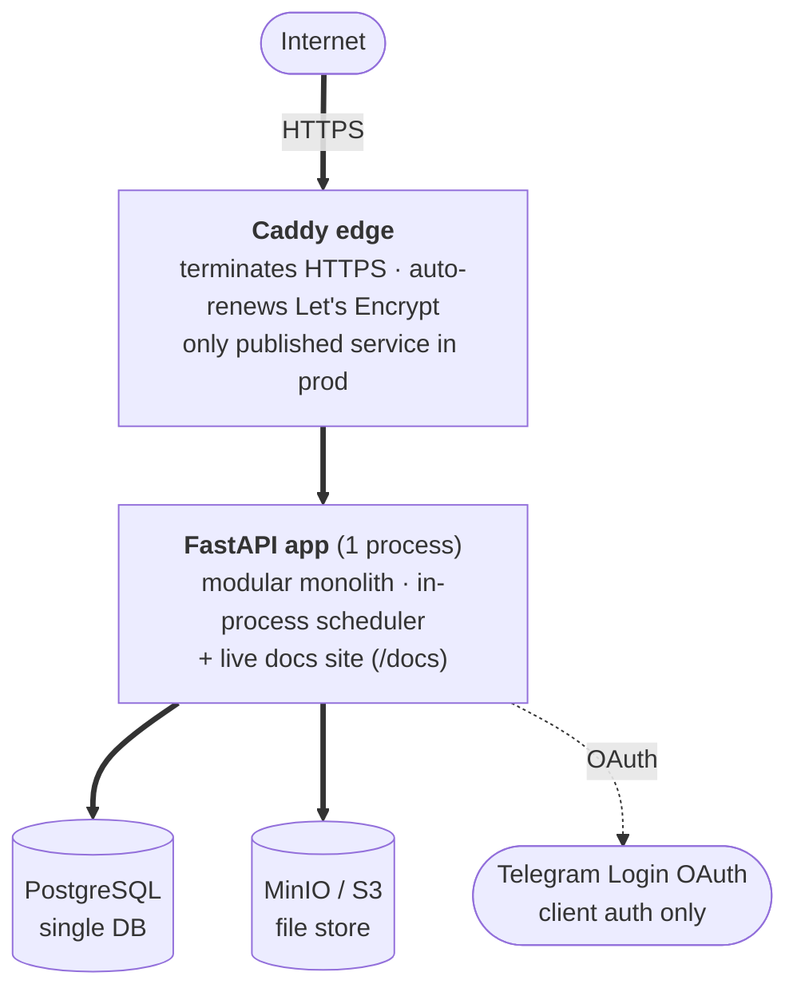

# Architecture

The system's situation, the technical shape that follows from it, and the invariants and
conventions every module respects.

## Operating envelope

**Tier 2 — internal/business SaaS.** Multi-tenant, modest scale, run by a small team. Not
high-traffic, not regulated — but it moves money on one axis, so that axis gets real rigor.

| Axis                | Where we are                                                                                                                                                                                            | Consequence                                                                                                                                                                                                            |
| ------------------- | ------------------------------------------------------------------------------------------------------------------------------------------------------------------------------------------------------- | ---------------------------------------------------------------------------------------------------------------------------------------------------------------------------------------------------------------------- |
| **Scale**           | Tens of workshops · low hundreds of branches · low thousands of clients · low tens of thousands of orders/year. Flat-to-modest growth. Read-heavy. Hottest op: cutting (≤ 100 parts, synchronous, 5 s). | One Postgres, one FastAPI process (replicas if needed). No sharding, no cache layer until something is _measured_ slow.                                                                                                |
| **Criticality**     | Orders carry money (advance / balance / refunds) and reserve real stock. A double-charge or wrong refund is real harm.                                                                                  | Integer-tiyin money (never float); atomic reserve / consume / release; append-only audit; idempotent ingestion seams; refunds tracked, not moved (manual in v1).                                                       |
| **Security**        | Public on the internet. Holds personal data, staff credentials, workshop payment-gateway credentials. Worth attacking.                                                                                  | Hard authn/authz on every request; opaque DB-backed sessions with instant revocation; password hashing + lockout; payment credentials owner-only; multi-tenant isolation at the service layer on every read and write. |
| **Latency**         | Back-office-ish — "a second or two" is fine. The one visible expensive op is cutting (5 s budget, synchronous; bigger jobs rejected, not queued in v1).                                                 | No async/queue on the hot path; cutting runs in-process within budget; background jobs on an in-process scheduler.                                                                                                     |
| **Lifespan × team** | Years; moderate change; ~2-person team.                                                                                                                                                                 | Modular monolith, boring tech (FastAPI · SQLAlchemy · Postgres · Vue · Tailwind), structure two people can operate at 3 a.m.                                                                                           |

**Not built for:** high traffic (no multi-region / cache / CDN — capacity work happens _if_ it's
needed); regulatory or audit-grade guarantees (the audit log is useful, not tamper-evident);
real-money movement in v1 (no gateway, no auto-refund, no settlement); offline operation; heavy
analytics / BI (dashboards are operational-DB aggregates).

## Topology

Caddy (config in `deploy/Caddyfile`) routes:

| Path                                 | Target                             |
| ------------------------------------ | ---------------------------------- |
| `/`                                  | static SEO landing (1 HTML)        |
| `/app/client`                        | client SPA                         |
| `/app/workshop`                      | workshop SPA                       |
| `/app/admin`                         | superadmin SPA                     |
| `/api`                               | FastAPI backend                    |
| `/docs` · `/api-docs` · `/api-redoc` | FastAPI backend (HTTP Basic-gated) |

- **One FastAPI process** — Python 3.12, async end-to-end (asyncio + asyncpg + SQLAlchemy 2.0,
  Alembic, pydantic-settings). Also renders `docs/` as a live site.
- **One PostgreSQL** — shared by all modules; each module owns its tables.
- **One MinIO / S3** — material images, logos, refund / delivery receipts, cutting PDFs. The
  `files` module owns it; others attach/detach by id.
- **In-process scheduler** — expire draft cuttings, pay-later overdue, stale refunds, expired
  sessions, daily low-stock summary.
- **Three SPAs + a static landing.** API same-origin under `/api`.
- **One external integration** — Telegram Login (OAuth), client auth only.
- **Deployment** — Docker Compose: Postgres + MinIO + FastAPI + nginx-served web + Caddy edge
  (the only published service in prod — HTTPS + Let's Encrypt). Push to `main`.

## Three SPAs + a static landing

A static SEO landing page at `/` (plain HTML, indexable) plus a Vue 3 / Vite repo building
**three SPAs**, each its own entry, auth surface, and route set: **client** (Telegram-auth
customers — cut, order, track), **workshop** (workshop owner & staff — every screen permission-gated),
**superadmin** (platform operators — provisioning, blocks, jobs console, error monitor). The
three audiences barely overlap, and a marketing page needs to be indexable — a single SPA can't
do both well. Shared primitives, the API client, design tokens, and i18n live once in the repo.
Design system: web/DESIGN.md

## Data-model invariants

Two rules every module respects.

- **Integer-tiyin money.** Every currency value — DB column, API field, intermediate computation
  — is integer tiyin (1 UZS = 100 tiyin). The frontend converts for display only. Money is the
  high-criticality axis; float currency is a bug waiting to happen.
- **No deletes for business entities.** Workshops, branches, materials, workers, workshop and
  platform users go to an `inactive` / `blocked` status — there is no `DELETE` path, and no
  `deleted_at` / `is_deleted` flag; the active state is the status enum. History (orders, audit,
  status events, cutting results) is kept forever; deletion would orphan it.

## Next

[`nfr.md`](nfr.md) — the non-functional checklist this shape has to satisfy.
