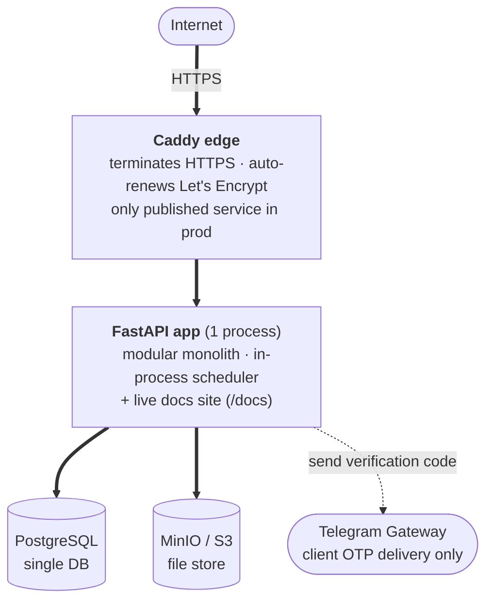

# Architecture

The system's situation, the technical shape that follows from it, and the invariants and
conventions every module respects.

## Operating envelope

**Tier 2 — internal/business SaaS.** Multi-tenant, modest scale, run by a small team. Not
high-traffic, not regulated — but it moves money on one axis, so that axis gets real rigor.

| Axis                | Where we are                                                                                                                                                                                            | Consequence                                                                                                                                                                                                            |
| ------------------- | ------------------------------------------------------------------------------------------------------------------------------------------------------------------------------------------------------- | ---------------------------------------------------------------------------------------------------------------------------------------------------------------------------------------------------------------------- |
| **Scale**           | Tens of workshops · low hundreds of branches · low thousands of clients · low tens of thousands of orders/year. Flat-to-modest growth. Read-heavy. Hottest op: cutting (≤ 100 parts, synchronous, 5 s). | One Postgres, one FastAPI process (replicas if needed). No sharding, no cache layer until something is _measured_ slow.                                                                                                |
| **Criticality**     | Money (recorded income / expenses) and real stock movement back the orders. A wrong balance or a lost stock decrement is real harm.                                                                     | Integer-tiyin money (never float); atomic stock decrement / restore; append-only audit; idempotent seams; money tracked, not moved (recorded by hand in v1, no order-held payments).                                   |
| **Security**        | Public on the internet. Holds personal data, staff credentials, and operational business records. Worth attacking.                                                                                      | Hard authn/authz on every request; opaque DB-backed sessions with instant revocation; password hashing + lockout; least-privilege admin scope; multi-tenant isolation at the service layer on every read and write.   |
| **Latency**         | Back-office-ish — "a second or two" is fine. The one visible expensive op is cutting (5 s budget, synchronous; bigger jobs rejected, not queued in v1).                                                 | No async/queue on the hot path; cutting runs in-process within budget; background jobs on an in-process scheduler.                                                                                                     |
| **Lifespan × team** | Years; moderate change; ~2-person team.                                                                                                                                                                 | Modular monolith, boring tech (FastAPI · SQLAlchemy · Postgres · Vue · Tailwind), structure two people can operate at 3 a.m.                                                                                           |

**Not built for:** high traffic (no multi-region / cache / CDN — capacity work happens _if_ it's
needed); regulatory or audit-grade guarantees (the audit log is useful, not tamper-evident);
real-money movement in v1 (no gateway, no auto-refund, no settlement); offline operation; heavy
analytics / BI (dashboards are operational-DB aggregates).

## Current stage

**Pre-production prototyping** — shaping business logic and UX against the prototype in
`web/prototypes/`. Nothing is deployed for real users: no production data, no external API
consumer, no installed client to keep working. So changing today's shape is cheap, and we spend
that freedom: edit existing migrations in place to keep the history clean rather than stacking
corrective ones, change schemas and contracts without backward-compat shims, and
delete-and-replace instead of running deprecation cycles. The guardrails still hold — docs stay
the source of truth, security defaults stay locked, the check gates run. This posture flips once
the first real workshop is onboarded with data worth keeping.

## Topology

Caddy (config in `deploy/Caddyfile`) routes by **subdomain** under a single apex
(`BASE_DOMAIN`, e.g. `mebel-pro.uz`):

| Host                    | Target                                                                                                    |
| ----------------------- | --------------------------------------------------------------------------------------------------------- |
| `mebel-pro.uz`          | static SEO landing (1 HTML)                                                                               |
| `app.mebel-pro.uz`      | client SPA (+ `/api/*` → backend)                                                                         |
| `workshop.mebel-pro.uz` | workshop SPA (+ `/api/*` → backend)                                                                       |
| `admin.mebel-pro.uz`    | superadmin SPA (+ `/api/*` → backend, + `/docs` · `/api-docs` · `/api-redoc` → backend, HTTP Basic-gated) |

Each SPA stays same-origin with its API (no CORS).

- **One FastAPI process** — Python 3.12, async end-to-end (asyncio + asyncpg + SQLAlchemy 2.0,
  Alembic, pydantic-settings). Also renders `docs/` as a live site.
- **One PostgreSQL** — shared by all modules; each module owns its tables.
- **One MinIO / S3** — material images, logos, and receipt attachments. The `files` module owns
  stored files; others attach/detach by id. Cutting PDFs are generated on demand from immutable
  cutting-result rows, not stored as file records in v1.
- **In-process scheduler** — prune expired sessions, daily low-stock summary.
- **Three SPAs + a static landing.** API same-origin under `/api`.
- **One external integration** — Telegram Gateway, used only to deliver client sign-in OTP codes.
- **Deployment** — Docker Compose: Postgres + MinIO + FastAPI + nginx-served web + Caddy edge
  (the only published service in prod — HTTPS + Let's Encrypt). Push to `main`.

## Three SPAs + a static landing

A static SEO landing page at `/` (plain HTML, indexable) plus a Vue 3 / Vite repo building
**three SPAs**, each its own entry, auth surface, and route set: **client** (Telegram OTP-auth
customers — cut, order, track), **workshop** (workshop owner & staff — every screen permission-gated),
**superadmin** (platform operators — provisioning, blocks, jobs console, error monitor). The
three audiences barely overlap, and a marketing page needs to be indexable — a single SPA can't
do both well. Shared primitives, the API client, design tokens, and i18n live once in the repo.
Design system: web/DESIGN.md

## Data-model invariants

Two rules every module respects.

- **Integer-tiyin money.** Every currency value — DB column, API field, intermediate computation
  — is integer tiyin (1 UZS = 100 tiyin). The frontend converts for display only. Money is the
  high-criticality axis; float currency is a bug waiting to happen.
- **No deletes for business entities.** Workshops, branches, materials, workers, workshop and
  platform users go to an `inactive` / `blocked` status — there is no `DELETE` path, and no
  `deleted_at` / `is_deleted` flag; the active state is the status enum. History (orders, audit,
  status events, cutting results) is kept forever; deletion would orphan it.

## Quality requirements

The non-feature requirements the shape above has to satisfy. Where a feature/entity doc owns the
specifics, this section just states the requirement.

### Audit & traceability

- Every mutating use case writes an append-only `action_log` row; every order status transition
  writes an append-only `status_change_log` row.
- Every API response carries `X-Trace-ID`; errors include `trace_id` in the body.

### Performance budgets

- API reads: p95 < 500 ms under expected load.
- Cutting optimisation: 5 s hard timeout, synchronous; > 100 parts rejected; ≤ 30 parts target
  < 1 s.
- PDF generation: synchronous, in-process; seconds, not minutes.

### Observability

- Structured logging (structlog) with the trace id on every line.
- `GET /api/v1/healthz` (liveness) and `GET /api/v1/readyz` (DB check) — both unauthenticated.
- Application errors recorded by the `platform` error monitor (code, count, last occurrence) —
  surfaced in the superadmin app.

### Internationalization

v1 ships Uzbek only. Strings are namespaced so adding `ru` / `en` is mechanical. Money, dates,
phones (`+998XXXXXXXXX`), and dimensions (millimetres) have fixed display conventions.

## Next

Into the detail:

- [`ref/features/`](ref/features/) — feature specs.
- [`ref/entities/`](ref/entities/) — entities by bounded context.
