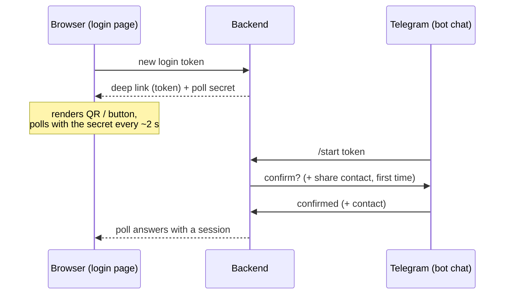

# Identity & access

The mechanics of [`access-patterns.md`](../../access-patterns.md) — how each principal signs
in, how sessions work, how workshops are provisioned, how staff and their grants are managed,
and how the surfaces look in the three apps.

## Workshop & platform user sign-in

Platform users sign in with login + password. Workshop users also sign in with login +
password. Workshop-user login is case-insensitive and **unique across the whole platform**, so
the login alone names exactly one account and the workshop follows from it — sign-in is a single
lookup plus one password verification, never a scan across same-login candidates. The error on a
bad pair is a **generic** "login or password is incorrect" — no account-existence oracle. **Five consecutive bad attempts → a 15-minute
lockout** (`locked_until`); a correct password resets the counter. Passwords are argon2 /
bcrypt-hashed at rest; complexity ≥ 8 chars with at least one upper, one lower, one digit.

`account_locked` and `account_blocked` are returned only after the submitted credential pair is
otherwise valid. Unknown login, wrong password, wrong password for a locked account, and wrong
password for a blocked account all return the same generic credential error.

Failed password attempts are also **throttled per client IP**: too many credential misses inside
a sliding window (default 20 per 15 min) → `login_rate_limited` (429) with a
`retry_after_seconds`, and while an IP is tripped even valid credentials from it are refused.
Only credential misses count, a success never resets the budget (one valid login can't launder
brute-force budget for its IP), and both password sign-in surfaces share one bucket. This
covers what the per-account lockout can't: guessing rotated across many accounts stays under
each account's lockout threshold. The
counter is in-memory and process-local (the app runs as a single instance; the account lockout
remains the durable backstop across restarts) and is env-tunable via `LOGIN_IP_THROTTLE_*`
settings. Like the Telegram-login per-IP budgets, it needs the deploy's trusted-proxy config
(`TRUSTED_PROXY_CIDRS`) — without it all traffic shares one bucket.

`password_reset_required` (set on creation, on a higher-principal password reset, and after
a security rotation) is an account gate. It is returned from `get-me` and the workshop /
superadmin app shell shows a blocking account banner until the user changes their password.
While the flag is true, the user may use only `me`, profile/password, sessions, logout, and
logout-everywhere surfaces; branch-scoped, platform-ops, and workshop-management routes are
forbidden until password change clears the flag.

**Platform users are seeded by a backend CLI command for bootstrap.** The in-app platform-user
registry is owned by [`platform.md`](platform.md) and is outside this identity slice.

### Sessions

Opaque tokens stored in the DB, hashed (SHA-256) — not JWTs. Access TTL **24 h**; refresh TTL
**7 d**; **at most 5 concurrent sessions per principal** (a 6th login evicts the oldest).
Revoking = deleting the row.

Browser clients keep the access token in memory only. The refresh token is issued as an
httpOnly, Secure, SameSite cookie scoped to the relevant app/API surface; it is never exposed to
frontend JavaScript. A page reload restores auth by calling refresh through that cookie.

| Trigger                           | Effect                                                            |
| --------------------------------- | ----------------------------------------------------------------- |
| logout (this session)             | delete this session                                               |
| "log out everywhere"              | delete all the user's sessions                                    |
| change own password               | delete all _other_ sessions; keep the current                     |
| reset password (higher principal) | delete all the user's sessions                                    |
| block user                        | delete all the user's sessions                                    |
| block workshop                    | delete the workshop's owner + staff sessions (clients unaffected) |
| 5-session cap exceeded            | evict the oldest                                                  |
| token expiry                      | inert; a periodic job prunes the row                              |

### Operations

A user can sign in, sign out, refresh their access token (the refresh path re-checks the
user, and for workshop users the workshop, is still active), change their own password
(revokes all _other_ sessions; clears `password_reset_required`), list their sessions and
revoke one or all, and fetch their `me` (principal type, ids, `is_owner`, grant set,
`password_reset_required`).

### UX

- **Sign-in screen** (workshop app `/auth/login`; superadmin app `/auth/login`) — both
  password-auth surfaces show login + password only. Failure uses the same generic error; a
  lockout banner ("try again at HH:MM") appears only after credentials are otherwise valid and
  the account is locked. A tripped IP throttle shows a generic "too many attempts, try again
  later" line — no per-IP detail is surfaced.
- **Password-reset gate** — shown in the workshop / superadmin app shell when
  `password_reset_required = true`; it is persistent, blocking for non-account routes, and links
  to the profile password tab. The gate disappears only after a successful password change.
- **Self profile** (`/workshop/profile`, `/admin/profile`) — Profile (read-only fields),
  Change password (strength meter), Sessions list (current marker, "revoke" per row, "log out
  everywhere").

## Client sign-in (Telegram bot)

The client signs in **through the platform's Telegram bot** — no password, no typed phone, no
code sent to a phone. The browser shows a one-time deep link into the bot; the client confirms
inside Telegram (and, on first contact, shares their Telegram-verified phone); the browser
session logs in the moment the bot confirms. The **phone is still the identity**
([client](../entities/identity.md#client)) — the Telegram account is the credential that proves
it, and the bot chat it opens doubles as the delivery channel for order notifications
([`notifications.md`](notifications.md#telegram-delivery-to-clients)).

This replaced the Telegram **Gateway** OTP flow (typed phone, code sent via the paid Gateway) in
2026-08. Forces: every Gateway send cost real money — half the old spec was send-budget
machinery capping the worst-case bill, and the Gateway account was never funded, so production
only ever ran on the dev-code bypass; meanwhile v1 wanted Telegram order notifications anyway,
which need exactly the bot chat this flow creates as a side effect. The Telegram Login Widget
was rejected: it solves login but opens no chat (so no notification channel) and puts a
third-party script on the login page. Consequence accepted: sign-in requires a Telegram account
— the same dependency the Gateway flow had, minus the bill. Revisit: if clients who cannot use
Telegram show up at the counter in real numbers, add an SMS OTP fallback rather than
resurrecting the Gateway.

### The handshake

1. **The login page asks for a login link.** The system mints a
   [login token](../entities/identity.md#telegram-login-token): a random deep-link token
   (public — it rides in the QR) plus a **poll secret** returned only to the requesting
   browser and never shown. Both are single-use with a 5-minute TTL. Creation is
   rate-limited per client IP (`TELEGRAM_LOGIN_*` settings, env-tunable; exceeding it is
   `login_token_rate_limited` with `retry_after_seconds`); like every per-IP budget it needs
   the deploy's trusted-proxy config (`TRUSTED_PROXY_CIDRS`) or all traffic shares one bucket.
2. **The client opens the bot.** The page renders `https://t.me/<bot>?start=<token>` two
   ways at once — as a QR and as a button, one per tab (UX below). Scanning or tapping opens
   the bot chat with the token attached.
3. **The bot identifies and confirms** (the conversation below). On success the token is
   `confirmed` and bound to the client.
4. **The browser polls with the poll secret.** The poll reports the token's state (so the
   page can say "confirm in Telegram" the moment the chat opens); on `confirmed` it answers
   with a normal [session](../entities/identity.md#session) and the token is `used`. Session
   mechanics and self-service session management are identical to every other principal.

**Two secrets, deliberately.** The deep-link token is displayed on screen — anyone who can
photograph the QR holds it. If polling redeemed the *token*, that photographer could poll it
and win the victim's session the moment the victim confirms. The session is therefore released
only against the poll secret, which never leaves the browser that requested it. The remaining
inversion — an attacker luring the victim into scanning the *attacker's* QR — is mitigated by
the confirm message naming the requesting device and time; the residual risk is accepted (it
is the same one Telegram's own QR login carries).

### The bot conversation

On `/start` with a valid pending token:

- **Known Telegram account** (its id is already linked to a client) — one inline confirm:
  "MebelPro saytiga kirish — *device, time*. Tasdiqlaysizmi?" **Tasdiqlash** → the token is
  `confirmed`. **Bekor qilish** → `declined`; the login page offers a fresh start.
- **Unknown account** — the same confirm first, then a `request_contact` keyboard asking the
  client to share their number. The contact is accepted **only when it is the sender's own**
  (`contact.user_id` equals the sender's id) — a forwarded or hand-picked contact is refused
  with a retry prompt. Then, by the verified phone:
  - **Client exists, `active`** → link the Telegram account to it and confirm. This is also
    how a staff-created walk-in row is claimed — and if the client row was linked to a
    *different* Telegram account (a replaced account on the same number), the fresh
    Telegram-verified contact wins and the row is relinked: possession of the number is the
    identity, exactly the trust the OTP code used to carry.
  - **Client exists, `blocked`** → the bot answers `account_blocked` copy; the token is
    `declined`.
  - **Phone not found** → register: create the client (`status = active`, `phone` from the
    contact, `name` prefilled from the Telegram profile name, trimmed to 80 chars) and
    confirm. There is no separate name step — the name is editable in the profile.

`/start` without a token, or with an expired / used one, gets a short help message pointing at
the login page, carrying the keyboard for the account's state (below). Bot copy is Uzbek-only in
v1 — the bot has no reliable locale channel, matching the server-rendered documents rule in
[`architecture.md`](../../architecture.md).

**The reply keyboard is account state, not decoration.** Telegram keeps the last reply keyboard
in the chat until a later message replaces or removes it, so a keyboard sent once outlives the
step that needed it. The bot therefore sends the keyboard for the sender's *current* state with
every plain reply — help, expired, the code, confirmed, declined:

| Sender's state | Keyboard |
| --- | --- |
| No client linked to the Telegram id | **📱 Raqamni ulashish** (`request_contact`), one-time |
| Linked, `active` | **🔑 Kirish kodi**, persistent — pressing it runs the fallback below |
| Linked, `blocked` | none (the keyboard is removed) |

That is what swaps «Raqamni ulashish» out the moment a contact share links the account, instead
of leaving it in the chat forever. A message may carry only one keyboard, so the confirm prompt
spends its slot on the inline **Tasdiqlash** / **Bekor qilish** pair and leaves the sticky
keyboard as it stands — safe because every path that links an account ends in a keyboard-bearing
message, so a linked account's chat already shows the code keyboard by the time a deep link can
reach it. The contact keyboard is never shown to a linked account except as the retry after a
forwarded contact.

There is no account-existence oracle: the exists / new branch is revealed only after a verified
contact, which itself proves possession of the number.

### Fallback: a code from the bot

For the client who reached the bot without a deep link (opened it by hand, camera unavailable):
the **🔑 Kirish kodi** keyboard button runs the same identification as above (contact share if
the account is unknown), then issues a [login code](../entities/identity.md#telegram-login-code) —
6 digits shown in the chat, single-use, 5-minute TTL, bound to the now-identified client. The
login card's collapsed "Kod bilan kirish" input redeems it and receives the session directly.

Note the inversion against the old OTP: the code travels **from Telegram to the site**, so
nothing is ever sent to a typed phone number — there is nothing to deliver, budget, or probe.
Redeeming is throttled per client IP (default 10 attempts / minute; exceeding it is
`login_code_rate_limited` with `retry_after_seconds`), and an unknown, expired,
or already-used code is one generic `invalid_code` — no oracle on which. With a 10⁶ space, a
5-minute lifetime, and the throttle, guessing a live code is lottery odds; the code is burned
on first success regardless.

### Staff-resolved walk-ins (find-or-create)

A walk-in customer at the counter has no app session, but their order still belongs to a
real client row. Workshop staff holding `manage_orders` resolve the walk-in **by phone**
from the workshop app's order-creation flow
([`orders.md`](orders.md#staff-created-orders-walk-in-clients)):

- **Phone-first, answered as it is typed.** The moment the phone is complete
  (`+998XXXXXXXXX`) the base is asked who owns it. A match fills the client's registered
  name into a read-only field with a "found in the base — check the number if this is
  someone else" caption, and the staffer reads that name before pressing continue; a miss
  leaves the field empty and required. **The disclosure still happens before the commit** —
  that is what stops a phone typo attaching an order to a stranger — but on one screen
  rather than behind a second confirm card.
- **Asking does not write.** The read is its own endpoint, separate from find-or-create:
  resolving on every typed phone would mint a client per typo. The write happens once, on
  continue, and creates the row (`status = active`) exactly as bot registration would.
- **A blocked client is rejected** (`account_blocked`) on the write path — mirrors bot
  sign-in. On the read path a blocked account reads as a **miss**: the answer to "may
  I write an order for this number" is no either way, and raising there would make the
  lookup an oracle for account status.
- **Never a login.** The staff path finds or creates the row; it creates **no client
  session**. The bot remains the only way a client signs in — the first time the walk-in
  shares that number's contact in the bot they claim the row and see their order history.
- **Guardrails.** Both paths deliberately disclose an existing client's stored name to
  `manage_orders` staff — the trade for the anti-typo confirmation, and the name is already
  what the counter conversation runs on. In exchange each is **rate-limited per staff user**
  (the same convention as the login-token budgets) and **every call writes an audit row** (the
  phone, the outcome, the acting staffer) — a staffer scanning phone numbers is throttled
  and visible. The read carries the larger hourly budget of the two: looking a number up
  and not writing an order is the normal case at a counter, not a suspicious one. Revisit
  if name disclosure draws a real privacy complaint — then mask the returned name, at the
  cost of a weaker confirmation.

**Why find-or-create, not a guest entity.** `phone` is unique on the client and the account
is passwordless — the bot's contact step is itself already a find-or-create on the phone. Reusing
that identity makes a staff-created client automatically claimable (no merge tooling, no
orphaned guest rows, order history intact) and needs no order schema change. A separate
guest/walk-in entity, or staff-typed contact fields with no client link, were rejected:
both split the customer's history and require a claim/merge path v1 doesn't have.

### Bot infrastructure

The bot is configured by `TELEGRAM_BOT_TOKEN` (secret), `TELEGRAM_BOT_USERNAME` (builds the
deep links), and `TELEGRAM_WEBHOOK_SECRET`. Updates arrive by **webhook** through the prod
edge, authenticated by Telegram's `secret_token` header — no polling process, no queue;
outbound messages go straight to the Bot API. The registration itself is a one-time deploy
step: `python -m app.cli telegram-webhook set` points the bot at this deployment's webhook
route with the configured secret (`info` inspects, `delete` removes; re-run `set` only when
the public origin or the secret rotates). Topology and the module split are
[`architecture.md`](../../architecture.md)'s.

### Dev & local sign-in

Local, CI, and E2E runs have no public webhook and no real Telegram. A single setting —
**`TELEGRAM_LOGIN_DEV_MODE`** — covers this: when `true`, a dev-only confirm operation marks
any pending login token `confirmed` as a given phone (with a name, when the phone is new),
skipping the bot entirely; the login page needs no change — its poll succeeds the same way,
and E2E drives the confirm directly. When `false` — the default, and **mandatory in
production** — only the real bot can confirm a token.

Production rejects `TELEGRAM_LOGIN_DEV_MODE=true` unless
**`ALLOW_PROD_TELEGRAM_LOGIN_DEV_MODE=true`** is also set. That flag exists only for
pre-production public testing before the bot is registered and configured; remove it, set dev
mode off, and configure the bot settings above before onboarding real users or real workshop
data.

Rate enforcement is controlled separately by **`TELEGRAM_LOGIN_RATE_LIMITS_ENABLED`** — the
master switch for the per-IP token-creation budget and the code-redeem throttle. It defaults to
`true` and must stay enabled outside automated test runs; local E2E sets it to `false` so
repeated parallel browser tests from one localhost IP do not exhaust the per-IP bucket.

### UX

One sign-in card (client app `/auth/login`) carrying two tabs — **QR kod** and **Telegram
orqali** — over one handshake. Both are available on every device; only which one *opens*
follows the device (desktop → QR, mobile → Telegram orqali, by the same `matchMedia` check the
old layout used — the card keeps following it until the reader picks a tab, then stops, so a
rotation cannot move them). Switching tabs is a change of instructions, not a restart: the
token and its
background poll belong to the card, so the handshake survives the switch and a reader whose
Telegram lives on the other device is one click away from the affordance they need.

- **QR kod** — the QR of the deep link, scanned by **the phone's camera** (not by Telegram;
  the copy says so). Under it, collapsed, sits the code fallback below.
- **Telegram orqali** — one primary **Telegram botga o'tish** button opening the deep link in a
  **new tab**, so the card is never navigated away from and its poll keeps running; the poll
  picks the session up when the client returns to the browser.
- **The in-flight handshake survives the round trip.** The live token, its poll secret and its
  expiry are parked in per-tab storage (`sessionStorage`), so a reload — or a mobile browser
  evicting the tab during the switch to Telegram — resumes the same handshake and polls it
  immediately rather than minting a second one and abandoning the token the client is about to
  confirm. The entry is dropped the moment the handshake ends: session issued, expired, used,
  declined, or replaced.
- **States, shared by both tabs** — *waiting* → *started* ("Telefoningizda tasdiqlang" the
  moment `/start` lands) → redirect into the app on `confirmed`. A `declined` token returns to
  *waiting* on a fresh handshake with a line saying why; an expired one names what died in the
  tab's own words ("QR eskirdi" / "Kirish havolasi eskirdi") over a **Yangilash** action that
  mints a new token. A handshake that cannot be minted at all names its cause and holds
  Yangilash for the `retry_after_seconds` budget.
- **Code fallback** — a disclosure under the QR tab, "Kamera ishlamayaptimi? Kod bilan
  kirish", collapsed by default so the reader who scanned the QR never meets it. Expanded it
  carries the instruction (open the bot, press **Kirish kodi**, type the digits here), a
  clickable `@<bot>` link built from the bot username the deep link already names, and the
  6-digit input: generic `invalid_code` inline, `retry_after_seconds` countdown when
  throttled. It needs no handshake of its own, so it still works while this browser's token is
  expired or throttled.
- **No name step** — registration happens entirely inside the bot.
- **Client profile** (`/c/profile`) — `name` editable (prefilled from Telegram at
  registration, never re-synced); `phone` read-only (changing it would mean re-sharing a
  contact — out of scope in v1); order count; sessions list with a current marker; "log out" /
  "log out everywhere". The client's pinned workshop is **not** edited here — it is set by
  following a workshop's link ([`client-entry.md`](client-entry.md)), never by a branch field
  on a profile form.

## Workshop provisioning (superadmin app)

A platform operator provisions a workshop atomically with its first user and first branch:

- **Create a workshop, first branch, and owner — atomically.** Input: workshop `name`
  (`currency` defaults to `UZS`) + first branch fields (`name`, `address`, `phone`) + the
  owner's `login`, plus an auto-generated temp password (manual override).
  The same transaction creates the `workshop` row, an `active` first `branch` row with empty
  `branch_pricing`, and a `workshop_user` row with `is_owner = true`,
  `home_branch_id = first_branch.id`, and `password_reset_required = true`. Returns the summary
  and the temp password **once**. The returned confirmation shows the owner login and temp
  password; only the temp password is secret and shown once. Provisioning creates exactly one
  owner; after that, v1 has no owner create / demote / delete / transfer path. Platform
  provisioning does not collect workshop-level contact data, branch coordinates, or owner
  name/phone; branch contact and precise branch location are owner-managed after first sign-in.
- **Block / unblock the workshop.** Blocking revokes the owner's + staff's sessions
  immediately; their next login is rejected. Clients are unaffected. Open orders **freeze** —
  staff can't act because they can't log in; no automatic transitions. Unblocking does **not**
  restore sessions — users log in again.
- **Reset the owner's password.** The operator is the owner's only recovery path: the
  owner-side staff reset refuses the owner as a target, so a locked-out owner has nowhere
  else to go. The reset issues a new auto-generated temp password (shown **once**), sets
  `password_reset_required`, revokes all the owner's sessions, and is audited. It works on a
  blocked workshop too — unblock and reset are often the same support call, and login stays
  gated by the block either way.

The operator's **only** workshop write actions are: provision (workshop + first branch + first
owner, atomic), block, unblock, and owner password reset. The operator does **not** edit the workshop profile or the
owner's profile/contact fields (name / phone) — that is owner territory and there is no
operator path to it. Workshop _editing_ (profile, settings) lives in
[`workshop.md`](workshop.md); owner-identity edits are owner self-service / owner-managed,
not operator-managed. If correcting an owner's phone via the operator ever becomes a real
need, it must be specified here first — it is deliberately absent in v1.

### UX

- **Create-workshop dialog** — workshop name + first branch name/address/phone/working-hours,
  owner login, temp password (auto-generated, copy button, manual toggle). On success:
  read-only confirmation showing the owner login + temp password with "share this with the
  owner — temp password shown once" + copy button; the owner sees the password-reset gate after
  sign-in and lands with the first branch available in branch context.
- **Block** (in the workshop detail) — mandatory reason; warning that staff sessions are
  revoked and open orders freeze; destructive-styled.
- **Reset owner password** (in the workshop detail, next to the owner login) —
  destructive-styled confirmation naming the owner login and that all their sessions are
  revoked; on success, the standard one-time-secret confirmation with the login + temp
  password.

All provisioning, create-user, reset-password, and block dialogs move focus into the dialog, trap
focus while open, and return focus to the trigger on close. One-time-secret confirmations expose a
copy button and keep the secret visible until the operator/owner closes the confirmation. Action
menus are keyboard-operable, and destructive actions move focus to the confirmation's primary
decision. The grants matrix is keyboard-operable by row/column, has an explicit Save, and preserves
unsaved changes until save, cancel, or confirmed navigation.

## Workshop user management (workshop app)

Each staff user holds a set of `(permission, branch)` grants. The owner holds every
permission on every branch implicitly, plus owner-only carve-outs.

### Permission catalog

| Permission             | Grants on the granted branch                                                                                                                                                                                                                                                                                                                                                                            |
| ---------------------- | ------------------------------------------------------------------------------------------------------------------------------------------------------------------------------------------------------------------------------------------------------------------------------------------------------------------------------------------------------------------------------------------------------- |
| `view_orders`          | **read-only** access to the branch's orders — list, search, and open any order in the branch, including the client's name and phone, line prices, materials and production stamps. No action on them, and no dashboard section of its own. It was called `view_dashboard` until 2026-07; the name promised a KPI page while the grant handed over every order in the branch, so it was renamed to what it does. |
| `manage_orders`        | the office side of the order workflow — verify / approve (`new → confirmed`), assign and re-assign the cutter / edger, apply discounts, complete a production job **on behalf** of an absent worker, **revert** one step on a mistake, cancel any pre-`completed` order with a reason, and **create a cutting draft + place an order on behalf of a walk-in client**, resolving them by phone ([Staff-resolved walk-ins](#staff-resolved-walk-ins-find-or-create)). Cannot do production work itself unless it also holds `process_production`. See [`orders.md`](orders.md).    |
| `process_production`   | the **cutter & edger workspaces** — see orders assigned to this user, view the cutting plan read-only, mark **Cutting done** (→ `edge_banding` or `ready`; stamps the cutter snapshot, decrements panel stock for `shop` panels) and **Banding done** (→ `ready`; stamps the edge snapshot, decrements edge stock per edge material for `shop` sides). Cannot edit, verify, cancel, or revert an order. Those workspaces exist only on a branch running **full** production mode, which the current plan (**Start**) does not offer — no full-mode branch can be created through the UI since 2026-09-05, so the workspaces are unreachable in practice. The grant stays worth giving: on a `simple` branch production is closed by `manage_orders`'s one **Tayyor** tap, and this grant is what makes a holder nameable in the «Kim kesdi?» pick — the worker-credit dimension the production reports count. The workspaces come back with the plan that offers full mode ([`orders.md`](orders.md#production-mode)). |
| `manage_catalog`       | the branch's own materials — attach the platform formats the branch carries, set each one's price and min-stock, activate / deactivate. (Decors and their formats are platform-side.)                                                                                                                                                                                                                                     |
| `manage_inventory`     | stock-in (from a supplier; suppliers added on demand), adjust, view stock and transactions.                                                                                                                                                                                                                                                                                                             |
| `manage_finance`       | the money ledger — record / edit / void income (including order payments) and expenses (including `salary`), and **read** the supplier list an expense is attributed to. It also carries the **To'lov qabul qilish** action on an order page the holder can already open (i.e. alongside `view_orders` or `manage_orders`), so the counter takes money where the order is. See [`finance.md`](finance.md). |
| `view_finance_reports` | read-only access to the home finance summary tiles (income · expenses · net) and the worker-production report. The income / expense ledgers themselves require `manage_finance`. See [`finance.md`](finance.md).                                                                                                                                                                                          |

`process_delivery` is **gated out of v1** — v1 is pickup-only
([`scope.md`](../../scope.md)), so there is no driver workspace and the grant is not in the
catalog; it returns when delivery does.

**A shared lookup is readable by every permission that legitimately needs it.** The supplier
list is the one case in v1: the warehouseman picks a supplier for an arrival and the accountant
attributes an expense to one, so both `manage_inventory` and `manage_finance` read it while
creating and editing a supplier stays with `manage_inventory`. Gating a lookup behind a single
grant is what leaves the second reader with a field that is offered and cannot work.

The converse holds too: **a screen must not fetch a lookup its viewer cannot read.** The
assignable-worker list is `manage_orders` only, and the order screen also admits `view_orders`
and `process_production` — so it asks for that list only when the viewer could act on it.
Fetching it regardless buys those readers nothing but a refusal on a page they are entitled to.

A staff user with zero grants can log in but sees nothing actionable. Grants live on the
user, not the branch: changing a branch's status doesn't touch grants; a grant on an
`inactive` branch is inert and becomes live again on reactivation.

**Workers are workshop users.** A "cutter" or "edge bander" is just a workshop user holding
`process_production` on the order's branch — there is **no separate `worker` entity** and
**no role**: capability is the grant set, and one person may hold `manage_orders` _and_
`process_production` _and_ `manage_finance` and run the whole flow alone. The system stores
no pay rates; how much a worker is paid is the accountant's manual calculation from the
work the user actually did, read from the order's production stamps (see
[`finance.md`](finance.md) and [`orders.md`](orders.md)).

### Owner-only powers

The owner (`is_owner`) holds every permission on every branch implicitly, plus these powers
that **cannot be delegated to staff in v1**:

- Create staff and grant / revoke their permissions.
- Create and edit branches; change branch status; set branch pricing.
- Read and edit workshop settings (profile).
- View workshop-wide reports.

Reading the settings row is owner-only, but the workshop's **name** is not a secret — every
workshop surface shows it as the tenant label. It therefore travels on the signed-in principal
itself, alongside the workshop id, so staff render the real name without asking for a row they
may not read.

### Operations (owner)

- **Create a workshop user** — `full_name`, `phone`, `login`, `password_reset_required = true`,
  temp password (auto / manual), a multi-branch picker that scopes the initial grants matrix,
  a derived `home_branch_id` (the first selected branch; it remains the assignment home for
  cutter / edger work), and **an optional initial set of `(permission, branch)` grants**.
  Created in one atomic operation; returns the user and the temp password
  **once**.
- **Edit profile fields** — `full_name`, `phone`, `home_branch_id`.
- **Set grants** — replaces the user's `permission_grant` rows atomically; each
  `(permission, branch)` is validated against the catalog and the workshop's branches. **The
  new grants take effect on the user's next request** — no session revoke. An open tab holding
  the old set corrects itself the first time the server refuses it: the refused read drops the
  rows it was refreshing, the app re-reads the principal and the branch context, and a page that
  is no longer allowed redirects home.
- **Reset password** — a temp password + `password_reset_required = true`; revokes the user's
  sessions.
- **Block / unblock** — blocking revokes sessions immediately; unblocking does not restore
  them.
- **List / get** — the workshop's users for the owner.

### UX

Under **Settings → Users** (owner-only nav item):

- **Users list** (`/workshop/settings/users`) — table: name, login, phone, home branch,
  granted-branches count, status, last login, action menu. Filters: home branch, status.
  **+ User**. Empty: "No staff yet — add one to delegate work."
- **Create-user dialog** — profile fields + multi-branch picker + temp password (auto / manual,
  copy) + an initial grants matrix (permission rows × selected branch columns, within the workshop).
  On success: read-only "share login + temp password — shown once" confirmation with copy.
- **User detail** (`/workshop/settings/users/:id`) — header (name, status badge, home branch,
  last login); tabs:
  - **Profile** (edit) — profile fields incl. home branch.
  - **Permissions** — the grants matrix; toggling saves atomically with an explicit Save and
    an unsaved-changes guard.
  - **Sessions** — list with current marker; revoke one / all.
- Row / detail actions: Edit · Reset password (→ one-time-secret confirmation) · Block /
  Unblock (block warns sessions are revoked) · Revoke sessions.

## Workshop app access matrix

The workshop SPA gates in two independent places; the server is the backstop behind both.

- **The sidebar** (`web/src/shared/app/workshopNav.ts`) is built from the grants the user holds
  **on the branch currently selected** in the branch picker.
- **The router guard** (route `meta.workshopAccess` in `web/src/apps/workshop/routes.ts`,
  evaluated by `canAccessWorkshopRoute`) tests the **whole grant set, branch-blind** — no
  workshop route declares `branchParam` today. A refused route redirects to `/workshop`, and the
  guard resolves before the target view mounts, so none of the refused page paints first.

The two predicates are deliberately different: a nav entry is an invitation, a route requirement
is a floor. Every place they diverge is listed below.

### What each permission unlocks in the sidebar

| Permission             | Sidebar entries (group)                                                   |
| ---------------------- | ------------------------------------------------------------------------- |
| `view_orders`          | none — it is an order-read grant, and the board it reads needs `manage_orders` |
| `manage_orders`        | Buyurtmalar (Boshqaruv)                                                   |
| `process_production`   | Kesish · Krom (Ishlab chiqarish)                                          |
| `manage_inventory`     | Ombor (Resurslar)                                                         |
| `manage_catalog`       | Material katalogi (Resurslar)                                             |
| `manage_finance`       | Tushum va xarajat · Qarzdorlik · Xodimlar mehnati (Moliya)                |
| `view_finance_reports` | Xodimlar mehnati (Moliya)                                                 |
| `is_owner`             | all of the above, plus Filiallar · Xodimlar · Sozlamalar (Tizim)          |

**Asosiy** (Boshqaruv) is shown to every signed-in workshop user, zero-grant staff included. It
is the app's home path and the redirect target for every refused route, so it cannot be gated
without first giving each principal its own landing page. Because it is ungated, the dashboard
carries the honest empty state instead: it names what the reader is missing whenever **no
section of the page renders** — not only when the grant set is empty. A holder of
`manage_catalog` alone has grants and still no dashboard card, and gets "nothing to show here,
your work is elsewhere" plus a link to the catalog, rather than a bare heading and a refresh
button.

Below 921px the sidebar becomes a **drawer** carrying the same item list — together with the
branch picker, the create action and the account button, which exist nowhere else on a phone — so
a permission-hidden entry stays hidden there too. There is no collapsed icon-rail state on the
desktop — the 264px column *is* the layout — so no tooltip can name a page the user cannot open.

### Links obey the target's requirement, not the card's

A card, panel row or back link is gated on the permission that **renders** it; the page it points
at has its own, usually stricter, requirement. The two must be checked separately or the link
bounces off the router guard straight back to `/workshop`. A KPI card whose target is out of reach
therefore renders as a plain card — no anchor, no hover lift, no pointer cursor — and a panel's
"more" link disappears rather than dangling. The rule lives in one place,
`web/src/shared/app/workshopDashboard.ts`, which answers both questions side by side:
`view_orders` renders the order KPI but cannot open `/workshop/orders`; `view_finance_reports`
renders the money figures but cannot open the ledgers.

A **Sizdan kutilmoqda** row splits the same rule across the row and its button. The **row**
appears whenever its condition holds and the reader can see the data behind it; the panel as a
whole is off only for a viewer holding neither an order grant nor `manage_inventory`, because
none of its rows would then have a source. The **button** is what follows the acting grant:
`manage_orders` gets the board or the order that carries the assign controls, a `view_orders`
reader gets the single order it can actually open, and where nothing is reachable the row states
the stall with no button at all — an instruction the reader cannot carry out is worse than a row
that only reports. On an order screen the back link points at the orders board for `manage_orders`
holders and at **Asosiy** for everyone else the page admits.

### What each route requires

| Route                                                                                                                                                        | Requirement                                            |
| ------------------------------------------------------------------------------------------------------------------------------------------------------------ | ------------------------------------------------------ |
| `/workshop`                                                                                                                                                  | none                                                   |
| `/workshop/profile` · `/workshop/notifications`                                                                                                              | none — account surfaces stay open to zero-grant staff  |
| `/workshop/orders` · `/orders/new` · `/orders/new/cutting` · `/orders/cutting/:id` · `/orders/cutting/:id/result` · `/orders/new/:draft_id/checkout` · `/orders/drafts` · `/orders/edit/:draft_id/review` | `manage_orders`                                        |
| `/workshop/orders/:order_id`                                                                                                                                 | `view_orders` · `manage_orders` · `process_production` |
| `/workshop/cutting` · `/workshop/banding` · `/workshop/production/:order_id` (`/workshop/production` redirects into them)                                     | `process_production` · `manage_orders`                 |
| `/workshop/inventory`                                                                                                                                        | `manage_inventory`                                     |
| `/workshop/catalog`                                                                                                                                          | `manage_catalog`                                       |
| `/workshop/finance/income` · `/finance/expenses` · `/finance/debts`                                                                                          | `manage_finance`                                       |
| `/workshop/finance/production`                                                                                                                               | `manage_finance` · `view_finance_reports`              |
| `/workshop/settings` · `/settings/users` · `/settings/users/:user_id` · `/branches` · `/branches/:branch_id`                                                  | owner only                                             |

The station pages accept `manage_orders` as well as `process_production`, but the sidebar offers
them only on `process_production` — an order manager reaches Kesish / Krom by URL and finds the
"no work assigned to you" state, which is the intended read.

### What the global search returns

| Grant on the **selected** branch          | Search section    |
| ----------------------------------------- | ----------------- |
| `view_orders` or `manage_orders`          | Buyurtmalar       |
| `manage_catalog`                          | Material katalogi |
| `manage_inventory`                        | Ombor             |
| owner only                                | Xodimlar          |

Search reads the selected branch's grants, so it is branch-scoped where the router guard is not.
With none of them the panel says "Bu filial bo'yicha qidiruv uchun ruxsat yo'q" rather than
returning an empty result set.

### Verified — 2026-07-26

One probe user per permission, each holding exactly that grant on one branch, driven through
every workshop route in a browser against the seeded demo world. `pass` means the cell matched
the tables above; a `D` reference points at a known deviation below. The table carries the
state after **every** deviation D1–D7 was fixed on 2026-07-26, across two changes: the
permission rename plus the dashboard/link/staleness fixes, and the profile, supplier-lookup
and order-refusal fixes. Rows were re-driven in the browser on each change, and the combined
state was re-driven again after the two were integrated.

| Principal                                | Sidebar | Forbidden URL refused | Allowed pages clean | Global search | Empty / partial states |
| ---------------------------------------- | ------- | --------------------- | ------------------- | ------------- | ---------------------- |
| owner                                    | pass    | pass (nothing refused) | pass               | pass          | pass                   |
| `view_orders`                            | pass    | pass                  | pass                  | pass          | pass                     |
| `manage_orders`                          | pass    | pass                  | pass                  | pass          | pass                     |
| `process_production`                     | pass    | pass                  | pass                  | pass          | pass                     |
| `manage_catalog`                         | pass    | pass                  | pass                  | pass          | pass                   |
| `manage_inventory`                       | pass    | pass                  | pass                  | pass          | pass                   |
| `manage_finance`                         | pass    | pass                  | pass                 | pass          | pass                   |
| `view_finance_reports`                   | pass    | pass                  | pass                  | pass          | pass                   |
| no grants                                | pass    | pass                  | pass                  | pass          | pass                   |
| `manage_orders` + `manage_inventory`     | pass    | pass                  | pass                  | pass          | pass                     |
| `manage_inventory` on the second branch  | pass    | pass                  | pass                  | pass          | pass                   |

Every refused route landed on `/workshop` with no frame of the refused view rendered, and no
principal saw a nav entry, search section, or owner-only route it was not entitled to. Grants on
one branch unlocked nothing on the other: the branch picker offers only granted branches, and an
order in a branch the reader has no grant on answers 404. No screen offered a link to a page its
viewer could not open.

Revoking a grant while the holder is signed in fails closed on the server, and the open tab now
follows within one round-trip: the refused request clears the rows it was meant to refresh, the
app re-reads `me` and the branch context, the sidebar drops the entries the user no longer holds,
and a page that is no longer allowed redirects to `/workshop`. No reload needed.

### Known deviations

Each is a defect against the tables above, not a rule. Identifiers are stable, so a fixed one
leaves a gap rather than renumbering the rest.

**All seven deviations found by the 2026-07-26 permission walk were fixed the same day**, in two
changes that landed together:

| | Was | Closed by |
|---|---|---|
| **D1** | `/workshop` rendered blank for staff whose grants light up no dashboard section | the empty state now fires on "no visible section", not "no grants" |
| **D2** | `view_dashboard` was an order-read grant labelled "Asosiy panel" | renamed to `view_orders`, labelled `Buyurtmalarni ko'rish (faqat o'qish)` |
| **D3** | the finance ledger fetched a supplier list gated on `manage_inventory` | `manage_finance` admitted to the supplier read; writes stay `manage_inventory` |
| **D4** | every non-owner took a 403 on their own profile, and the workshop name fell back to the generic tenant label | the name rides on the `me` principal; the profile no longer reads owner-only settings |
| **D5** | screens linked to routes the viewer could not open | each link is gated on the **target route's** requirement, not the card's |
| **D6** | an order the reader is not entitled to reported a network failure | 404/403 is distinguished from transport failure, with copy naming the real outcome |
| **D7** | a revoked grant left a stale shell until reload | a 403 triggers a deduped `me` + branch-context re-read, and stores drop rows on refusal |

One defect was created by the *combination* of D2 and D4 and fixed at integration:
`WorkshopProfileView.vue` kept a **private copy** of the permission-label map, so the rename in D2
left its Ruxsatlar panel printing the raw `view_orders` code. The private copy is gone; the view
now reads `permissionLabels` from `workshopUi`. A duplicate that only breaks on rename is worse
than no duplicate — if another one appears, delete it rather than syncing it.

## Branch context (workshop app)

A staff user may hold grants on multiple branches. The workshop app uses a **branch picker** — a
two-line card at the top of the sidebar, under the wordmark: the workshop's name on the dominant
line, the selected branch beneath it, opening the list of branches. It defines the current branch
context, and every branch-scoped screen (orders, inventory, the Asosiy dashboard, material
catalog, workers) reads from it. Below 921px it travels into the drawer with the rest of the sidebar,
because a phone has nowhere else to put it.

Rules:

- The picker offers branches the user has any grant on — or **all branches**, if `is_owner`.
- On first login: auto-select if the user has exactly one accessible branch; otherwise
  prompt.
- The selection persists per session (local storage); a session revoke or re-login resets it.
- The picker UI never lets the user pick a branch they can't scope to. The server never
  trusts it anyway: create/list operations may submit a branch id, which the service validates
  against the grant set; operations on existing records derive the target branch from stored data.

### Which pages the context reaches

Not every screen is branch-scoped, and a picker that looks live while doing nothing is worse
than no picker. Every workshop route **declares** its scope; the shell renders the picker from
that declaration, so a new route has to state where it stands.

| Scope | What it means | Picker | Pages |
| --- | --- | --- | --- |
| `branch` | Reads the context and reloads when it changes | live | Asosiy · Buyurtmalar · Saqlangan chizmalar · Kesish · Krom · Ombor · Material katalogi · Tushum va xarajat · Qarzdorlik · Xodimlar mehnati · Yangi buyurtma |
| `workshop` | Workshop-wide by design | disabled, the reason stacked beneath the card | Filiallar · Xodimlar ro'yxati · Sozlamalar · Bildirishnomalar · Profil |
| `entity` | Takes its branch from the record on screen | disabled, the reason stacked beneath the card | Buyurtma tafsilotlari · Chizma (ish) · Kesim chizmasi + natija + rasmiylashtirish · Filial tafsilotlari · Xodim tafsilotlari |

**The whole finance module is `branch`.** `Qarzdorlik` included: every term in the debt fold —
invoice, supplier payment, order, adjustment — names a branch, so a branch's balance is a real
number and the branches sum to the workshop. Only the three **Tizim** pages are workshop-wide,
because a branch list, a staff list and the workshop's own settings have no branch to be scoped
to; `Bildirishnomalar` and `Profil` join them as personal surfaces reached from the chrome rather
than the nav — the bell in the header, the profile from the sidebar's account button. An `entity`
page must never let the picker override the branch stored on the record — a cutting draft in
particular is frozen to the branch it was started on, and the editor keeps its own in-page branch
control for that reason. It seeds that control from the current context when the draft has no
branch bound yet, so the user isn't asked twice for a choice they already made in the picker.

**Below two branches the card stays and stops being a control.** A workshop with one branch — or
none, before the first is created — renders the same two-line block as an inert outlined card:
same shape and position, no chevron, no listbox, nothing to open. Hiding it would change the
shape of the sidebar from one workshop to the next, and the outline is the signal the `workshop`
and `entity` scopes above already carry (minus their stacked reason) — the card is stating that
there is no choice to make here. The context auto-pins to the one branch and every page behaves
as if it is selected; with no branches at all the second line reads `Filial yo'q` rather than
going blank.

### The route guard is branch-blind, deliberately

Route requirements name permissions, never a branch: a grant on *any* branch satisfies a
workshop route. **The frontend route layer is not part of branch isolation, and shouldn't
be.** Every request re-derives the target branch server-side from the grant set and the stored
record, so a route guard that also checked branches would be a second, weaker copy of a rule
the server already enforces — and one that drifts. The guard's job is narrower: don't route a
user to a screen they can hold no permission for. Branch scope is the server's.

This leaves one asymmetry worth naming: global search *is* branch-scoped in the client — it
reads the selected branch's permission list to decide which result sections to request. That's
result shaping, not enforcement; the search endpoints re-derive scope like everything else.

Revisit if a branch-scoped route ever needs to render before its first API call resolves — a
guard would then be the only thing standing between the user and a flash of another branch's
shell. Nothing does today.

Zero-grant staff keep access to account controls: profile, password-reset gate, sessions, logout,
and logout-everywhere. Branch-scoped navigation and work screens stay hidden / empty until the owner
grants at least one active branch permission.

## How a request is authorized

1. The auth middleware turns the bearer token into a **principal context**: type, workshop
   id, `is_owner`, the grant set.
2. The operation determines the **target branch**. Create/list operations may use a submitted
   branch id after validating it against stored branch/workshop data; operations on existing
   records derive the branch from the stored record, never from a client-supplied replacement.
3. Allow if `is_owner`, or if `(required_permission, target_branch)` is in the grant set; for
   owner-only operations, allow only if `is_owner`. Otherwise → `forbidden`.

## Edge cases

- **Create-workshop fails after the workshop row but before the owner row** — the whole
  operation rolls back (atomic).
- **Login collides with any existing workshop login** — rejected with `login_exists` (409),
  whether the holder is in this workshop or another one. The create-user form surfaces it inline
  on the login field ("Bu login band. Boshqa login tanlang.") and prefills a workshop-derived
  prefix (a slug of the workshop name + `_`) to steer owners away from the obvious collisions.
  The prefix is a suggestion only — fully editable and clearable, with no enforced format.
- **Block a workshop while staff are mid-action** — their next request 401s; the platform
  operator can still read the workshop's data for incident response.
- **A staff member's only granted branch goes `inactive`** — they effectively have no
  actionable screens until it's reactivated or they're granted another; the branch picker
  hides the inactive entry.
- **Staff user with zero grants** — can log in; account controls remain available, while
  branch-scoped screens are empty / hidden.
- **Owner as cutter / edger on a non-home branch** — allowed: `is_owner` holds
  `process_production` on every branch and is **exempt** from the
  `home_branch_id = order.branch_id` assignment check that binds non-owner staff (see
  [`orders.md`](orders.md)).
- **Grant on a branch that later goes `inactive`** — inert; the branch disappears from the
  picker; reactivating makes the grant live again.
- **Owner blocks themselves** — disallowed (a workshop must have an active owner).
- **Client has no Telegram** — cannot sign in; there is no SMS fallback in v1, and counter
  staff can still place walk-in orders for them. Revisit per the decision in
  [Client sign-in](#client-sign-in-telegram-bot).
- **Client declines in the bot** — the token is `declined`; the login page returns to a fresh
  QR / button.
- **Token expires mid-conversation** — the bot answers "muddat tugadi, saytdagi QR ni
  yangilang"; the page's poll reports expiry and offers **Yangilash**.
- **Client shares someone else's contact** — refused (`contact.user_id` must equal the
  sender's id); the bot re-prompts for the client's own contact.
- **Client's Telegram number is not `+998`** — refused with copy saying only `+998` numbers
  are supported; the client identity's phone invariant is `+998XXXXXXXXX`-shaped
  ([`identity.md`](../entities/identity.md#client)).
- **Same number, new Telegram account** — the verified contact relinks the client row to the
  new account; the old account can no longer confirm logins. Existing sessions are untouched —
  the relink proves the same identity, it doesn't revoke it.
- **Client's Telegram number changes after registration** — login keeps working through the
  linked account (the known-account branch never re-asks for the contact), so the stored
  `phone` goes stale. Accepted in v1; revisit with a "re-verify phone" profile action if a
  stale number ever misroutes a staff walk-in resolve.
- **QR photographed / scanned by someone else** — inert: the session is released only against
  the poll secret, which never appears on screen (see [The handshake](#the-handshake)).
- **Fallback code guessed** — one generic `invalid_code` whether unknown, expired, or used;
  redeem attempts are throttled per IP; a live code dies on first successful redeem.
- **Client blocked the bot earlier** — pressing Start un-blocks it by definition; sign-in is
  unaffected. Notification delivery to a blocked bot is
  [`notifications.md`](notifications.md#telegram-delivery-to-clients)'s concern.

## Next

- [`workshop.md`](workshop.md) — branches, workshop settings, and audit.
- [`finance.md`](finance.md) — income, expenses, and the worker-production reports the
  accountant uses to pay the workers granted access here.
