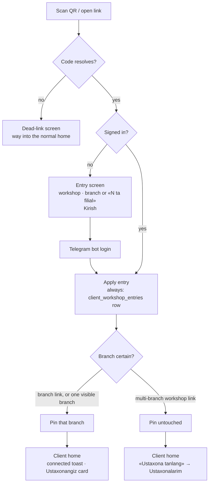

# Client entry & workshop links

How a client arrives in the client app: a workshop hands out a link or a printed QR, the
client follows it, and the app is **pinned to one of its branches** from then on. This page
owns the workshop code, the entry flow, the pin, the client's own workshops and their
profiles, and the scoping the pin imposes on the rest of the client app. The screens it
narrows keep their own homes — the drawing's branch in [`cutting.md`](cutting.md), the client
home dashboard and order screens in [`orders.md`](orders.md#ux-client-app).

## Problem

The client app is **a tool a workshop hands its own clients**, not a marketplace. Today's
growth channel is the workshop recommending the app — and the app opened with a
platform-wide branch directory and a branch picker listing every workshop on the platform.
A workshop will not recommend an app whose first screen lists its competitors, one step away
from their prices.

Every client surface has to pass one test: *would the workshop owner show this screen to
their own client without flinching?* The directory and the cross-workshop picker fail it.
The other half of the same problem is arrival: a client scanning the QR taped to a counter
landed in a generic app that knew nothing about the shop they were standing in, and had to
find that shop in a list of strangers.

## Domain rules

- **The client enters through a workshop's door, not through a market.** The only way to
  reach another workshop is that workshop's own link. The app offers no cross-workshop
  browsing, search, or comparison surface anywhere — not a tab, not a "see more".
- **No *cross-workshop* storefront.** The link lands as close to value as possible: the
  ordinary home, already pinned. A client may see the profile and the price list of the
  workshops they **already deal with** — that is the shop they are standing in showing them
  its own prices, which passes the owner-flinch test — but there is no surface anywhere that
  puts two workshops side by side. (Until 2026-09-05 the rule was the broader "no storefront";
  the owner narrowed it after the client-UX review, on the reasoning that hiding a workshop's
  own prices from its own client protects nobody.)
- **The client is pinned to a branch, never to a workshop — and the UI calls that branch
  «Ustaxonangiz».** To a client a branch *is* a workshop: they collect from a counter, at a
  price that counter set. The word «filialingiz» therefore appears nowhere in the client app,
  and there is no `preferred_workshop_id`.
- **Naming rule, system-wide.** A workshop with **one** branch is named by the workshop alone;
  its branch name never appears. A workshop with **several** is named
  **«{Workshop} · {Branch}»**, always in that order. A branch name is never shown alone.
  Address and phone are always the branch's. One rule, so the same shop reads the same way on
  home, in the editor, on an order and in a notification.
- **The marketplace is a later phase**, and a deliberate one: public workshop cards and open
  price comparison start only when the platform itself brings the demand that would justify
  them. Nothing here builds it early; nothing here makes it harder. Until then it stays an
  explicit non-goal ([`scope.md`](../../scope.md)).

### The workshop code

Every workshop carries a permanent `public_code` — 8 characters of Crockford base32, unique
platform-wide, generated when the workshop is provisioned and backfilled for every workshop
that existed before ([`workshop.md`](../entities/workshop.md)).

The code is an **identifier, not a secret**: it resolves to information a client standing in
the shop can already see. It only has to be unguessable enough that the public lookup can't
be walked end to end, and 32⁸ behind a rate limit is comfortably that. It is also
**permanent** — printed QR codes must never rot — so there is no regenerate or revoke
operation; revisit only if a workshop is ever harassed through its link, and even then the
price is reprinting every counter's QR.

Lookup **normalizes lookalikes** before matching: `I`/`L` → `1`, `O` → `0`, `U` → `V`, case
folded. Crockford's alphabet already excludes those letters, so a code can only acquire them
by being read off paper by a human, which is exactly the case worth rescuing.

### The two link forms

| Form | Who prints it | What it does |
|---|---|---|
| `/w/{code}` | the workshop — business cards, Telegram bio | adds the workshop to Ustaxonalarim; pins its branch **only** when it has exactly one visible branch |
| `/w/{code}/{branch_no}` | a branch — the QR on its counter | adds the workshop and pins that branch |

`branch_no` is the branch's own permanent number ([`workshop.md`](../entities/workshop.md)),
so a branch's link is derivable from paperwork the branch already prints.

**Resolving a link is public** — unauthenticated and IP-throttled, because it has to work
before the client has an account. It returns the minimum the landing needs: workshop name and
logo reference, and the workshop's `active` / `temporarily_closed` branches (id, `branch_no`,
name, address, primary phone, status, `closed_reason`). No prices, no catalog, no staff, no
counts. An unknown code, a `blocked` workshop, and a workshop with zero visible branches all
return **one identical not-found** — a dead link explains nothing about why it is dead. A
branch link whose `branch_no` no longer resolves falls back to the workshop-level behaviour
of the same code rather than dying, and says so, because the printed QR outlives branch
reshuffles.

### What entry writes

Applying an entry writes **two things**, and they answer two different questions.

1. **Always a row in `client_workshop_entries`** (`client_id`, `workshop_id`,
   `last_entered_at`; one row per pair, upserted — [`identity.md`](../entities/identity.md#client-workshop-entry)).
   This is *the relationship*, and it is what puts the workshop on Ustaxonalarim before the
   client has drawn anything.
2. **The pin — `preferred_branch_id` — only when the branch is *certain***: a branch link, or
   a workshop link to a workshop with exactly one visible branch. A multi-branch workshop link
   leaves the pin exactly as it was.

**Certainty is the whole rule for the pin.** A branch link names its counter; a one-branch
workshop has only one counter to name; a multi-branch link names none, and nothing may guess
which counter the client stood at — so that client is asked on Ustaxonalarim instead, where
each branch row's **Yangi chizma** pins as it starts. The earlier "pin the workshop now, the
branch later" state is gone with the workshop-level pin it needed.

- **Entry is the one path that writes the pin.** The client sends the code and the branch
  together; the server re-resolves the code, cross-checks that the branch belongs to it and
  is visible, then sets the pin, audited like any other client profile write. A refusal
  leaves the previous pin untouched. A bare branch id can never pin — the **code is the
  capability** that names the workshop.
- **Latest choice wins**, with no confirmation friction: entering a door means walking through
  it. Re-following the same link is idempotent. Besides a link, the pin moves through
  **Asosiy qilish** on a branch row and through **Yangi chizma** on a non-pinned branch row;
  the editor itself never re-pins.
- **The pin seeds, it does not enforce.** New cutting drafts take their branch from it, and a
  drawing keeps its own branch for life — nothing written in the editor reaches the profile.
- **A blocked workshop unpins in effect.** The session read that carries the pinned workshop
  and branch names returns them as null while the workshop is `blocked`, and that pair is the
  app's whole "is pinned" signal — so scoping silently stops applying rather than trapping the
  client behind a workshop that can no longer serve them.

### Related workshops

The workshops a client sees on **Ustaxonalarim** are **stored ∪ derived**: every workshop with
a `client_workshop_entries` row, plus the pinned branch's workshop, plus the workshop of every
branch the client has an order or a cutting draft on (staff-minted walk-in drafts included, so
a client registered at a counter finds that shop waiting for them). `blocked` workshops are
excluded from both halves. Order is the **pinned workshop first**, then the rest by the most
recent thing that happened with them — an entry, an order, a drawing — newest first.

*Why the stored half exists.* Derivation alone was tried first, on the reasoning that a client
who followed a link and drew nothing had no relationship worth keeping. That was wrong in the
one case that matters: they scan the counter QR, get interrupted, scan another shop's QR a week
later, and the first shop — whose paper they are holding — is gone from the app. The
relationship existed in the world and nowhere in the data. The table records relationships
rather than scans, so it stays the size of the former. A workshop the client has history with
still survives losing every visible branch; it stays listed with an empty branch list rather
than vanishing mid-history.

### What the pin scopes

Scoping is **read-time and offer-side only**: the server's client read scope is unchanged,
and the pin narrows what the app *offers*, never what data it can render.

- **Pinned** → home shows the **Ustaxonangiz** card and its **+ Yangi chizma**, which starts a
  drawing at the pinned branch. The Ustaxona tab opens that workshop's profile directly when
  the client deals with exactly one workshop, and Ustaxonalarim when there are several.
- **Not pinned** (multi-branch link, organic signup, blocked pinned workshop) → **there is no
  drawing action anywhere**: home's card is replaced by the **Ustaxona tanlang** prompt into
  Ustaxonalarim, and a direct URL to the new-drawing route is redirected there before any
  editor renders. A drawing needs a branch, and Ustaxonalarim is where a branch is chosen.
- **A drawing only ever starts from a workshop** — the pin, or a branch row's **Yangi
  chizma**. The editor holds no workshop or branch state of its own, so *"which branch will
  you collect from?"* is answered by the button that started the drawing and never asked
  again ([`cutting.md`](cutting.md)).
- **An existing draft keeps its own branch** even when that branch is outside the current pin,
  and still renders normally. The pin scopes *new* choices; it never rewrites data or hides a
  drawing the client already made.

## User stories

- As a client, I want to scan the QR on a workshop's counter and land in an app already set
  to that workshop, so that I can start drawing instead of searching for them in a list.
- As a workshop owner, I want a link and a printable QR of my own, so that recommending the
  app is handing over a piece of paper.
- As a workshop owner, I want the app I recommend to show my client my shop — and not my
  competitors.
- As a client with more than one workshop behind me, I want to see the ones I actually deal
  with, with their addresses and phones, and switch which one the app is set to.
- As a client, I want to see my workshop's own price list before I draw, so that I know what a
  sheet costs without ringing them.

## UX

**There is no branch-choice step at entry.** It was asked here until 2026-09-05, on a
workshop-level link with several branches, and it was the wrong moment: the client has not
drawn anything, does not yet know what they are collecting, and the question only matters when
a drawing starts. It is now answered by the per-branch **Yangi chizma** buttons on
Ustaxonalarim and the workshop profile, which pin as they open the editor.

### Landing (`/w/…`)

Public route in the client app, working signed in or out. The resolved entry (code + branch)
is held in browser storage so it survives the Telegram login round-trip in the same browser;
losing that storage degrades to an ordinary un-pinned login, which is harmless — the QR can
be scanned again.

- **Signed in** → the entry applies immediately and the client lands on home.
- **Signed out** → a slim entry screen: workshop name, the greeting *"{workshop} sizni taklif
  qilmoqda"*, and the standard **Kirish** action into the existing Telegram
  login ([`access-management.md`](access-management.md)). The entry applies once the session
  exists. The line under the greeting names the branch when the link settles one, and
  otherwise says how many there are — *"{n} ta filial · {names}"* — which is context, not a
  question: nothing is chosen here.
- **Dead link** → **"Havola topilmadi"** with the plain-language body and a way into the
  normal client home. Never a raw 404; a throttled lookup gets the transient variant with a
  retry rather than a raw 429.
- The signed-out landing shows the workshop's **real logo**, over a public route scoped to the
  code rather than to a file id: it serves that one workshop's logo and nothing else, shares
  the lookup's throttle, and answers the same not-found for a workshop that has none. The
  general file route stays authenticated, and the name monogram remains the fallback whenever
  a logo is absent or fails to load.

### After entry

Entry lands on the **existing home dashboard** — no storefront, no interstitial. The trust cue
is a one-time toast, *"Siz {workshop} ustaxonasiga ulandingiz"*, and then the
**Ustaxonangiz** card at the top of home: logo, the workshop named by the naming rule, the
branch's address and tap-to-call phone, a pill only when the branch is `temporarily_closed`,
and a chevron — the card body links to that workshop's profile
([`orders.md`](orders.md#ux-client-app) owns the rest of the page).

*Superseding the 2026-09-02 decision.* The header used to carry a pinned line,
`{workshop} · {branch}`, beside a counts subtitle. Both are gone: the pinned line read like a
staff badge on a client's own home — the client is not the workshop's employee — and a line of
text is a weaker cue than a card that shows the shop's logo and dials its phone. With no pin
there is no card; the **Ustaxona tanlang** prompt takes its place.

### Ustaxonalarim (`/c/branches`)

The old platform-wide branch directory, repurposed at the same route under a new name. One
card per **related workshop**, **pinned workshop first**: the head is the logo or monogram and
the workshop name, and is itself the link to that workshop's profile. Under it, one row per
visible branch — the same row the profile uses.

**The branch row is where the pin and the actions live**, because the pin is a branch. Its
title line names the branch (or the workshop, for a one-branch workshop — the naming rule),
with a status pill and reason only when `temporarily_closed`; then address, tap-to-call phone
and **Xaritada ko'rish** when the branch has coordinates; then two small buttons, primary
**Yangi chizma** and outline **Katalog**.

The mark is a **star**: the pinned row carries a filled one, labelled *Asosiy*; every other row
carries an outline star **button**, *Asosiy qilish*, which pins that branch in place — the star
fills, the previous empties, a toast names it, and nothing navigates. **Yangi chizma** on a
non-pinned row re-pins as it opens the editor. There is no «Asosiy» pill and no
«Asosiy qilish» text button: a star is the affordance people already know for this, and it
fits on a row that also has to hold two buttons on a phone.

Empty state (**"Hali ustaxona ulanmagan"**) explains that the app is joined through a
workshop's link or QR — and offers no drawing action, because a drawing needs a branch.
**The platform-wide directory is gone**, and nothing in the client app links to a list of all
workshops any more.

### Workshop profile and catalog

Both are **only for related workshops** — the set described under [Related
workshops](#related-workshops). Any other workshop id renders the ordinary not-found view.

- **Profile** (`/c/workshops/:workshopId`) — the logo or monogram and the workshop name, with
  no badge and no action of its own (the pin belongs to a branch, so it is on the branch row),
  then **Filiallar**: exactly the rows described above. A one-branch workshop shows a single
  row titled by the workshop name. No description, hours or rating — the workshop entity has
  none, and none are added to fill a page.
- **Catalog** (`/c/workshops/:workshopId/catalog?branch=…`) — one branch's **read-only price
  list**: the branch as a dropdown in the head, a search field, a decor-type chip row, and
  decor-first rows exactly as the editor's material picker draws them — a decor thumbnail that
  opens a lightbox on tap, the decor name, a grain mark, and the price where a concrete format
  is named (per sheet for panels, per metre for tape; a decor carried in several formats lists
  them beneath itself, each with its own size and price). `discontinued` materials are not
  listed. There is **no add-to-draft and no drawing CTA** — the page is a price list, and the
  one **Yangi chizma** is a tap back on the profile.

*Why read-only, and why only inside the client's own workshops.* The marketplace stays a later
phase ([`scope.md`](../../scope.md)); a price list of the shop the client already stands in is
a trust cue, not discovery. A client who can see what a sheet costs before drawing does not
have to ring the counter to find out, and the workshop showing them is showing its own prices
to its own customer.

### Where the workshop gets its link

Owner surfaces in the workshop app ([`workshop.md`](workshop.md)), no new grant — a
**"Mijoz havolasi"** card in two places:

- **Branch detail** — the branch URL, a **Nusxalash** copy action, a QR rendered in the app
  itself (SVG, no external service), and **Chop etish**, which opens a minimal print sheet:
  workshop name and logo, branch name, the QR, and the tagline *"Chizmangizni o'zingiz
  chizing — narxini darhol bilasiz"*. The print sheet is the artifact the counter actually
  needs.
- **Workshop settings** — the same card once, with the workshop-level URL, for anything not
  tied to one counter: business cards, a Telegram bio, a sign.

The QR encodes the absolute URL on the deployment's public client origin — the same source
the Telegram bot uses for its links.

## Edge cases

- **Unknown code, blocked workshop, or workshop with no visible branch** → one identical
  dead-link screen; the lookup never distinguishes the causes.
- **Branch link whose `branch_no` is gone or invisible** → falls back to the workshop-level
  behaviour of the same code (a single-branch pin, or no pin), flagged as a fallback.
- **Multi-branch workshop link** → the workshop lands on Ustaxonalarim, the pin is untouched,
  and home shows **Ustaxona tanlang**. This is the designed outcome, not a failure.
- **Pinned branch later goes `inactive`** → the pin is not scope-enforced. Ustaxonalarim and
  the profile keep showing the workshop, list its remaining visible branches, and any of them
  can be starred or drawn from.
- **Pinned workshop later blocked** → the session read nulls the pinned names, so the app
  behaves as un-pinned: home shows **Ustaxona tanlang** and the workshop drops off
  Ustaxonalarim (its profile and catalog answer not-found too). The stored
  `preferred_branch_id` is left alone and revives on unblock.
- **Entry while a draft is open elsewhere** → the pin changes; the open draft keeps its
  branch. No draft is ever re-branched implicitly.
- **Same link followed twice** → idempotent; the toast shows again, nothing else changes.
- **Two tabs, two links, one login** → the last applied entry wins, and both toasts
  truthfully name what they connected.
- **Client with a legacy `preferred_branch_id`** (set before this feature) → treated as a pin
  like any other; derivation and scoping just work.
- **Staff walk-in flow** → unaffected. It is locked to the staffer's selected branch and never
  consults the client's pin ([`orders.md`](orders.md#staff-created-orders-walk-in-clients)).
- **Related workshop with zero visible branches** → stays listed with an empty branch list;
  history is not erased by a branch reshuffle. Its catalog is unreachable, since a catalog is
  a branch's.
- **Catalog of a branch that is not the workshop's, or not visible** → not-found, like any
  other unrelated id; the branch is re-checked against the workshop on every read.
- **Lost browser storage between landing and login** → an ordinary un-pinned login; the client
  scans again.

## Next

- [`cutting.md`](cutting.md) — the drawing whose branch the pin settles.
- [`orders.md`](orders.md#ux-client-app) — the home, list and order screens the pin feeds.
- [`workshop.md`](workshop.md) — the branch and settings screens that publish the link.
- [`identity.md`](../entities/identity.md#client) — the client record the pin lives on.
