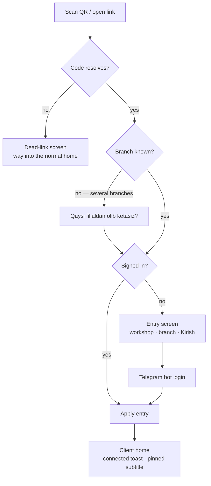

# Client entry & workshop links

How a client arrives in the client app: a workshop hands out a link or a printed QR, the
client follows it, and the app is **pinned** to that workshop from then on. This page owns
the workshop code, the entry flow, the pin and the workshops derived around it, and the
scoping the pin imposes on the rest of the client app. The screens the pin narrows keep
their own specs — the cutting editor's branch picker in [`cutting.md`](cutting.md), the
client home dashboard in [`orders.md`](orders.md#ux-client-app).

## Problem

The client app is **a tool a workshop hands its own clients**, not a marketplace. Today's
growth channel is the workshop recommending the app — and the app opened with a
platform-wide branch directory and a branch picker listing every workshop on the platform.
A workshop will not recommend an app whose first screen lists its competitors, one step away
from their prices.

Every client surface has to pass one test: *would the workshop owner show this screen to
their own client without flinching?* The directory and the cross-workshop picker fail it.
The other half of the same problem is arrival: a client scanning the QR taped to a counter
landed in a generic app that knew nothing about the shop they were standing in, and had to
find that shop in a list of strangers.

## Domain rules

- **The client enters through a workshop's door, not through a market.** The only way to
  reach another workshop is that workshop's own link. The app offers no cross-workshop
  browsing, search, or comparison surface anywhere — not a tab, not a "see more".
- **No storefront.** The link lands as close to value as possible: the ordinary home, already
  pinned. Workshop identity is a slim trust cue (name, branch, address, phone), never a
  profile page with a browsable catalog — the catalog lives inside the editor, where
  materials are actually picked.
- **The marketplace is a later phase**, and a deliberate one: public workshop cards and open
  price comparison start only when the platform itself brings the demand that would justify
  them. Nothing here builds it early; nothing here makes it harder. Until then it stays an
  explicit non-goal ([`scope.md`](../../scope.md)).

### The workshop code

Every workshop carries a permanent `public_code` — 8 characters of Crockford base32, unique
platform-wide, generated when the workshop is provisioned and backfilled for every workshop
that existed before ([`workshop.md`](../entities/workshop.md)).

The code is an **identifier, not a secret**: it resolves to information a client standing in
the shop can already see. It only has to be unguessable enough that the public lookup can't
be walked end to end, and 32⁸ behind a rate limit is comfortably that. It is also
**permanent** — printed QR codes must never rot — so there is no regenerate or revoke
operation; revisit only if a workshop is ever harassed through its link, and even then the
price is reprinting every counter's QR.

Lookup **normalizes lookalikes** before matching: `I`/`L` → `1`, `O` → `0`, `U` → `V`, case
folded. Crockford's alphabet already excludes those letters, so a code can only acquire them
by being read off paper by a human, which is exactly the case worth rescuing.

### The two link forms

| Form | Who prints it | What it does |
|---|---|---|
| `/w/{code}` | the workshop — business cards, Telegram bio | pins the workshop; one visible branch pins straight to it, several ask which |
| `/w/{code}/{branch_no}` | a branch — the QR on its counter | pins that branch, no choice step |

`branch_no` is the existing per-workshop number that already appears in every order number,
so a branch's link is derivable from paperwork it already prints.

**Resolving a link is public** — unauthenticated and IP-throttled, because it has to work
before the client has an account. It returns the minimum the landing needs: workshop name and
logo reference, and the workshop's `active` / `temporarily_closed` branches (id, `branch_no`,
name, address, primary phone, status, `closed_reason`). No prices, no catalog, no staff, no
counts. An unknown code, a `blocked` workshop, and a workshop with zero visible branches all
return **one identical not-found** — a dead link explains nothing about why it is dead. A
branch link whose `branch_no` no longer resolves falls back to the workshop-level behaviour
of the same code rather than dying, and says so, because the printed QR outlives branch
reshuffles.

### The pin

**The pin is the client's `preferred_branch_id`**
([`identity.md`](../entities/identity.md#client)) — no new entity, no second column. The
**pinned workshop** is the workshop of that branch, and every scoping rule below derives from
it at read time.

- **Entry is the one path that writes the pin.** The client sends the code and the branch
  together; the server re-resolves the code, cross-checks that the branch belongs to it and
  is visible, then sets the pin, audited like any other client profile write. A refusal
  leaves the previous pin untouched. A bare branch id can never pin — the **code is the
  capability** that names the workshop.
- **Latest entry wins**, with no confirmation friction: entering a door means walking through
  it. Re-following the same link is idempotent.
- **The pin seeds, it does not enforce.** New cutting drafts still take their branch from it,
  and changing a draft's branch still never writes back to the profile — the seeding rule
  that makes the pin reach the editor for free is unchanged.
- **A blocked workshop unpins in effect.** The session read that carries the pinned workshop
  and branch names returns them as null while the workshop is `blocked`, and that pair is the
  app's whole "is pinned" signal — so scoping silently stops applying rather than trapping the
  client behind a workshop that can no longer serve them.

### Related workshops

The workshops a client sees on **Ustaxonalarim** are **derived on read, never stored**: the
pinned workshop, plus the workshop of every branch the client has an order or a cutting draft
on (staff-minted walk-in drafts included, so a client registered at a counter finds that shop
waiting for them). `blocked` workshops are excluded.

Derivation over a stored relationship is the point: a client who followed a link, never drew
anything, and then followed another workshop's link simply loses the first — no relationship
ever existed to keep. A workshop the client does have history with survives even when it has
no visible branch left; it stays listed with its branch list empty rather than vanishing
mid-history.

### What the pin scopes

Scoping is **read-time and offer-side only**: the server's client read scope is unchanged,
and the pin narrows what the app *offers*, never what data it can render.

- **Pinned** → every new branch choice is scoped to the pinned workshop's branches. Picking
  among them is a pickup decision, not a comparison.
- **Not pinned** (organic signup, cleared storage, legacy accounts) → the cross-workshop
  picker stays exactly as it was. This population shrinks as links spread, and the
  marketplace phase will design for it deliberately rather than by default.
- **An existing draft keeps its own branch** even when that branch is outside the pinned
  workshop, and still renders normally. The pin scopes *new* choices; it never rewrites data
  or hides a drawing the client already made.

## User stories

- As a client, I want to scan the QR on a workshop's counter and land in an app already set
  to that workshop, so that I can start drawing instead of searching for them in a list.
- As a workshop owner, I want a link and a printable QR of my own, so that recommending the
  app is handing over a piece of paper.
- As a workshop owner, I want the app I recommend to show my client my shop — and not my
  competitors.
- As a client with more than one workshop behind me, I want to see the ones I actually deal
  with, with their addresses and phones, and switch which one the app is set to.

## UX

### Landing (`/w/…`)

Public route in the client app, working signed in or out. The resolved entry (code + branch)
is held in browser storage so it survives the Telegram login round-trip in the same browser;
losing that storage degrades to an ordinary un-pinned login, which is harmless — the QR can
be scanned again.

- **Signed in** → the entry applies immediately and the client lands on home.
- **Signed out** → a slim entry screen: workshop name, the greeting *"{workshop} sizni taklif
  qilmoqda"*, the branch line, and the standard **Kirish** action into the existing Telegram
  login ([`access-management.md`](access-management.md)). The entry applies once the session
  exists.
- **Branch choice** (workshop-level link, several branches) → one small list of *that
  workshop's* visible branches — name, address, status — under **"Qaysi filialdan olib
  ketasiz?"**. One tap continues. A `temporarily_closed` branch shows its reason and stays
  choosable; ordering from it is gated later, exactly as it is today. A branch link never
  shows this step.
- **Dead link** → **"Havola topilmadi"** with the plain-language body and a way into the
  normal client home. Never a raw 404; a throttled lookup gets the transient variant with a
  retry rather than a raw 429.
- The signed-out landing shows the workshop's **real logo**, over a public route scoped to the
  code rather than to a file id: it serves that one workshop's logo and nothing else, shares
  the lookup's throttle, and answers the same not-found for a workshop that has none. The
  general file route stays authenticated, and the name monogram remains the fallback whenever
  a logo is absent or fails to load.

### After entry

Entry lands on the **existing home dashboard** — no profile page, no storefront. Two things
carry the trust cue:

- a one-time toast, *"Siz {workshop} ustaxonasiga ulandingiz"*;
- the home header's pinned line, `{workshop} · {branch}`, linking to Ustaxonalarim. It
  **joins** the usual counts subtitle rather than replacing it (owner decision, 2026-09-02):
  where the app is scoped and what is waiting are two different questions, and the counts line
  is the one the client came for. With no pin the header is unchanged.

### Ustaxonalarim (`/c/branches`)

The old platform-wide branch directory, repurposed at the same route under a new name. It
lists the client's **related workshops**, pinned first with an **Asosiy** badge: workshop name
and logo, then that workshop's visible branches as rows — name, address, primary phone
(tap-to-call), status with reason. Exactly the pickup and contact information a client needs,
and nothing else: no prices, no catalogs, no CTAs into the editor.

Any listed workshop can be made the pin (**Asosiy qilish**), which runs the same entry
operation as the link — the page carries each workshop's code for it — asking which branch
when the workshop has several. Switching among workshops the client already deals with is
their own history, not discovery.

Empty state (**"Hali ustaxona ulanmagan"**) explains that the app is joined through a
workshop's link or QR, and keeps the plain "start a cutting" action for the organic path.
**The platform-wide directory is gone**, and nothing in the client app links to a list of all
workshops any more.

### Where the workshop gets its link

Owner surfaces in the workshop app ([`workshop.md`](workshop.md)), no new grant — a
**"Mijoz havolasi"** card in two places:

- **Branch detail** — the branch URL, a **Nusxalash** copy action, a QR rendered in the app
  itself (SVG, no external service), and **Chop etish**, which opens a minimal print sheet:
  workshop name and logo, branch name, the QR, and the tagline *"Chizmangizni o'zingiz
  chizing — narxini darhol bilasiz"*. The print sheet is the artifact the counter actually
  needs.
- **Workshop settings** — the same card once, with the workshop-level URL, for anything not
  tied to one counter: business cards, a Telegram bio, a sign.

The QR encodes the absolute URL on the deployment's public client origin — the same source
the Telegram bot uses for its links.

## Edge cases

- **Unknown code, blocked workshop, or workshop with no visible branch** → one identical
  dead-link screen; the lookup never distinguishes the causes.
- **Branch link whose `branch_no` is gone or invisible** → falls back to the workshop-level
  behaviour of the same code (branch choice, or a single-branch pin), flagged as a fallback.
- **Pinned branch later goes `inactive`** → the pin is not scope-enforced; the editor still
  offers the workshop's other visible branches, and with none visible its existing
  pick-a-workshop gate takes over. Ustaxonalarim keeps showing the workshop with its status.
- **Pinned workshop later blocked** → the session read nulls the pinned names, so the app
  behaves as un-pinned: the cross-workshop picker returns and the workshop drops off
  Ustaxonalarim. The stored `preferred_branch_id` is left alone and revives on unblock.
- **Entry while a draft is open elsewhere** → the pin changes; the open draft keeps its
  branch. No draft is ever re-branched implicitly.
- **Same link followed twice** → idempotent; the toast shows again, nothing else changes.
- **Two tabs, two links, one login** → the last applied entry wins, and both toasts
  truthfully name what they connected.
- **Client with a legacy `preferred_branch_id`** (set before this feature) → treated as a pin
  like any other; derivation and scoping just work.
- **Staff walk-in flow** → unaffected. It is locked to the staffer's selected branch and never
  consults the client's pin ([`orders.md`](orders.md#staff-created-orders-walk-in-clients)).
- **Related workshop with zero visible branches** → stays listed with an empty branch list;
  history is not erased by a branch reshuffle.
- **Lost browser storage between landing and login** → an ordinary un-pinned login; the client
  scans again.

## Next

- [`cutting.md`](cutting.md) — the editor and the branch picker the pin scopes.
- [`workshop.md`](workshop.md) — the branch and settings screens that publish the link.
- [`identity.md`](../entities/identity.md#client) — the client record the pin lives on.
