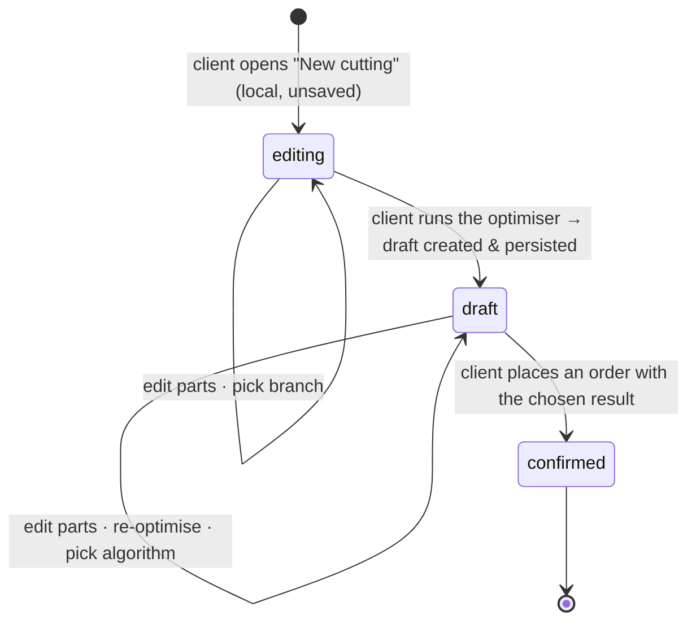

# Cutting optimization

The 2D guillotine cutting-stock solver: in, a list of parts where each part picks its own
panel material and per-side edge materials; out, a per-material panel layout, a weighted
waste %, and the structural metrics the order needs for pricing. Cutting is its own module —
no pricing, no payment, no stock logic — and exposes results to the order flow in
[`orders.md`](orders.md).

## Problem

Customers describe parts over the phone; the workshop optimises by hand or with a desktop
tool. The customer can't see the layout, the waste, or the price until the shop tells them.
And a real job — a wardrobe, a kitchen — uses several materials at once: DSP shelves, MDF
backs, plywood drawer bottoms, plus a leftover panel the customer brings from a previous job
and PVC edge tape in different colours and thicknesses for different visible faces. A
single-material flow rejects half the work; forcing one cutting per material rejects the
other half (the user has to reconcile panels and prices across runs); a flow that only
picks edge _thickness_ without naming the actual tape forces the workshop to guess which
manufacturer's spool to load and surprises clients at the counter.

## Domain rules

### What's in a cutting

A **cutting draft** is the working surface a client — or, for a walk-in order, workshop staff
on the client's behalf ([`orders.md`](orders.md#staff-created-orders-walk-in-clients)) — edits
and re-optimises until an order is placed. It's private (see _Access_) and persists
indefinitely (no expiry; the client's self-made drafts cap at 50). The draft becomes a server
entity on the **first optimise** — the editor opens local and unsaved, so abandoned/empty
editors never mint a draft (see _Lifecycle_).

A draft owns:

- **A `preferred_branch_id` — required to build the parts list.** Seeded from the client's
  stored [profile default](../entities/identity.md#client) when one exists; the current profile
  UI does not expose setting that default. Selecting a workshop is **mandatory**: the catalog is
  scoped to the chosen branch, so the parts editor stays gated behind a "pick a workshop" prompt
  until one is set, and **Optimise** is disabled without it. The client can **change** the branch
  (there is no "clear to none" — the field is required once you're editing), and the order step
  defaults to it. Switching branches is not a data operation: parts already in the list stay
  editable even when their materials aren't carried at the new branch (see _Recovery
  affordances_). The column stays nullable in storage for drafts that predate this rule and for
  the brief unsaved window before the first branch pick.
- **Parts.** Each part picks its own **panel** material from the platform catalog,
  dimensions (length × width × quantity), and a per-side **edge** material (top, bottom,
  left, right — each `null` for no banding, or a catalog edge material). Every material is
  **workshop-supplied**: the editor offers no "I'll bring it myself" choice (the snapshot's
  `material_source` / side `source` fields are always `shop`; see _Parts and materials_).
  Grain direction is a property of the chosen panel material, and each part stores
  `follow_grain` (default `true`) to say whether that part must respect it. The instruction
  matters only on grained panels. Edge thickness and colour are properties of the chosen edge
  material — the user picks the tape, not a thickness. A part may also carry an optional
  display `name`; blank names stay `null` and render as `D{row}` in the editor, SVG, and PDF.
- **Algorithm results.** Re-running the optimiser produces one result per available
  algorithm in a single call against the same input. All N results are kept on the draft until
  the next run replaces them. The client picks one as the **chosen** result; the chosen one is
  what binds to an order.

Each algorithm result records: `algorithm_name`, `algorithm_version`, per-material panels
and their placements, weighted `waste_percentage`, `panels_used_by_material`,
`total_cut_length_mm`, `total_edge_length_mm`, `edge_length_by_material` (integer millimetres
per edge material; UI/pricing displays metres; only the `shop`-source length feeds the order's
billed and consumed totals; `own` length is tracked separately for the cutting plan).

### Lifecycle

- `editing` is **local and unsaved** — the editor before the first optimise. No server draft
  exists yet, so navigating away discards the entry (the editor warns first). The draft is
  created and persisted on the **first optimise**, which is also when autosave begins.
- `draft` is mutable. `confirmed` is immutable and kept forever — it is the historical
  record an order points at.
- Re-running the optimiser on a `draft` replaces only optimiser-generated candidates. A
  2D-Place MAP import result (`source=imported_map`) is preserved and stays chosen until the
  user explicitly picks another result or edits the parts list. Editing parts invalidates
  every candidate, including imported MAP layouts. No intermediate-run history.
- On order placement, the **chosen** algorithm result becomes the draft's frozen snapshot and
  the draft flips to `confirmed`. Other algorithm results from the same run are discarded at
  this point.

**Why create lazily.** Minting the draft only on the first optimise keeps abandoned and empty
editors out of the drafts list and the 50-draft cap; the accepted cost is that input before
the first optimise isn't autosaved (the editor warns before discarding it). Revisit if clients
report losing pre-optimise work — then back the unsaved editor with local storage, or restore
eager creation.

### Parts and materials

- A part's panel material is a reference to the **platform catalog** (the shared list
  curated by platform operators), but the client only ever picks from the **selected
  branch's carried materials** — a branch is required before the parts editor opens
  (see _Branch selector_), so the picker is always branch-scoped. The branch indicator
  (below) flags any already-entered row whose material the current branch can't fulfil.
- **All materials are workshop-supplied.** The data model keeps a per-part
  `material_source` and a per-side edge `source` (`shop` / `own` — the optimiser, pricing,
  and the workshop side still understand both, and historical orders may carry `own`), but
  the client flow no longer offers the choice: the editor always writes `shop`, and a
  legacy draft saved with `own` parts or sides is normalized back to `shop` when it loads.
- **Edge tape is a catalog material too.** Each side of a part is either `null` (no banding)
  or a catalog edge material. The picker UX pins decor-matching edges at the top of one
  material list so the common case ("match the panel decor in 0.4 mm") is a single tap
  without hiding the rest of the catalog (see _UX_).

### The optimiser

- **One run, multiple materials, multiple algorithms.** A run takes all parts, groups them
  by panel material, and produces an independent layout per material (panels aren't shared
  across materials — different thicknesses, colours). Every available algorithm runs against
  the same input in the same request; all results are returned.
- **Winner = lowest weighted waste %.** Pre-selected as the chosen result; the client may
  switch to a different algorithm's result if the trade favours fewer panels or different
  cut topology.
- **Guillotine cuts only.** A cut runs edge-to-edge; the algorithm recursively splits the
  panel into smaller rectangles. Non-guillotine, L-shaped, and CNC paths are out of scope.
- **Tekstura lock = part instruction.** Each part carries `follow_grain` (default `true`).
  When it is true the part is rotation-locked; when false the algorithm may rotate the part
  90°. If a locked part can't fit in its forced orientation, the run fails with
  `impossible_grain`. The catalog `panel.grain_direction` flag remains metadata for
  materials, but it no longer gates this per-part instruction.

| Material `grain_direction` | Part `follow_grain` | Rotation                |
| -------------------------- | ------------------- | ----------------------- |
| `true`                     | `true`              | locked; no 90° rotation |
| `true`                     | `false`             | free rotation           |
| `false`                    | `true`              | locked; no 90° rotation |
| `false`                    | `false`             | free rotation           |

- **One catalog material → one standard panel size.** The same spec in another size is a
  separate catalog material (size is part of its identity and name); custom panel sizes
  per run are future.
- **Global constants.** Kerf 4 mm. Edge trim 10 mm per side (usable area = panel − 2× edge
  trim).
- **Edge-banding length is computed here.** For each part edge with a banding material set,
  the edge length is the part's length (top/bottom) or width (left/right). Totals roll up
  **by edge material** (`edge_length_by_material`, integer millimetres) — this is the
  **geometric banded length**.
  The metres an order actually **bills and consumes** add a fixed per-side trim overhang
  (masters glue tape long, then trim it flush) — a system constant, the same at every branch
  — so the **consumed** figure is geometry + that trim; see [`orders.md`](orders.md#pricing)
  for the rule. The optimiser emits the geometry, and because the overhang is constant the
  consumed metres are known without a branch.
- **No stock check at cutting time.** The optimiser says only "N panels needed of material
  X" and "L metres needed of edge material Y." Stock is never a gate: the operator sees a
  non-blocking low-stock warning at order verification and the inventory module
  auto-decrements as production completes (see [`orders.md`](orders.md)).
- **No pricing computed here.** Pricing depends on the branch — branches set their own
  per-panel cutting rate and their own per-metre edge price. The optimiser yields
  structural metrics only; price first appears at the order step.

### Limits

| Constraint                       | Value                                                                                         |
| -------------------------------- | --------------------------------------------------------------------------------------------- |
| Part minimum                     | 50 mm × 50 mm                                                                                 |
| Part maximum                     | panel − 2× edge trim (for the part's chosen panel material)                                   |
| Parts per optimisation           | ≤ 100 (across all materials)                                                                  |
| Import file                      | ≤ 1 MiB; `.csv`, БАЗИС-Мебельщик `Спецификация в XML` `.xml`, or 2D-Place `.map`              |
| Panels per material per result   | ≤ 20 (a single material above this must be split into separate orders)                        |
| Open self-made drafts per client | ≤ 50 (anti-abuse; client deletes to add more; staff-minted drafts don't count — see _Access_) |
| Hard timeout per run             | 5 s → `optimization_timeout`                                                                  |

### Access

- A client sees only their own **self-made** drafts and confirmed results. A staff-minted
  draft (below) is **invisible to the client — list and get — until the order is placed**
  (symmetric privacy: staff never see a client's self-made drafts either), and it doesn't
  count toward the client's 50-draft cap (the cap stays a backstop on the client path only).
- A draft minted by workshop staff for a walk-in
  ([`orders.md`](orders.md#staff-created-orders-walk-in-clients)) is stamped with the
  creating workshop (`created_via_workshop_id` —
  [`../entities/cutting.md`](../entities/cutting.md)). Staff access to it is
  **workshop-scoped, not branch-scoped**: any staffer holding `manage_orders` in that
  workshop may pick it up. Deliberate: the colleague who started a walk-in draft may be
  off-shift or at another desk, and branch- or per-creator scoping would strand the draft
  mid-sale. Revisit if intra-workshop draft visibility becomes a confidentiality concern —
  then tighten to branch scope. Outside the minting workshop a draft simply doesn't exist
  (404, no existence oracle).
- Abandonment of a staff-minted draft is a **recorded punt**: there is **no staff draft
  listing in v1**. The editor's leave-guard offers to discard (delete) a never-ordered
  walk-in draft on exit; a draft left behind anyway is invisible to the client and harmless.
  Revisit when workshops ask to resume walk-in drafts — then add a listing.
- Workshop staff and the owner see confirmed results bound to orders in their scope; the PDF
  download is gated the same way. Every optimisation run is audited.

## User stories

- As a client, I want all my parts in one cutting even when they need different materials,
  so I don't run multiple cuttings and reconcile panels / prices afterwards.
- As a client, I want to compare algorithm results before committing, so I can pick "fewer
  panels" over "lowest waste" when I care more about cost than offcuts.
- As a client, I want to choose the workshop up front so I only ever pick materials it can
  actually cut — but when I switch workshops I don't want that to throw away parts I've
  already entered.
- As a client, I want to filter the catalog by manufacturer so I get the brand the workshop
  near me reliably carries (Egger vs. Kronospan).
- As a client, I want the matching edge for my panel decor offered first so I'm not hunting
  through tens of edge SKUs for the obvious choice.
- As a client, I want the draft saved automatically, so I don't lose it if I close the
  browser.
- As a workshop user (cutter), I want the confirmed layout and PDF on my tablet at the saw,
  so I can cut without translation.
- As a client, I want to import a 2D-Place `.map` file and keep its exact sheet layout, so a
  layout prepared outside the app can become the chosen cutting result without rerunning the
  optimiser.

## Imports

The cutting import endpoint accepts three source formats:

- CSV part lists. The parser detects a likely header row and asks the user to map columns
  when needed.
- БАЗИС-Мебельщик XML specifications. The parser imports rectangular panel details and
  reports ignored holes, grooves, and non-panel objects as warnings.
- 2D-Place `.map` layouts. The parser keeps the external sheet layout and returns
  `source_format=map_2dplace`, `material_groups`, and `map_layout`.

For `.map`, the wizard groups sheets by exact size and asks the user to pick one catalog panel
material for each sheet-size group. The material step shows a live size match indicator: matching
catalog panel dimensions keep the external placement, while mismatched dimensions degrade to a
parts-only import. If any imported detail has banding marks, the wizard asks for one edge material
and applies it to all marked sides. The commit endpoint validates the selected panel dimensions
against the MAP sheet dimensions, validates that every placement matches the generated parts,
rejects overlapping/out-of-bounds placements, then creates a new draft with an imported result
already chosen.

Imported MAP results are stamped `algorithm_name=imported-2dplace-map`,
`algorithm_version=map-1`, `source=imported_map`, `kerf_mm=0`, and `edge_trim_mm=0`. Waste and
cut/edge metrics are recomputed from the persisted placements; MAP waste/remainder rectangles
are stored as panel `offcuts` and used only for preview, not pricing. The UI labels these results
`Fayldan joylashuv`. If the user edits the parts list, the editor warns that the imported
layout will be removed before the draft is patched.

## UX — the cutting wizard (client app)

A single workspace at `/c/cutting/:id` (`/c/cutting/new` before the first optimise; no stepper
— one editing surface above, one results panel below). Entry is the client app's home **New
cutting** button, which opens an empty, unsaved editor; the draft is created and persisted on
the first **Optimise** (see _Lifecycle_). A secondary **My drafts** entry lists unbound drafts.

### Branch selector (top of the editor)

A small affordance under the page header naming the active branch. Choosing one is
**required** — the catalog is scoped to the branch, so until one is set the parts editor
shows a **"pick a workshop first"** gate (a `store`-icon empty state with a single **Pick a
workshop** button) in place of the parts list, and a caption on the selector explains the
list is built from the chosen workshop's catalog.

### Parts editor

Rows are grouped visually by panel material in first-seen order, with a leading
`Material tanlanmagan` group for new rows before a material is picked. Each row has a `Nomi`
input, dimensions, quantity, a grained-material-only `Tekstura` toggle, four compact edge cells,
duplicate, and an overflow menu for material replacement and deletion. `Enter` moves through
cells and appends a new inherited row from the last cell of the last row. Deleting a row shows an
undo toast; clearing all rows still requires confirmation.

The edge-tape registry above the rows is derived from the current part sides. Distinct
`(edge material_id, source)` pairs get numbered chips; row edge cells show those numbers, so a
large cutting list can be scanned without repeating long tape names in every row.

### Results

Results render as one active variant at a time. When an imported MAP layout and an optimiser
layout both exist, tabs switch between `Fayldagi joylashuv` and `Optimizer varianti` without
changing the chosen result; `Shu variantni tanlash` updates `chosen_result_id`. The results area
shows metric cards, a sheet-thumbnail strip, one large sheet SVG, offcut/remainder overlays, and a
sticky footer summarising the currently chosen result before checkout.

- **None set** → "No workshop selected" + a **Pick a workshop** button.
- **Set** → just the branch name, e.g. "Yunusobod · Furniture House" + a **Change** button.
  There is **no Clear** — the field is required once you're editing.

Picking or changing the branch opens a single flat branch list — one row per branch, naming
the branch, its workshop, and today's hours, with a status pill (`temporarily_closed`
branches stay selectable, the row just flags why); a search field appears once the list is
long. One tap selects a branch; **Apply** sets the draft's `preferred_branch_id`.
**Changing it never edits the parts list.** Rows that reference materials the new branch
doesn't carry get a per-row warning + recovery affordances (below).

### Parts editor (top)

A mode switch at the top: **Manual entry** (default) · **Upload file** (`.csv` / `.xml`).
Upload opens the import wizard; manual entry stays as the plain row editor. The expected
source is БАЗИС-Мебельщик's **Спецификация в CSV** or **Спецификация в XML** export;
Excel-made lists must be saved as CSV first. The page header carries a **Clear parts list**
trash icon, shown only once there are rows. The primary **Optimise** button lives in a
**sticky bottom action bar** — alongside the row / piece count (and, when it's disabled, the
reason shown inline) — so it stays reachable above a long list.

Adding a row follows the content rather than a fixed header control: an empty editor shows a
centred **Add part** call-to-action, and once there are rows a dashed **Add part** tile sits
beneath the last row (there is no separate header add button).

On wide layouts the parts table renders as a dense, scannable grid: a shared column header
and one compact single-line row per part (the panel cell carries a colour swatch, a separate
texture-follow column, and a leading row checkbox for bulk actions;
a trailing **Delete** trash button removes the row). On narrow screens each row stacks into
a labelled card.

### File import wizard

The import wizard is stateless: it never stores the file, creates a draft, or writes to the
database. It only parses a local `.csv` or БАЗИС-Мебельщик XML file into ordinary editor
parts.

1. **File.** The client picks a file; the UI pre-checks the 1 MiB size cap and `.csv`/`.xml`
   extension, then calls `POST /api/v1/client/cutting/import/parse` without a mapping.
2. **Columns.** CSV imports return a preview and suggested column roles. The user confirms
   or changes the mapping and sets how many top rows to skip. Length and width must be
   mapped before continuing. БАЗИС-Мебельщик XML imports skip this step because the source
   already carries typed fields.
3. **Materials.** Materials from the file become groups only. The user must pick a panel
   catalog item for every panel group and an edge catalog item for every edge group. When
   the CSV carries a `Толщина`/thickness column, or XML material carries `Толщина`, the
   wizard shows that value as a muted hint next to the panel group. The uploaded file name
   is shown above the material list, which helps the БАЗИС-Мебельщик "by material" export
   mode where the material name lives in the file name. There is deliberately no automatic
   material matching.
4. **Report and load.** The wizard shows total parts/pieces, skipped rows, and warnings
   before it writes anything into the editor. Empty editors get a single **Load** action;
   non-empty editors offer **Append** and a danger-confirmed **Replace**.

XML support is intentionally narrow: it accepts only БАЗИС-Мебельщик's project-root
`<Проект>` export from **Спецификация в XML**. The parser flattens every
`Изделие/СписокЭлементов/Объект`, imports only `ТипОбъекта = Панель`, multiplies object
quantity by product quantity, reads `Длина_детали_без_облицовки` / `Ширина_детали_без_облицовки`
when present, and maps `Горизонтальная` / `Вертикальная` texture orientation to
`follow_grain = true`. Non-panel objects are counted in the report, not imported. Holes,
grooves, non-rectangular panels, and edges marked "see drawing" import the rectangular part
but appear as warnings.

Rows skipped because they cannot be represented (for example an `Итого` footer in a numeric
column) appear in the report. Recoverable domain problems still import: a sub-50 mm part is
loaded and then flagged by the editor's normal validation. Imports over 100 pieces are
rejected at parse time; imports that make the current editor exceed 100 pieces show a notice
and the optimiser remains blocked until rows are removed.

The parts table:

| Column       | Behaviour                                                                                                                                                                                                                                                                                                                                                                                                                                                                                                                                                                                                                                                                                                                                                                                                                                                                                                                                                |
| ------------ | -------------------------------------------------------------------------------------------------------------------------------------------------------------------------------------------------------------------------------------------------------------------------------------------------------------------------------------------------------------------------------------------------------------------------------------------------------------------------------------------------------------------------------------------------------------------------------------------------------------------------------------------------------------------------------------------------------------------------------------------------------------------------------------------------------------------------------------------------------------------------------------------------------------------------------------------------------- |
| **#**        | row number                                                                                                                                                                                                                                                                                                                                                                                                                                                                                                                                                                                                                                                                                                                                                                                                                                                                                                                                               |
| **Panel**    | searchable dropdown of the platform catalog (`panel` kind); each result shows manufacturer + decor / colour + thickness + size. The picker's own type-to-filter search is the only narrowing inside the parts editor — there is no separate manufacturer / type / thickness / sort bar (it duplicated the search and added clutter). The picker is always filtered to the selected branch's carried materials — a branch is required before the editor opens, and materials the branch doesn't carry are not offered (there is no widen-to-full-catalog toggle; a row that already references a not-carried material after a branch switch keeps it, flagged by the per-row warning). Selected row shows the picked panel's short label (e.g. `Egger DSP H1334 18 mm · 2750×1830`). A trailing **✕** clears the pick and reopens the list (showing the full set) for a fresh search — re-picking otherwise means manually clearing the typed label first |
| **Tekstura** | per-part `follow_grain` toggle. Pressed means the part is rotation-locked; unpressed means rotation is allowed. This instruction is honoured directly for the part, regardless of the selected panel's catalog `grain_direction` flag                                                                                                                                                                                                                                                                                                                                                                                                                                                                                                                                                                                                                                                                                       |
| **L mm**     | numeric; validated against the part-min / part-max bounds of the chosen panel                                                                                                                                                                                                                                                                                                                                                                                                                                                                                                                                                                                                                                                                                                                                                                                                                                                                            |
| **W mm**     | same                                                                                                                                                                                                                                                                                                                                                                                                                                                                                                                                                                                                                                                                                                                                                                                                                                                                                                                                                     |
| **Qty**      | integer ≥ 1                                                                                                                                                                                                                                                                                                                                                                                                                                                                                                                                                                                                                                                                                                                                                                                                                                                                                                                                              |
| **Edges**    | per-side summary — a small panel diagram (line weight signals thickness) + a one-line label (e.g. `H1334 · 0.4 mm` · `T·B · H1334 2.0` · `Mixed · 2 edges` · `None`). Tap → edge picker                                                                                                                                                                                                                                                                                                                                                                                                                                                                                                                                                                                                                                                                                                                                                                  |
| **Delete**   | a trash icon button removes the row                                                                                                                                                                                                                                                                                                                                                                                                                                                                                                                                                                                                                                                                                                                                                                                                                                                                                                                      |

The grain toggle (small arrow + `Tekstura`) appears on the row.
Pressed means `follow_grain=true` and the part is rotation-locked; unpressed means
`follow_grain=false` and the optimiser may rotate it.

**Edge picker** (opens from the Edges cell — popover on desktop, bottom sheet on mobile):

- **One surface, no modes.** The picker asks two questions first: which sides need edge
  banding, and which tape should be used. There is no separate "match panel" section,
  "browse other materials" section, "customise per side" button, or standalone "apply to
  all" button.
- **The panel diagram is the centerpiece.** Compact quick-pattern chips sit above it
  (**None**, **All sides**, **Top + bottom**, **Left + right**) — each chip carries a mini
  rectangle that draws its banded sides thick so it reads spatially, not just by text — and
  the diagram below shows
  the part with all four sides **labelled** (top / bottom / left / right) — tap a side to
  toggle its banding; banded sides fill.
  Choosing a tape applies it only to the **currently banded** sides; with **no** side
  selected the tape is just remembered (highlighted in the list) and used by the next side
  toggled on — picking a tape never auto-bands all four sides.
- **The ranked tape list is revealed on demand.** Once a tape is chosen the list collapses
  to a one-line summary (swatch + tape + thickness + how many sides) with a **Change**
  toggle; opening it — or arriving at a part with no banding yet — shows the full list.
  Edges with the same `decor_code` as the panel are pinned first with a **Recommended**
  marker; same-`color` matches follow; the rest of the **branch's carried** edge materials
  continue in the same list, filtered by search + a thickness dropdown — like the panel
  picker, tapes the branch doesn't carry are not offered (a tape already applied to the
  part stays listed so the selection can't vanish; the per-side warning flags it). If no
  panel is selected, matching appears once the panel is picked but catalog search still
  works.
- **The edge picker applies to the row it was opened from.** The footer has only **Cancel**
  and **Apply**; **Apply** saves the selected side pattern and tape to the row whose
  **Edges** cell opened the picker, and never edits sibling rows from inside the picker.
  **Bulk edge apply** is instead an explicit **list-level** action (see _Bulk row actions_
  below) — the picker stays single-purpose, exactly as foreseen here.

**Bulk row actions (desktop).** On wide layouts the parts table gains a leading checkbox
column (and a select-all in the header). Selecting one or more rows reveals a bulk bar with
**Apply edges** (opens the edge picker seeded from the first selected row and writes the
applied side pattern / tape to every selected row), **Change material** (a small
picker that sets one panel material on every selected row), and **Delete**. This is the
list-level path for re-banding or re-materialing many identical parts without N picker
round-trips — a desktop power feature; on mobile each row is edited individually (its own
fields plus the per-row delete button).

Per-row inline validation; when something blocks the optimiser the reason is shown inline
next to the (disabled) **Optimise** button in the sticky bar — there is no separate roll-up
banner under the table.

### Recovery affordances — when materials aren't carried at the preferred branch

When `preferred_branch_id` is set and a row references materials the branch doesn't carry,
the row is **not** disabled, **not** dropped, **not** moved. It stays in place, editable,
with a **per-row warning** on each affected row (there is no separate top-level roll-up
banner — the warning lives on the row that has the issue):

- The warning reads _"Not at <branch> — pick a different material or change the branch."_
  Recovery is a material swap: the panel is swapped on the row's panel cell (the picker is
  pre-filtered to the branch), and when an edge side is affected the warning carries an
  inline **Pick a different tape** button that opens the edge picker with the same inline
  note visible.
- The row's **Delete** (trash) button still works; removal is opt-in and never automatic.

### Clearing the parts list (deliberate)

A **Clear parts list** trash icon next to the page header runs a danger-styled action
(confirmation: _"Remove all N parts? This can't be undone."_). This is the only way to wipe
parts wholesale; changing the branch never invokes it.

### Run and the result panel

A primary **Optimise** button in the sticky bottom action bar. Disabled while running (5 s
cap), then disabled until any row changes (so re-tapping doesn't re-run a stale layout); the
disable reason is shown inline next to it. On a brand-new
(unsaved) editor the first **Optimise** also creates and saves the draft before running, after
which the URL becomes `/c/cutting/:id` and autosave takes over.

The result panel only renders once an optimise has produced a result (or an error to surface);
before the first run there is **no empty placeholder** — the parts editor and the sticky
Optimise button are all there is to see.

On success, the panel scrolls into view with three regions:

1. **Headline metrics.**
   - Weighted **waste %** (across all panel materials).
   - **Panels used** total and per-material breakdown.
   - **Edge tape** total length — the **consumed** metres (geometric banding + the fixed
     30 mm trim overhang per banded side), with a breakdown listing each edge material
     that has metres (e.g. `Rehau H1334 0.4 — 8.4 m · Rehau H1334 2.0 — 3.2 m`). When some
     sides are `own`, the breakdown splits shop and own metres per material. The metric
     carries a compact split such as `edge sides 12.8 m + trim overhang 0.6 m`; no long
     explanatory message is shown in the flow. Because the trim overhang is a fixed system constant,
     this is the real figure from the cutting result onward; only price waits on the
     branch's rates ([`orders.md`](orders.md#pricing)).
   - **Cut length total** (m), informational.
   - **Parts placed** count, e.g. `24 / 24` ✓ (red with a per-part list if any didn't fit).
   - The chosen **algorithm** name plus a **Compare algorithms** link → expander with one
     row per algorithm (name, waste %, panels, cut length) and a **Use this one** button
     per row to swap the visualisation.

2. **Panel layout visualiser.**
   - A material tab strip (`DSP H1334 18mm · 2750×1830 · 3 panels` ·
     `MDF Qum 16mm · 2800×2070 · 1 panel`). Within a material, panel tabs
     (`Panel 1 / 2 / 3`).
   - The active panel renders as an interactive SVG (pan / zoom on mobile); each placed
     part carries one centred label — display name + dimensions + a `↻` marker when the
     placement is rotated (e.g. `Polka 1500×800 ↻`) — rather than an opaque part id. Labels
     hide on placements too small to carry them. Offcut rectangles overlay as dashed
     outlines: green with a `Qoldiq …×… — sizda qoladi` label when usable, red `chiqit`
     when waste. Selecting a placement highlights it in the side legend, which leads with
     the dimensions (+ quantity index, rotation indicator).
   - **Banded sides** are flagged by a short, centred accent tick set just inside the
     placed rectangle, on each banded side only (not a full-length frame) — so the cutter
     sees which edges take tape at a glance. The side mapping follows the part's own edges;
     a rotated placement maps them 90° clockwise. Tick inset, length and weight are
     normalised, so banding reads the same on a large and a small panel.

3. **Actions.**
   - **Place order with this cutting** → routes into the order wizard
     (see [`orders.md`](orders.md)).
   - **Download PDF** — the print-ready cutting map for the saw operator: one page per
     panel, page oriented to the sheet (landscape for wide sheets), with the visualiser's
     exact geometry, labels, banding ticks and offcut overlays; header with material +
     sheet size + fill (`List N · … · KIM %`), footer with the algorithm stamp + waste.
     Text is rendered with an embedded Unicode font, so Cyrillic material and part names
     print correctly.
   - **Edit parts** scrolls back to the editor; any row change marks the result stale; the
     next **Optimise** replaces it.

Pricing is **not** shown on this screen — totals depend on the branch and surface at the
order step.

### My drafts (`/c/cutting/drafts`)

A list of unbound drafts. Each row: a short label (`14 parts · 6 panels`), the dominant
panel material, last-edited time (relative), the preferred branch chip when set, a Delete
action. Empty: "No saved cuttings — start a new one." No expiry chip — drafts persist until
the client deletes them or hits the cap.

### Read-only view (`/c/cutting/:id` when `confirmed`)

Same workspace, editing disabled, with a banner naming the bound order.

### Workshop side

The workshop app runs the **same editor component** for staff-created walk-in drafts
([`orders.md`](orders.md#staff-created-orders-walk-in-clients)) in a **fixed-branch mode**:
the branch selector is hidden, the branch is locked to the branch the flow was entered from
and frozen into the draft at creation (a later topbar branch switch never retargets an
in-progress draft), and a persistent **identity strip** in the editor header names the
walk-in client (name + phone). Everything else — parts editor, edge picker, optimise,
results — is this page, unchanged.

An order's **Cutting** tab embeds the SVG of the order's confirmed result and a PDF link.

## Edge cases

- **`material_not_found`** — a part references a catalog id that's missing or removed → the
  editor flags the row; the optimiser refuses to run.
- **`part_too_large` / `part_too_small`** — outside the bounds for the chosen panel
  material → the wizard names the offending part and the max size.
- **`impossible_grain`** — a locked part (`follow_grain=true`) can't fit in its forced
  orientation → the row is flagged.
- **`too_many_parts` / `too_many_panels_needed`** — over the caps → reject; split the job.
- **`optimization_timeout`** — no result within 5 s → retry or simplify.
- **`draft_limit_exceeded`** — > 50 open drafts → delete some first.
- **Unsupported import file** — the wizard accepts `.csv` and БАЗИС-Мебельщик
  **Спецификация в XML** `.xml`; `.xlsx`, legacy `.xls`, proprietary CAD files, PDFs,
  arbitrary JSON/XML/text, empty files, oversized files, and binary junk are rejected with a
  clear error before they touch the editor.
- **Import footers / summary rows** — non-empty rows whose mapped numeric cells cannot be
  parsed, such as an `Итого` footer, are listed in the import report as skipped rows with
  the original row number and preview text.
- **Recoverable imported typos** — imported parts below the 50 mm minimum or otherwise
  outside the chosen panel's bounds are loaded into the editor and flagged inline by the
  existing validation, so the client can correct them instead of losing the row.
- **Import piece cap** — a parsed file above 100 pieces is rejected; an append that makes
  the editor exceed 100 pieces is allowed to land but the optimiser stays blocked until the
  client removes rows.
- **All-`own` cutting** — no `shop` materials at all; the order step accepts any active
  branch with a saw.
- **Edges all `own`** — the order's `edge_length_by_material` still records the total
  metres per material (informational for the cutting plan / PDF), but stock decrement skips
  every side at `edge_banding → ready` because no side is `shop`.
- **Catalog change while a draft sits** — if a material a part references is later removed
  from the catalog, the draft is flagged on next open with that row highlighted; the
  client picks a replacement before re-running.
- **`preferred_branch_id` set but the branch later goes `inactive`** — the branch is
  treated as "no carried materials"; the wizard surfaces the same not-carried recovery
  affordances on every row, plus a banner pointing at the branch's status; the client
  **changes** the branch to unlock (the selector offers no clear, only a switch).
- **`cutting_result_not_usable`** — the order step finds the draft is already `confirmed`
  (concurrent placement, or back-navigation after placing) → redirect to its detail.
- **Algorithm replaced later** — old `confirmed` results stay exactly as they were,
  stamped with the old algorithm version; their PDFs are not regenerated.
- **A workshop deactivates an edge material that's set as a per-side preference on an
  in-flight draft** — same handling as a deactivated panel: row flagged on next open, edge
  side cleared with a one-tap "pick replacement" affordance that opens the edge picker with
  that side active.

## Next

- [`orders.md`](orders.md) — how a chosen cutting result becomes a placed order and which
  cutting metrics drive which price component.
- [`catalog-inventory.md`](catalog-inventory.md) — the platform catalog (manufacturers,
  panels, edges) the wizard reads from, and the branch's selection that scopes the
  editor's catalog.
