# Cutting optimization

The 2D guillotine cutting-stock solver: in, a list of parts where each part picks its own
panel material and per-side edge materials; out, a per-material panel layout, a weighted
waste %, and the structural metrics the order needs for pricing. Cutting is its own module —
no pricing, no payment, no stock logic — and exposes results to the order flow in
[`orders.md`](orders.md).

## Problem

Customers describe parts over the phone; the workshop optimises by hand or with a desktop
tool. The customer can't see the layout, the waste, or the price until the shop tells them.
And a real job — a wardrobe, a kitchen — uses several materials at once: DSP shelves, MDF
backs, plywood drawer bottoms, plus a leftover panel the customer brings from a previous job
and PVC edge tape in different colours and thicknesses for different visible faces. A
single-material flow rejects half the work; forcing one cutting per material rejects the
other half (the user has to reconcile panels and prices across runs); a flow that only
picks edge *thickness* without naming the actual tape forces the workshop to guess which
manufacturer's spool to load and surprises clients at the counter.

## Domain rules

### What's in a cutting

A **cutting draft** is the working surface a client edits and re-optimises until they place an
order. It's private to the client and persists indefinitely (no expiry; cap at 50 open
drafts).

A draft owns:

- **An optional `preferred_branch_id`.** Seeded from the client's
  [profile default](../entities/identity.md#client); the client can change or clear it on
  the draft without touching the profile. When set, the material picker is **pre-filtered**
  to materials this branch carries and the order step defaults to this branch — but the
  filter is a help, never a data operation: parts already in the list stay editable even
  when their materials aren't carried at the new branch (see *Recovery affordances*).
- **Parts.** Each part picks its own **panel** material from the platform catalog, its own
  source (`shop` / `own`), dimensions (length × width × quantity), and a per-side **edge**
  material (top, bottom, left, right — each `null` for no banding, or a catalog edge
  material with its own source). Grain is **not** a per-part choice — it's a property of
  the chosen panel material. Edge thickness and colour are properties of the chosen edge
  material — the user picks the tape, not a thickness.
- **Algorithm results.** Re-running the optimiser produces one result per available
  algorithm in a single call (all run in parallel against the same input). All N results are
  kept on the draft until the next run replaces them. The client picks one as the **chosen**
  result; the chosen one is what binds to an order.

Each algorithm result records: `algorithm_name`, `algorithm_version`, per-material panels
and their placements, weighted `waste_percentage`, `panels_used_by_material`,
`total_cut_length_mm`, `total_edge_length_mm`, `edge_length_by_material` (metres per edge
material, only the `shop`-source metres feed the order's billed and consumed totals; `own` metres are tracked
separately for the cutting plan).

### Lifecycle

```mermaid
stateDiagram-v2
    [*] --> draft : client opens "New cutting"
    draft --> draft : edit parts · run optimiser · pick algorithm
    draft --> confirmed : client places an order with the chosen result
    confirmed --> invalidated : order modify re-runs the optimiser (a new result is bound; this one is kept for audit)
    confirmed --> [*]
    invalidated --> [*]
```

- `draft` is mutable. `confirmed` and `invalidated` are immutable and kept forever — they're
  the historical record an order points at.
- Re-running the optimiser on a `draft` replaces all algorithm results in-place. No
  intermediate-run history.
- On order placement, the **chosen** algorithm result becomes the draft's frozen snapshot and
  the draft flips to `confirmed`. Other algorithm results from the same run are discarded at
  this point.

### Parts and materials

- A part's panel material is a reference to the **platform catalog** (the shared list
  curated by platform operators). All catalog `panel` materials are pickable in the editor
  regardless of branch availability; the branch indicator (below) flags where this
  composition can be fulfilled.
- A part's `material_source = shop` means the workshop supplies the panel; `own` means the
  client brings it, and only the cutting service is purchased for that part. Different
  parts can have different sources — including parts of the same material (some from shop,
  some brought).
- An `own` part still picks a catalog material — the entry supplies panel dimensions,
  thickness, kerf-relevant data, and the grain rule. Non-catalog materials are out of
  scope for v1.
- **Edge tape is a catalog material too.** Each side of a part is either `null` (no banding)
  or `(edge material, source)`. The picker UX surfaces decor-matching edges first so the
  common case ("match the panel decor in 0.4 mm") is a single tap (see *UX*). Like panels,
  edges can be `shop` (workshop supplies) or `own` (client brings their own spool); a
  side's source is independent of the panel's source on the same part and of other sides'
  sources.

### The optimiser

- **One run, multiple materials, multiple algorithms.** A run takes all parts, groups them
  by panel material, and produces an independent layout per material (panels aren't shared
  across materials — different thicknesses, colours). Every available algorithm runs
  concurrently against the same input; all results are returned.
- **Winner = lowest weighted waste %.** Pre-selected as the chosen result; the client may
  switch to a different algorithm's result if the trade favours fewer panels or different
  cut topology.
- **Guillotine cuts only.** A cut runs edge-to-edge; the algorithm recursively splits the
  panel into smaller rectangles. Non-guillotine, L-shaped, and CNC paths are out of scope.
- **Grain — a property of the panel material, not the part.** Each catalog `panel` material
  declares whether it has a visible grain direction. For a **grained material**, every part
  on it has its length aligned with the panel's grain (the long side); the algorithm may
  not rotate the part 90°. For a **non-grained material**, the algorithm is free to rotate
  parts. If a part on a grained material can't fit in its forced orientation, the run fails
  with `impossible_grain`. The user is never asked to set grain on a part.
- **One catalog material → one standard panel size.** The same spec in another size is a
  separate catalog material (size is part of its identity and name); custom panel sizes
  per run are future.
- **Global constants.** Kerf 4 mm. Edge trim 10 mm per side (usable area = panel − 2× edge
  trim).
- **Edge-banding length is computed here.** For each part edge with a banding material set,
  the edge length is the part's length (top/bottom) or width (left/right). Totals roll up
  **by edge material** (`edge_length_by_material`) — this is the **geometric banded length**.
  The metres an order actually **bills and consumes** add a fixed per-side trim overhang
  (masters glue tape long, then trim it flush) — a system constant, the same at every branch
  — so the **consumed** figure is geometry + that trim; see [`orders.md`](orders.md#pricing)
  for the rule. The optimiser emits the geometry, and because the overhang is constant the
  consumed metres are known without a branch.
- **No stock check at cutting time.** The optimiser says only "N panels needed of material
  X" and "L metres needed of edge material Y." Stock is never a gate: the operator sees a
  non-blocking low-stock warning at order verification and the inventory module
  auto-decrements as production completes (see [`orders.md`](orders.md)).
- **No pricing computed here.** Pricing depends on the branch — branches set their own
  per-panel cutting rate and their own per-metre edge price. The optimiser yields
  structural metrics only; price first appears at the order step.

### Limits

| Constraint | Value |
|---|---|
| Part minimum | 50 mm × 50 mm |
| Part maximum | panel − 2× edge trim (for the part's chosen panel material) |
| Parts per optimisation | ≤ 100 (across all materials) |
| Panels per material per result | ≤ 20 (a single material above this must be split into separate orders) |
| Open drafts per client | ≤ 50 (anti-abuse; client deletes to add more) |
| Hard timeout per run | 5 s → `optimization_timeout` |

### Access

A client sees only their own drafts and confirmed results. Workshop staff and the owner see
confirmed results bound to orders in their scope; the PDF download is gated the same way.
Every optimisation run is audited.

## User stories

- As a client, I want all my parts in one cutting even when they need different materials,
  so I don't run multiple cuttings and reconcile panels / prices afterwards.
- As a client, I want to mark some parts or some edges as "I'll bring this material myself,"
  so I can use a leftover I already have.
- As a client, I want to compare algorithm results before committing, so I can pick "fewer
  panels" over "lowest waste" when I care more about cost than offcuts.
- As a client, I want to pre-filter the catalog to one branch's selection so I don't pick
  materials that branch can't fulfil — but I don't want that filter to throw away parts
  I've already entered.
- As a client, I want to filter the catalog by manufacturer so I get the brand the workshop
  near me reliably carries (Egger vs. Kronospan).
- As a client, I want the matching edge for my panel decor offered first so I'm not hunting
  through tens of edge SKUs for the obvious choice.
- As a client, I want the draft saved automatically, so I don't lose it if I close the
  browser.
- As a workshop user (cutter), I want the confirmed layout and PDF on my tablet at the saw,
  so I can cut without translation.

## UX — the cutting wizard (client app)

A single workspace at `/c/cutting/:id` (no stepper — one editing surface above, one results
panel below). Entry is the client app's home **New cutting** button, which creates an empty
draft and routes here. A secondary **My drafts** entry lists unbound drafts.

### Branch pre-filter (top of the editor)

A small affordance under the page header naming the active pre-filter:

- **No pre-filter** → "Catalog: all branches" + a **Pick a branch** link.
- **Pre-filter set** → "Catalog: Yunusobod · Furniture House" + a **Clear** button and a
  **Change** button.

Picking or changing the branch opens a workshop-and-branch picker (workshops on the left,
the workshop's active and `temporarily_closed` branches on the right). Confirming sets the
draft's `preferred_branch_id`. Clearing removes it. **Neither edits the parts list.** Rows
that reference materials the new branch doesn't carry get a per-row warning + recovery
affordances (below).

### Parts editor (top)

A mode switch at the top: **Manual entry** (default) · **Upload file** (`.bas` / `.xlsx`;
disabled in v1 with a "Coming soon" pill).

The parts table:

| Column | Behaviour |
| --- | --- |
| **#** | row number |
| **Panel** | searchable dropdown of the platform catalog (`panel` kind); each result shows manufacturer + decor / colour + thickness + size; sortable by relevance / decor / manufacturer. Filter chips above: `Manufacturer` (multi-select), `Type` (`dsp` / `mdf` / `plywood` / …), `Thickness`. When `preferred_branch_id` is set, the picker is pre-filtered to that branch's selection by default; a toggle "Show all catalog" widens it. Selected row shows the picked panel's short label (e.g. `Egger DSP H1334 18 mm · 2750×1830`) with an inline source chip: `From shop` ↔ `I'll bring it` |
| **L mm** | numeric; validated against the part-min / part-max bounds of the chosen panel |
| **W mm** | same |
| **Qty** | integer ≥ 1 |
| **Edges** | per-side summary — a small panel diagram (line weight signals thickness) + a one-line label (e.g. `H1334 · 0.4 mm` · `T·B · H1334 2.0` · `Mixed · 2 edges` · `None`). Tap → edge picker |
| **⋯** | duplicate row · delete row |

The grain indicator (a small arrow) appears **on the panel chip itself** when the chosen
panel has grain — a passive cue, not a control.

**Edge picker** (opens from the Edges cell — popover on desktop, bottom sheet on mobile):

- **Collapsed view (default)** — three preset rows:
  - **None** — clears all sides.
  - **Match panel — 0.4 mm** — auto-detected matching edge (same `decor_code` or, failing
    that, same `color`) at 0.4 mm. Labelled with the picked edge's name; greyed with a
    *"No matching edge in catalog — Customise per side"* note when no match exists; greyed
    with *"Pick a panel material first"* when the row has no panel yet.
  - **Match panel — 2.0 mm** — same, in 2.0 mm.
  - Below the presets: an **"I'll bring my own edge tape"** toggle (flips the source for
    all four banded sides at once; default off — `shop`).
  - A **Customise per side** disclosure → expanded view.
  - The existing **Apply edges to ALL parts in this list** checkbox.

- **Expanded view (Customise per side)** — the presets stay visible as a strip at the top
  (one-tap override). Below: an interactive panel diagram with the four sides labelled, and
  a row per side (TOP / BOTTOM / LEFT / RIGHT). Each row shows the current side's edge
  material + source chip; tapping a side (on the diagram or its row) opens the **per-side
  sub-picker**.

- **Per-side sub-picker** — sized to keep the user inside the edge-picker context (slides
  over the picker on mobile):
  - **Recommended** — top 3–5 edges sharing the panel's `decor_code` / `color`, across
    manufacturers, at varying thicknesses. The chosen-by-the-preset edge is checked.
  - **Browse all edges** — opens the full edge catalog modal (same component as the panel
    catalog, with the manufacturer / thickness filters).
  - **Source** — radio: workshop supplies (`shop`) / I'll bring my own (`own`). Default:
    shop. Independent per side.
  - **Apply to <side>** — primary action; closes the sub-picker, returns to the per-side
    view with the row updated.

- **Apply edges to ALL parts** — when checked, confirming the picker writes to every
  existing row:
  - From a **Match-panel preset** → applies the **rule** (each row matches its own panel's
    decor at the chosen thickness). A White-MDF row gets a White-decor edge, not the
    H1334 Dub Sonoma the source row used.
  - From **None** → clears all rows.
  - In **Customise per side** mode → disabled (per-side state is row-specific).
  - When the action would overwrite asymmetric per-side state already on other rows, a
    confirm step names the consequence ("This will replace edges on N other parts —
    continue?").

Per-row inline validation; a single roll-up message below the table when something blocks
the optimiser.

### Recovery affordances — when materials aren't carried at the preferred branch

When `preferred_branch_id` is set and a row references materials the branch doesn't carry,
the row is **not** disabled, **not** dropped, **not** moved. It stays in place, editable,
with:

- A **dismissible summary banner** above the parts table: *"N parts use materials not
  carried at <branch>. Bring your own, swap them, or place this order at a different
  branch."* + a **Clear preferred branch** action.
- A **per-row warning** on each affected row: *"Not at <branch>."* with two inline buttons:
  - **I'll bring my own** — flips the row's panel source (or for an affected edge side,
    that side's source) to `own`. The branch no longer needs to carry it.
  - **Pick a different material** — opens the picker pre-filtered to the new branch (panel
    swap on the panel cell; edge swap inside the edge picker's per-side sub-picker, where
    the same inline note also appears).
- The row's existing **⋯ → Delete row** menu still works; removal is opt-in and never
  automatic.

For a row whose **own**-source panel is referenced (i.e. the client already brings the
panel), there's no warning — `own` doesn't care which branch carries it. Same for `own`
edge sides.

### Clearing the parts list (deliberate)

A **"⋯" menu next to the page header** carries a **Clear parts list** action (danger-styled,
confirmation: *"Remove all N parts? This can't be undone."*). This is the only way to wipe
parts wholesale; the branch pre-filter never invokes it.

### Run and the result panel

A primary **Optimise** button below the editor. Disabled while running (5 s cap), then
disabled until any row changes (so re-tapping doesn't re-run a stale layout).

On success, the panel scrolls into view with three regions:

1. **Headline metrics.**
   - Weighted **waste %** (across all panel materials).
   - **Panels used** total and per-material breakdown.
   - **Edge tape** total length — the **consumed** metres (geometric banding + the standard
     ~3 cm/side trim masters leave and bill), with a breakdown listing each edge material
     that has metres (e.g. `Rehau H1334 0.4 — 8.4 m · Rehau H1334 2.0 — 3.2 m`). When some
     sides are `own`, the breakdown splits shop and own metres per material. A short note
     explains the figure includes the standard per-side trim — surfaced to the client as
     **Stanok haqqi** (Uzbek, lit. "the machine's allowance"; the canon term is *trim
     overhang*) — what the client is billed for and what consumes stock
     ([`orders.md`](orders.md#pricing)); because the trim is a fixed constant this is the
     real figure, no branch needed.
   - **Cut length total** (m), informational.
   - **Parts placed** count, e.g. `24 / 24` ✓ (red with a per-part list if any didn't fit).
   - The chosen **algorithm** name plus a **Compare algorithms** link → expander with one
     row per algorithm (name, waste %, panels, cut length) and a **Use this one** button
     per row to swap the visualisation.

2. **Panel layout visualiser.**
   - A material tab strip (`DSP H1334 18mm · 2750×1830 · 3 panels` ·
     `MDF Qum 16mm · 2800×2070 · 1 panel`). Within a material, panel tabs
     (`Panel 1 / 2 / 3`).
   - The active panel renders as an interactive SVG (pan / zoom on mobile). Hovering a
     placement highlights it in the side legend (part #, dimensions, quantity index,
     rotation indicator).

3. **Actions.**
   - **Place order with this cutting** → routes into the order wizard
     (see [`orders.md`](orders.md)).
   - **Download PDF** — the print-ready cutting map for the saw operator (one page per
     panel, header with material + panel index + waste, footer with the algorithm stamp).
   - **Edit parts** scrolls back to the editor; any row change marks the result stale; the
     next **Optimise** replaces it.

Pricing is **not** shown on this screen — totals depend on the branch and surface at the
order step.

### My drafts (`/c/cutting/drafts`)

A list of unbound drafts. Each row: a short label (`14 parts · 6 panels`), the dominant
panel material, last-edited time (relative), the preferred branch chip when set, a Delete
action. Empty: "No saved cuttings — start a new one." No expiry chip — drafts persist until
the client deletes them or hits the cap.

### Read-only view (`/c/cutting/:id` when `confirmed` / `invalidated`)

Same workspace, editing disabled, with a banner naming the bound order. An **invalidated**
result also says "a newer cutting result is bound to this order" with a link to it.

### Workshop side

An order's **Cutting** tab embeds the SVG of the order's confirmed result and a PDF link.
If the result is `invalidated` (a modify produced a fresher one), the tab flags it and
links to the current result.

## Edge cases

- **`material_not_found`** — a part references a catalog id that's missing or removed → the
  editor flags the row; the optimiser refuses to run.
- **`part_too_large` / `part_too_small`** — outside the bounds for the chosen panel
  material → the wizard names the offending part and the max size.
- **`impossible_grain`** — a part on a grained material can't fit rotated-locked → the row
  is flagged.
- **`too_many_parts` / `too_many_panels_needed`** — over the caps → reject; split the job.
- **`optimization_timeout`** — no result within 5 s → retry or simplify.
- **`draft_limit_exceeded`** — > 50 open drafts → delete some first.
- **All-`own` cutting** — no `shop` materials at all; the order step accepts any active
  branch with a saw.
- **Edges all `own`** — the order's `edge_length_by_material` still records the total
  metres per material (informational for the cutting plan / PDF), but stock decrement skips
  every side at `edge_banding → ready` because no side is `shop`.
- **Catalog change while a draft sits** — if a material a part references is later removed
  from the catalog, the draft is flagged on next open with that row highlighted; the
  client picks a replacement before re-running.
- **`preferred_branch_id` set but the branch later goes `inactive`** — the pre-filter is
  treated as "no carried materials" for that branch; the wizard surfaces the same
  not-carried recovery affordances on every row, plus a banner pointing at the branch's
  status; the client clears or changes the pre-filter to unlock.
- **`cutting_result_not_usable`** — the order step finds the draft is already `confirmed`
  or `invalidated` (concurrent placement, or back-navigation after placing) → redirect to
  its detail.
- **Algorithm replaced later** — old `confirmed` / `invalidated` results stay exactly as
  they were, stamped with the old algorithm version; their PDFs are not regenerated.
- **A workshop deactivates an edge material that's set as a per-side preference on an
  in-flight draft** — same handling as a deactivated panel: row flagged on next open, edge
  side cleared with a one-tap "pick replacement" affordance in the per-side sub-picker.

## Next

- [`orders.md`](orders.md) — how a chosen cutting result becomes a placed order, when it's
  invalidated, which cutting metrics drive which price component.
- [`catalog-inventory.md`](catalog-inventory.md) — the platform catalog (manufacturers,
  panels, edges) the wizard reads from, and the branch's selection that drives the
  pre-filter.
