# Cutting optimization

The 2D guillotine cutting-stock solver: in, a list of parts where each part picks its own
material; out, a per-material sheet-layout scheme, a weighted waste %, and the structural
metrics the order needs for pricing. Cutting is its own module — no pricing, no payment, no
stock logic — and exposes results to the order flow in [`orders.md`](orders.md).

## Problem

Customers describe parts over the phone; the workshop optimises by hand or with a desktop
tool. The customer can't see the layout, the waste, or the price until the shop tells them.
And a real job — a wardrobe, a kitchen — uses several materials at once: DSP shelves, MDF
backs, plywood drawer bottoms, plus a leftover sheet the customer brings from a previous job.
A single-material flow rejects half the work; forcing one cutting per material rejects the
other half (the user has to reconcile sheets and prices across runs).

## Domain rules

### What's in a cutting

A **cutting draft** is the working surface a client edits and re-optimises until they place an
order. It's private to the client and persists indefinitely (no expiry; cap at 50 open
drafts).

A draft owns:

- **Parts.** Each part picks its own material from the platform catalog, its own source
  (`shop` / `own`), dimensions (length × width × quantity), grain (`any` / `required`), and
  per-side edge banding (top, bottom, left, right — each `0.4` / `2.0` mm or none).
- **Algorithm results.** Re-running the optimiser produces one result per available
  algorithm in a single call (all run in parallel against the same input). All N results are
  kept on the draft until the next run replaces them. The client picks one as the **chosen**
  result; the chosen one is what binds to an order.

Each algorithm result records: `algorithm_name`, `algorithm_version`, per-material sheets and
their placements, weighted `waste_percentage`, `sheets_used_by_material`,
`total_cut_length_mm`, `total_edge_length_mm`, `edge_length_by_thickness`.

### Lifecycle

```mermaid
stateDiagram-v2
    [*] --> draft : client opens "New cutting"
    draft --> draft : edit parts · run optimiser · pick algorithm
    draft --> confirmed : client places an order with the chosen result
    confirmed --> invalidated : order modify re-runs the optimiser (a new result is bound; this one is kept for audit)
    confirmed --> [*]
    invalidated --> [*]
```

- `draft` is mutable. `confirmed` and `invalidated` are immutable and kept forever — they're
  the historical record an order points at.
- Re-running the optimiser on a `draft` replaces all algorithm results in-place. No
  intermediate-run history (the *purpose* of a draft is iteration; keeping every run bloats
  storage without earning any audit value before binding).
- On order placement, the **chosen** algorithm result becomes the draft's frozen snapshot and
  the draft flips to `confirmed`. Other algorithm results from the same run are discarded at
  this point.

### Parts and materials

- A part's material is a reference to the **platform catalog** (the shared list curated by
  the platform operator). All catalog materials are pickable in the editor regardless of
  branch availability; the branch indicator (below) flags where this composition can be
  fulfilled.
- A part's `source = shop` means the workshop supplies the sheets; `source = own` means the
  client brings the material, and only the cutting service is purchased. Different parts can
  have different sources — including parts of the same material (some from shop, some
  brought).
- An `own` part still picks a catalog material — the entry supplies sheet dimensions,
  thickness, kerf-relevant data, and edge-banding compatibility. Non-catalog materials are
  out of scope for v1.

### The optimiser

- **One run, multiple materials, multiple algorithms.** A run takes all parts, groups them by
  material, and produces an independent layout per material (sheets aren't shared across
  materials — different thicknesses, colours). Every available algorithm runs concurrently
  against the same input; all results are returned.
- **Winner = lowest weighted waste %.** Pre-selected as the chosen result; the client may
  switch to a different algorithm's result if the trade favours fewer sheets or different
  cut topology.
- **Guillotine cuts only.** A cut runs edge-to-edge; the algorithm recursively splits the
  sheet into smaller rectangles. Non-guillotine, L-shaped, and CNC paths are out of scope.
- **Grain.** Two modes per part. `any` — the algorithm may rotate 90°. `required` — the
  part's length must run along the sheet's grain (its long side); no rotation. A `required`
  part that can't fit in its forced orientation fails the run with `impossible_grain`.
- **One catalog material → one standard sheet size.** Custom sheet sizes are future.
- **Global constants.** Kerf 4 mm. Edge trim 10 mm per side (usable area = sheet − 2× edge
  trim).
- **Edge-banding length is computed here.** For each part edge with a banding thickness, the
  edge length is the part's length (top/bottom) or width (left/right). Totals roll up by
  thickness across all materials (`edge_length_by_thickness`). The order's pricing reads
  this.
- **No stock check at cutting time.** The optimiser says only "N sheets needed of material
  X." Real availability is checked by `reserve` at order confirmation
  (see [`orders.md`](orders.md)).
- **No pricing computed here.** Pricing depends on the branch — branches set their own
  cutting models, material prices, and edge-banding rates. The optimiser yields structural
  metrics only; price first appears at the order step.

### Limits

| Constraint | Value |
|---|---|
| Part minimum | 50 mm × 50 mm |
| Part maximum | sheet − 2× edge trim (for the part's chosen material) |
| Parts per optimisation | ≤ 100 (across all materials) |
| Sheets per material per result | ≤ 20 (a single material above this must be split into separate orders) |
| Open drafts per client | ≤ 50 (anti-abuse; client deletes to add more) |
| Hard timeout per run | 5 s → `optimization_timeout` |

### Access

A client sees only their own drafts and confirmed results. Workshop staff and the owner see
confirmed results bound to orders in their scope; the PDF download is gated the same way.
Every optimisation run is audited.

## User stories

- As a client, I want all my parts in one cutting even when they need different materials, so
  I don't run multiple cuttings and reconcile sheets / prices afterwards.
- As a client, I want to mark some parts as "I'll bring this material myself," so I can use a
  leftover I already have.
- As a client, I want to compare algorithm results before committing, so I can pick "fewer
  sheets" over "lowest waste" when I care more about cost than offcuts.
- As a client, I want to see — while I'm still editing — which branches could fulfil this
  list, so I'm not surprised at the order step.
- As a client, I want the draft saved automatically, so I don't lose it if I close the
  browser.
- As a workshop user (cutter), I want the confirmed layout and PDF on my tablet at the saw,
  so I can cut without translation.

## UX — the cutting wizard (client app)

A single workspace at `/c/cutting/:id` (no stepper — one editing surface above, one results
panel below). Entry is the client app's home **New cutting** button, which creates an empty
draft and routes here. A secondary **My drafts** entry lists unbound drafts.

### Parts editor (top)

A mode switch at the top: **Manual entry** (default) · **Upload file** (`.bas` / `.xlsx`;
disabled in v1 with a "Coming soon" pill).

The parts table:

| Column | Behaviour |
| --- | --- |
| **#** | row number |
| **Material** | searchable dropdown of the platform catalog (by name / thickness / colour); shows the picked material's short label (e.g. `DSP 18mm Bel`) with an inline source chip: `From shop` ↔ `I'll bring it` |
| **L mm** | numeric; validated against the part-min / part-max bounds of the chosen material |
| **W mm** | same |
| **Qty** | integer ≥ 1 |
| **Edges** | compact `T·B·L·R` chip strip showing each side's banding (`–` / `0.4` / `2.0`); tap → popover |
| **Grain** | toggle `any` / `required` |
| **⋯** | duplicate row · delete row |

**Edges popover** — quick presets `None` · `All 0.4` · `All 2.0` snap all four sides; below
that, four per-side dropdowns (Top / Bottom / Left / Right) for the rare per-side case; an
**Apply to all parts** checkbox at the bottom propagates to every existing row. A
header-level **Default edge** picker on the table itself sets the starting edge for any new
row added (doesn't retroactively touch existing rows).

Per-row inline validation; a single roll-up message below the table when something blocks the
optimiser.

### Branches indicator (sticky, bottom of the editor)

A thin strip that names which active branches can fulfil this composition:

- **N branches available** → "3 branches carry these materials — Toshkent · Chilonzor ·
  Yunusobod." Clickable to expand; informational only.
- **Zero branches** → "No active branch carries `MDF 16mm Belyj` — flip that part to *I'll
  bring it*, or pick another material." The optimiser can still run; the order step is what
  enforces.
- **All-`own` composition** → "Any active branch with a saw." No constraint until the order
  step.

### Run and the result panel

A primary **Optimise** button below the editor. Disabled while running (5 s cap), then
disabled until any row changes (so re-tapping doesn't re-run a stale layout).

On success, the panel scrolls into view with three regions:

1. **Headline metrics.**
   - Weighted **waste %** (across all materials).
   - **Sheets used** total and per-material breakdown.
   - **KROM (edge banding)** total length plus breakdown by thickness (`0.4: 8.4 m · 2.0:
     3.2 m`).
   - **Cut length total** (m), informational.
   - **Parts placed** count, e.g. `24 / 24` ✓ (red with a per-part list if any didn't fit).
   - The chosen **algorithm** name plus a **Compare algorithms** link → expander with one row
     per algorithm (name, waste %, sheets, cut length) and a **Use this one** button per row
     to swap the visualisation.

2. **Sheet layout visualiser.**
   - A material tab strip (`DSP 18mm Bel · 3 sheets` · `MDF 16mm · 1 sheet`). Within a
     material, sheet tabs (`Sheet 1 / 2 / 3`).
   - The active sheet renders as an interactive SVG (pan / zoom on mobile). Hovering a
     placement highlights it in the side legend (part #, dimensions, quantity index, rotation
     indicator).

3. **Actions.**
   - **Place order with this cutting** → routes into the order wizard
     (see [`orders.md`](orders.md)).
   - **Download PDF** — the print-ready cutting map for the saw operator (one page per
     sheet, header with material + sheet index + waste, footer with the algorithm stamp).
   - **Edit parts** scrolls back to the editor; any row change marks the result stale; the
     next **Optimise** replaces it.

Pricing is **not** shown on this screen — totals depend on the branch and surface at the
order step.

### My drafts (`/c/cutting/drafts`)

A list of unbound drafts. Each row: a short label (`14 parts · 6 sheets`), the dominant
material, last-edited time (relative), a Delete action. Empty: "No saved cuttings — start a
new one." No expiry chip — drafts persist until the client deletes them or hits the cap.

### Read-only view (`/c/cutting/:id` when `confirmed` / `invalidated`)

Same workspace, editing disabled, with a banner naming the bound order. An **invalidated**
result also says "a newer cutting result is bound to this order" with a link to it.

### Workshop side

An order's **Cutting** tab embeds the SVG of the order's confirmed result and a PDF link. If
the result is `invalidated` (a modify produced a fresher one), the tab flags it and links to
the current result.

## Edge cases

- **`material_not_found`** — a part references a catalog id that's missing or removed → the
  editor flags the row; the optimiser refuses to run.
- **`part_too_large` / `part_too_small`** — outside the bounds for the chosen material → the
  wizard names the offending part and the max size.
- **`impossible_grain`** — a `required` part can't fit rotated-locked → the row is flagged.
- **`too_many_parts` / `too_many_sheets_needed`** — over the caps → reject; split the job.
- **`optimization_timeout`** — no result within 5 s → retry or simplify.
- **`draft_limit_exceeded`** — > 50 open drafts → delete some first.
- **All-`own` cutting** — no `shop` materials at all; the branches indicator shows "Any
  active branch with a saw"; the order step still requires a branch pick.
- **Catalog change while a draft sits** — if a material a part references is later removed
  from the catalog, the draft is flagged on next open with that row highlighted; the client
  picks a replacement before re-running.
- **`cutting_result_not_usable`** — the order step finds the draft is already `confirmed` or
  `invalidated` (concurrent placement, or back-navigation after placing) → redirect to its
  detail.
- **Algorithm replaced later** — old `confirmed` / `invalidated` results stay exactly as they
  were, stamped with the old algorithm version; their PDFs are not regenerated.

## Next

- [`orders.md`](orders.md) — how a chosen cutting result becomes a placed order, when it's
  invalidated, which cutting metrics drive which price component.
- [`catalog-inventory.md`](catalog-inventory.md) — the platform catalog the wizard reads
  from.
