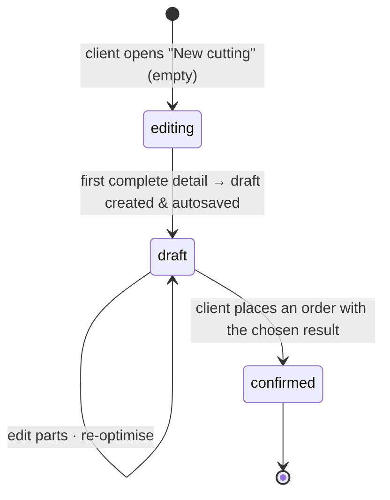

# Cutting optimization

The 2D guillotine cutting-stock solver: in, a list of parts where each part picks its own
panel material and per-side edge materials; out, a per-material panel layout, a weighted
waste %, and the structural metrics the order needs for pricing. Cutting is its own module —
no pricing, no payment, no stock logic — and exposes results to the order flow in
[`orders.md`](orders.md).

## Problem

Customers describe parts over the phone; the workshop optimises by hand or with a desktop
tool. The customer can't see the layout, the waste, or the price until the shop tells them.
And a real job — a wardrobe, a kitchen — uses several materials at once: DSP shelves, MDF
backs, plywood drawer bottoms, plus a leftover panel the customer brings from a previous job
and PVC edge tape in different colours and thicknesses for different visible faces. A
single-material flow rejects half the work; forcing one cutting per material rejects the
other half (the user has to reconcile panels and prices across runs); a flow that only
picks edge _thickness_ without naming the actual tape forces the workshop to guess which
manufacturer's spool to load and surprises clients at the counter.

## Domain rules

### What's in a cutting

A **cutting draft** is the working surface a client — or, for a walk-in order, workshop staff
on the client's behalf ([`orders.md`](orders.md#staff-created-orders-walk-in-clients)) — edits
and re-optimises until an order is placed. It's private (see _Access_) and persists
indefinitely (no expiry; the client's self-made drafts cap at 50). The first complete detail
creates the server draft and autosave keeps the snapshot current; an editor without a complete
detail does not mint a draft (see _Lifecycle_).

A draft owns:

- **A `preferred_branch_id` — required to build the parts list.** A new client editor starts with
  no branch selected. Selecting a workshop is **mandatory**: the catalog is scoped to the chosen
  branch, so the parts editor stays gated behind a "pick a workshop" prompt until one is set, and
  **Optimise** is disabled without it. The client can **change** the branch (there is no "clear to
  none" — the field is required once you're editing), and the order step defaults to it.
  Switching branches is not a data operation: parts already in the list stay editable even when
  their materials aren't carried at the new branch (see _Recovery affordances_). The column stays
  nullable in storage for drafts that predate this rule and for an editor before its first saved
  detail.
- **Parts.** Each part picks its own **panel** material from the platform catalog,
  dimensions (length × width × quantity), and a per-side **edge** material (top, bottom,
  left, right — each `null` for no banding, or a catalog edge material). Every material is
  **workshop-supplied**: the editor offers no "I'll bring it myself" choice (the snapshot's
  `material_source` / side `source` fields are always `shop`; see _Parts and materials_).
  Grain direction is a property of the chosen panel material, and each part stores
  `follow_grain` (default `true`) to say whether that part must respect it. The instruction
  matters only on grained panels. Edge thickness and colour are properties of the chosen edge
  material — the user picks the tape, not a thickness. A part may also carry an optional
  display `name`; blank names stay `null` and render as `D{row}` in the editor, SVG, and PDF.
- **Layout result.** Re-running the optimiser produces one best result against the current input.
  Solver variants are an engine implementation detail: the engine validates and scores them,
  then returns only its winner. That result is chosen automatically and is what binds to an
  order.

Each result records: an internal `algorithm_name` / `algorithm_version` audit stamp, per-material panels
and their placements, weighted `waste_percentage`, `panels_used_by_material`,
`total_cut_length_mm`, `total_edge_length_mm`, `edge_length_by_material` (integer millimetres
per edge material; UI/pricing displays metres; only the `shop`-source length feeds the order's
billed and consumed totals; `own` length is tracked separately for the cutting plan).

### Lifecycle

- `editing` has no complete detail yet. Selecting a branch, naming the drawing, or adding an
  incomplete row does not create or save a server draft. Its first complete detail creates the
  draft; debounced autosave then stores later snapshots only when every listed row is complete.
  A small browser recovery copy covers refresh while a save is still in flight.
- `draft` is mutable. `confirmed` is immutable and kept forever — it is the historical
  record an order points at.
- A 2D-Place MAP import result (`source=imported_map`) is the draft's sole chosen result until a
  geometry-affecting parts edit. Such an edit invalidates the file layout; the next continue
  action runs the optimiser and stores one generated result. Name, edge-band, and
  material-source edits retain the imported layout and refresh its edge metrics. There is no
  imported-versus-optimizer choice and no intermediate-run history.
- On order placement, the chosen result becomes the draft's frozen snapshot and the draft flips
  to `confirmed`.

**Why create on the first complete detail.** Empty, named, or incomplete drawings never consume
a draft slot; a usable detail is saved without requiring the optimiser.

### Parts and materials

- A part's panel material is a reference to the **platform catalog** (the shared list
  curated by platform operators), but the client only ever picks from the **selected
  branch's carried materials** — a branch is required before the parts editor opens
  (see _Branch selector_), so the picker is always branch-scoped. The branch indicator
  (below) flags any already-entered row whose material the current branch can't fulfil.
- **All materials are workshop-supplied.** The data model keeps a per-part
  `material_source` and a per-side edge `source` (`shop` / `own` — the optimiser, pricing,
  and the workshop side still understand both, and historical orders may carry `own`), but
  the client flow no longer offers the choice: the editor always writes `shop`, and a
  legacy draft saved with `own` parts or sides is normalized back to `shop` when it loads.
- **Edge tape is a catalog material too.** Each side of a part is either `null` (no banding)
  or a catalog edge material. The picker UX pins decor-matching edges at the top of one
  material list, then prefers tape widths that cover the selected panel thickness with the
  closest fit. Narrow tapes sink to the bottom and show a warning, but stay selectable
  (see _UX_).
- **Thickening (`УТ`) is an instruction, not geometry.** A part may be flagged `thickened`
  (utolshenie / obmanka): the workshop glues a strip of the same panel underneath so the
  visible edge reads twice as thick. The strip is **never planned** — it is not placed, not
  counted in panels used, not priced, and flipping the flag does not invalidate a result.
  What it does change is the tape: the banded edge is now 2× the panel thickness, so the
  picker ranks and warns against the doubled figure. The flag is **per part**, not per side,
  so every banded side of a thickened part is judged against that doubled edge — a
  deliberate simplification, since a part thickened on one side only is the rarer case and
  the drawing shows which sides carry tape. It is set in the edge dialog (the tape it forces
  is that dialog's subject) and stamped `УТ` in the parts list glyph, at the centre of the
  part on the drawing, and at the centre of the part on the PDF map.

### The optimiser

- **One run, multiple materials, one result.** A run takes all parts, groups them by panel
  material, and produces an independent layout per material (panels aren't shared across
  materials — different thicknesses, colours). The cutting engine may evaluate native and
  PackingSolver candidates internally, but it validates and scores them with one engine-owned
  policy and returns only the winner for each material group. The application combines those
  groups into one chosen result; the client never selects a solver. Provider orchestration and
  fallback remain the cutting engine's contract.
- **Guillotine cuts only.** A cut runs edge-to-edge; the algorithm recursively splits the
  panel into smaller rectangles. Non-guillotine, L-shaped, and CNC paths are out of scope.
- **Tekstura lock = part instruction.** Each part carries `follow_grain` (default `true`).
  When it is true the part is rotation-locked; when false the algorithm may rotate the part
  90°. If a locked part can't fit in its forced orientation, the run fails with
  `impossible_grain`. The catalog `panel.grain_direction` flag remains metadata for
  materials, but it no longer gates this per-part instruction.

| Material `grain_direction` | Part `follow_grain` | Rotation                |
| -------------------------- | ------------------- | ----------------------- |
| `true`                     | `true`              | locked; no 90° rotation |
| `true`                     | `false`             | free rotation           |
| `false`                    | `true`              | locked; no 90° rotation |
| `false`                    | `false`             | free rotation           |

- **One catalog material → one standard panel size.** The same spec in another size is a
  separate catalog material (size is part of its identity and name); custom panel sizes
  per run are future.
- **Kerf and edge trim are per-branch settings**, not global constants — each branch owns its
  saw's kerf and its own edge trim (usable area = panel − 2× edge trim), editable by the
  workshop owner on the branch form ([`workshop.md`](workshop.md)). Platform defaults for a new
  branch: kerf 4 mm, edge trim 5 mm. Every optimisation run resolves both from the draft's
  branch; a branch-less draft falls back to the platform defaults.
- **Edge-banding length is computed here.** For each part edge with a banding material set,
  the edge length is the part's length (top/bottom) or width (left/right). Totals roll up
  **by edge material** (`edge_length_by_material`, integer millimetres) — this is the
  **geometric banded length**.
  The metres an order actually **bills and consumes** add a fixed per-side trim overhang
  (masters glue tape long, then trim it flush) — a system constant, the same at every branch
  — so the **consumed** figure is geometry + that trim; see [`orders.md`](orders.md#pricing)
  for the rule. The optimiser emits the geometry, and because the overhang is constant the
  consumed metres are known without a branch.
- **No stock check at cutting time.** The optimiser says only "N panels needed of material
  X" and "L metres needed of edge material Y." Stock is never a gate: the operator sees a
  non-blocking low-stock warning at order verification and the inventory module
  auto-decrements as production completes (see [`orders.md`](orders.md)).
- **No pricing computed here.** Pricing depends on the branch — branches set their own
  per-panel cutting rate and their own per-metre edge price. The optimiser yields
  structural metrics only; price first appears at the order step.

### Limits

| Constraint                       | Value                                                                                         |
| -------------------------------- | --------------------------------------------------------------------------------------------- |
| Part minimum                     | 10 mm × 10 mm                                                                                 |
| Part maximum                     | panel − 2× edge trim (for the part's chosen panel material)                                   |
| Parts per optimisation           | ≤ 300 (across all materials)                                                                  |
| Import file                      | ≤ 1 MiB; `.csv`, БАЗИС-Мебельщик `Спецификация в XML` `.xml`, or 2D-Place `.map`              |
| Panels per material per result   | ≤ 20 (a single material above this must be split into separate orders)                        |
| Open self-made drafts per client | ≤ 50 (anti-abuse; client deletes to add more; staff-minted drafts don't count — see _Access_) |
| Hard timeout per run             | 10 s → `optimization_timeout`                                                                 |

### Access

- A client sees only their own **self-made** drafts and confirmed results. A staff-minted
  draft (below) is **invisible to the client — list and get — until the order is placed**
  (symmetric privacy: staff never see a client's self-made drafts either), and it doesn't
  count toward the client's 50-draft cap (the cap stays a backstop on the client path only).
- A draft minted by workshop staff for a walk-in
  ([`orders.md`](orders.md#staff-created-orders-walk-in-clients)) is stamped with the
  creating workshop (`created_via_workshop_id` —
  [`../entities/cutting.md`](../entities/cutting.md)). Staff access to it is
  **workshop-scoped, not branch-scoped**: any staffer holding `manage_orders` in that
  workshop may pick it up. Deliberate: the colleague who started a walk-in draft may be
  off-shift or at another desk, and branch- or per-creator scoping would strand the draft
  mid-sale. Revisit if intra-workshop draft visibility becomes a confidentiality concern —
  then tighten to branch scope. Outside the minting workshop a draft simply doesn't exist
  (404, no existence oracle).
- A staff-minted draft left unfinished is **saved and resumable**: the workshop's
  **Saqlangan chizmalar** surface ([UX](#workshop-side)) lists every never-ordered walk-in
  draft of the workshop, so an interrupted sale can be picked back up instead of restarted.
  The editor's leave-guard still offers to discard on exit for the operator who knows they're
  done; a draft kept is simply reachable from the listing. Ordered drafts are consumed on
  placement, so the listing only ever shows genuinely in-progress work; an order's revision
  scratchpad ([`orders.md`](orders.md#revising-a-placed-order)) is not a standalone draft and
  never appears there.
- Workshop staff and the owner see confirmed results bound to orders in their scope; the PDF
  download is gated the same way. Every optimisation run is audited.

## User stories

- As a client, I want all my parts in one cutting even when they need different materials,
  so I don't run multiple cuttings and reconcile panels / prices afterwards.
- As a client, I want the optimiser to choose one valid, practical layout, so I can continue
  without understanding or comparing solver implementations.
- As a client, I want to choose the workshop up front so I only ever pick materials it can
  actually cut — but when I switch workshops I don't want that to throw away parts I've
  already entered.
- As a client, I want to filter the catalog by manufacturer so I get the brand the workshop
  near me reliably carries (Egger vs. Kronospan).
- As a client, I want the matching edge for my panel decor offered first so I'm not hunting
  through tens of edge SKUs for the obvious choice.
- As a client, I want the draft saved automatically, so I don't lose it if I close the
  browser.
- As a workshop user (cutter), I want the confirmed layout and PDF on my tablet at the saw,
  so I can cut without translation.
- As a client or workshop staff member acting for a walk-in client, I want to import a 2D-Place
  `.map` file and keep its exact sheet layout, so a layout prepared outside the app can become
  the chosen cutting result without rerunning the optimiser.

## Imports

The cutting import endpoint accepts three source formats:

- CSV part lists. The parser detects a likely header row and asks the user to map columns
  when needed.
- БАЗИС-Мебельщик XML specifications. The parser imports rectangular panel details and
  reports ignored holes, grooves, and non-panel objects as warnings.
- 2D-Place `.map` layouts. The parser keeps the external sheet layout and returns
  `source_format=map_2dplace`, `material_groups`, and `map_layout`.

For `.map`, the wizard groups sheets by exact size and asks the user to pick one catalog panel
material for each sheet-size group. The material step shows a live size match indicator: matching
catalog panel dimensions keep the external placement, while mismatched dimensions degrade to a
parts-only import. If any imported detail has banding marks, the wizard asks for one edge material
and applies it to all marked sides. The commit endpoint validates the selected panel dimensions
against the MAP sheet dimensions, validates that every placement matches the generated parts,
rejects overlapping/out-of-bounds placements, then creates a new draft with an imported result
already chosen, named after the uploaded file with its extension stripped (e.g. `AFZAL.map` ->
`AFZAL`; left unnamed when nothing usable remains). The same flow is available in the workshop
editor for a resolved walk-in client: staff must hold `manage_orders` on the current branch, and
the new draft is staff-minted with that branch frozen. CSV/XML imports never mint a draft this
way — they only load parts into the editor's current draft (see above), so there is no file name
to seed a draft name from.

Imported MAP results are stamped `algorithm_name=imported-2dplace-map`,
`algorithm_version=map-1`, and `source=imported_map`. `kerf_mm` / `edge_trim_mm` are derived from
the imported layout's own geometry rather than a branch setting: kerf is the most common gap
between two adjacent real parts on the same sheet, edge trim is the most common inset of a real
part from its sheet's edge, each taken across every sheet in the layout (not per sheet, so a
one-off stray gap can't outvote the dominant one) and clamped to the same range a branch's own
kerf/edge-trim accepts. Either falls back to `0` when the layout gives no evidence (a single part,
no part near an edge) or the derived value is out of range. Waste and cut/edge metrics are
recomputed from the persisted placements; MAP waste/remainder rectangles are stored as panel
`offcuts` and used only for preview, not pricing. The UI labels these results `Fayldan joylashuv`.
A successful MAP commit opens that result before any editing. The editor warns only before a
geometry-affecting parts edit (adding/removing a row, quantity, dimensions, panel material, or
texture direction). Accepting the edit removes the file layout, clears the choice, and requires a
fresh optimiser run. Name, edge-band, and material-source edits are geometry-neutral: they save
without the warning and retain the layout while its edge metrics are refreshed.

## UX — the cutting flow (client app)

Two stages share one draft: the detail editor at `/c/cutting/:id` (`/c/cutting/new` before the
first complete detail), then the standalone result at `/c/cutting/:id/result`. Entry is the client
app's home **New cutting** button, which opens an empty editor; its first complete detail creates
and persists the draft (see _Lifecycle_). **Optimise** moves to the result stage only after a
successful run. A secondary **My drafts** entry lists unbound drafts and opens drafts with a chosen
result on the result stage; drafts without one reopen in the editor.

### Branch selector (top of the editor)

A small affordance under the page header naming the active branch. Choosing one is
**required** — the catalog is scoped to the branch, so until one is set the parts editor
shows a **"pick a workshop first"** gate (a `store`-icon empty state with a single **Pick a
workshop** button) in place of the parts list, and a caption on the selector explains the
list is built from the chosen workshop's catalog.

### Parts editor

Rows are grouped visually by panel material in first-seen order, with a leading
`Material tanlanmagan` group for new rows before a material is picked. Each row has a `Nomi`
input, dimensions, quantity, a grained-material-only `Burilish` toggle, four compact edge cells,
duplicate, and an overflow menu for material replacement and deletion. The toggle names the
permission rather than the material property, so it is on when the part **may** rotate — the
inverse of the stored `follow_grain`. It renders as a two-state glyph switch (grain lines when
the part is pinned to the texture, a rotation arrow when it is free) rather than a checkbox,
because both states carry meaning and a bare box under a one-word header did not say which. `Enter` moves through
cells and appends a new inherited row from the last cell of the last row. Deleting a row shows an
undo toast; clearing all rows still requires confirmation.

Each material group shows its own edge-tape registry under the material name. Distinct
`(edge material_id, source)` pairs get one number and colour in their first-use order; row edge
cells, group registries, and the edge picker all render that same identity. Applying a tape to more
sides never changes its number or colour. When a tape is removed, the remaining tapes are compacted
back to consecutive `1..N` numbers, so the next tape takes a deleted number and its matching colour.
The visible group registry lists only tapes currently used in that group, sorted by this drawing-wide
number.

### Results

Results expose one current, chosen layout. A MAP import opens its file layout; a geometry edit
removes it, and the next optimisation creates one replacement layout. The result area shows the
sheet-thumbnail strip, one large sheet SVG, offcut/remainder overlays, material and detail rails,
and the order summary before checkout.

- **None set** → "No workshop selected" + a **Pick a workshop** button.
- **Set** → just the branch name, e.g. "Yunusobod · Furniture House" + a **Change** button.
  There is **no Clear** — the field is required once you're editing.

Picking or changing the branch opens a single flat branch list — one row per branch, naming
the branch, its workshop, and today's hours, with a status pill (`temporarily_closed`
branches stay selectable, the row just flags why); a search field appears once the list is
long. One tap selects a branch; **Apply** sets the draft's `preferred_branch_id`.
**Changing it never edits the parts list.** Rows that reference materials the new branch
doesn't carry get a per-row warning + recovery affordances (below).

### Parts editor (top)

A mode switch at the top: **Manual entry** (default) · **Upload file** (`.csv` / `.xml`).
Upload opens the import wizard; manual entry stays as the plain row editor. The expected
source is БАЗИС-Мебельщик's **Спецификация в CSV** or **Спецификация в XML** export;
Excel-made lists must be saved as CSV first. For a mutable saved draft, the page header carries
a danger-outline **Delete drawing** button; it is absent for a new or read-only drawing. The
sticky bottom action bar has exactly one primary action — alongside the row / piece count (and,
when optimisation is disabled, the reason shown inline) — so it stays reachable above a long
list. When the draft's chosen result exists and its parts snapshot matches the current editor
parts, it is **View result** and opens the result stage; otherwise it is **Optimise**. A geometry
edit therefore changes an unchanged MAP import from **View result** to **Optimise**, while a
read-only drawing can still open its current result.

Adding a row follows the content rather than a fixed header control: an empty editor shows a
centred **Add part** call-to-action, and once there are rows a dashed **Add part** tile sits
beneath the last row (there is no separate header add button).

On wide layouts the parts table renders as a dense, scannable grid: a shared column header
and one compact single-line row per part (the panel cell carries a colour swatch, a separate
texture-follow column, and a leading row checkbox for bulk actions;
a trailing **Delete** trash button removes the row). On narrow screens each row stacks into
a labelled card.

### File import wizard

The import wizard is stateless for CSV/XML: it never stores the file and only parses it into
ordinary editor parts. A MAP layout is the exception: committing a size-matched layout creates a
new imported-result draft for the current client or workshop walk-in client and opens the result
stage immediately. A MAP whose selected panel size does not match degrades to parts-only import
and stays in the editor; there is no unseen result to warn about.

The wizard is **two screens**, not a step rail. Parsing runs the moment a file is selected, so
everything after the drop is known at once; serialising it into steps only delayed the
diagnostics past the point where they could change a decision.

1. **File.** The user picks a file; the UI pre-checks the 1 MiB size cap and `.csv`/`.xml`/`.map`
   extension, then calls the role-scoped parse endpoint (`POST /api/v1/client/cutting/import/parse`
   or `POST /api/v1/workshop/cutting/import/parse`) without a mapping.
2. **Review and import.** One screen, ordered by how likely each block is to need attention.

The review screen carries four blocks:

- **File strip** — name, source format, and `N xil · M dona`, with a **Boshqa fayl** action back
  to the file screen.
- **Diagnostics** — skipped rows, warnings, ignored objects, and (for MAP) the sheet list, each
  a count that expands in place. These sit **ahead of** the commit: a row count the parser
  dropped is the one fact that can still change the operator's mind.
- **Columns** (CSV only) — the parse response carries suggested column roles and a suggested
  skip count, so the wizard applies the guess and re-parses through it without asking. The block
  collapses to a one-line summary (`A→uzunlik · B→kenglik · …`) with a **To'g'rilash** action
  that reveals the preview table, the per-column role pickers, and the skip-rows control. When
  the guess is short of a length or width column the block opens itself and the commit stays
  blocked. БАЗИС-Мебельщик XML and MAP imports have no columns block — the source carries typed
  fields.
- **Materials** — the one decision that always needs a person. Materials from the file become
  groups only; the user picks a panel catalog item for every panel group and an edge catalog item
  for every edge group, and there is deliberately no automatic matching. A `Толщина`/thickness
  value from CSV or XML shows as a muted hint on the group. An unpicked group carries an accent
  border, so the reason the commit is blocked is visible on the thing blocking it. For MAP
  imports the panel-size match verdict renders as a chip on the card, since the whole layout
  survives or dies on it.

The footer holds **one** primary action, `Import qilish`, disabled until the mapping and every
material pick are complete. When the editor already has parts, an **Qo'shish / Almashtirish**
segmented control sits beside it with a live consequence line (`Hozirgi 7 xil o'chadi`) — the
mode is a choice with a stated cost, not two competing buttons one of which is red.

XML support is intentionally narrow: it accepts only БАЗИС-Мебельщик's project-root
`<Проект>` export from **Спецификация в XML**. The parser flattens every
`Изделие/СписокЭлементов/Объект`, imports only `ТипОбъекта = Панель`, multiplies object
quantity by product quantity, reads `Длина_детали_без_облицовки` / `Ширина_детали_без_облицовки`
when present, and maps `Горизонтальная` / `Вертикальная` texture orientation to
`follow_grain = true`. Non-panel objects are counted as a diagnostic, not imported. Holes,
grooves, non-rectangular panels, and edges marked "see drawing" import the rectangular part
but appear as warnings.

Rows skipped because they cannot be represented (for example an `Итого` footer in a numeric
column) appear in the review screen's diagnostics, before the import is committed. Recoverable domain problems still import: an undersized part is
loaded and then flagged by the editor's normal validation. Imports over 300 pieces are
rejected at parse time; imports that make the current editor exceed 300 pieces show a notice
and the optimiser remains blocked until rows are removed.

The parts table:

| Column       | Behaviour                                                                                                                                                                                                                                                                                                                                                                                                                                                                                                                                                                                                                                                                                                                                                                                                                                                                                                                                                |
| ------------ | -------------------------------------------------------------------------------------------------------------------------------------------------------------------------------------------------------------------------------------------------------------------------------------------------------------------------------------------------------------------------------------------------------------------------------------------------------------------------------------------------------------------------------------------------------------------------------------------------------------------------------------------------------------------------------------------------------------------------------------------------------------------------------------------------------------------------------------------------------------------------------------------------------------------------------------------------------- |
| **#**        | row number                                                                                                                                                                                                                                                                                                                                                                                                                                                                                                                                                                                                                                                                                                                                                                                                                                                                                                                                               |
| **Panel**    | searchable dropdown of the platform catalog (`panel` kind); each result shows manufacturer + decor / colour + thickness + size. The picker's own type-to-filter search is the only narrowing inside the parts editor — there is no separate manufacturer / type / thickness / sort bar (it duplicated the search and added clutter). The picker is always filtered to the selected branch's carried materials — a branch is required before the editor opens, and materials the branch doesn't carry are not offered (there is no widen-to-full-catalog toggle; a row that already references a not-carried material after a branch switch keeps it, flagged by the per-row warning). Selected row shows the picked panel's short label (e.g. `Egger DSP H1334 18 mm · 2750×1830`). A trailing **✕** clears the pick and reopens the list (showing the full set) for a fresh search — re-picking otherwise means manually clearing the typed label first |
| **Tekstura** | per-part `follow_grain` toggle. Pressed means the part is rotation-locked; unpressed means rotation is allowed. This instruction is honoured directly for the part, regardless of the selected panel's catalog `grain_direction` flag                                                                                                                                                                                                                                                                                                                                                                                                                                                                                                                                                                                                                                                                                                                    |
| **L mm**     | numeric; validated against the part-min / part-max bounds of the chosen panel                                                                                                                                                                                                                                                                                                                                                                                                                                                                                                                                                                                                                                                                                                                                                                                                                                                                            |
| **W mm**     | same                                                                                                                                                                                                                                                                                                                                                                                                                                                                                                                                                                                                                                                                                                                                                                                                                                                                                                                                                     |
| **Qty**      | integer ≥ 1                                                                                                                                                                                                                                                                                                                                                                                                                                                                                                                                                                                                                                                                                                                                                                                                                                                                                                                                              |
| **Edges**    | per-side summary — a small panel diagram (line weight signals thickness) + a one-line label (e.g. `H1334 · 0.4 mm` · `T·B · H1334 2.0` · `Mixed · 2 edges` · `None`). Tap → edge picker                                                                                                                                                                                                                                                                                                                                                                                                                                                                                                                                                                                                                                                                                                                                                                  |
| **Delete**   | a trash icon button removes the row                                                                                                                                                                                                                                                                                                                                                                                                                                                                                                                                                                                                                                                                                                                                                                                                                                                                                                                      |

The grain toggle (small arrow + `Tekstura`) appears on the row.
Pressed means `follow_grain=true` and the part is rotation-locked; unpressed means
`follow_grain=false` and the optimiser may rotate it.

**Edge picker** (opens from the row glyph on every viewport):

- **One modal, two in-dialog panels.** The compact glyph is display-only: its four borders
  show banding state, while the whole glyph opens this modal on desktop and mobile alike.
  Panel 1 is the marking view. Its tape list contains only tapes already used in this drawing:
  first the part's sides, then its material group, then other groups. The arming ladder uses
  those draft-scoped sources only; it never falls through to a catalog recommendation. With
  nothing armed, sides and **4 tomon** are disabled and the dialog says
  `Avval kromka tanlang — keyin tomonlarni bosing.`; **Kromkasiz** remains available. The visible
  tape rows are ordered by their registry number, not by number of banded sides.
- **Marking view.** The diagram centre shows the row name (`D{n}` when unnamed) and its
  dimensions. Side bars show only the side name and registry-number badge. The only whole-part
  patterns, next to the diagram, are **4 tomon** and **Kromkasiz**. Side and pattern changes apply
  immediately; the dialog closes with its close control, Escape, or the backdrop.
  A new tape is tentative (`Yangi`) until it is committed into the drawing registry, preserving
  that registry's sticky number and colour identity.
- **Catalog panel.** `+ Yana kromka qo'shish` opens panel 2. It searches the selected branch's
  carried tapes with single-select thickness chips. `Shu panelga mos` contains decor/colour
  matches; all remaining choices are under `Boshqa kromkalar`. Tapes already on the drawing are
  excluded, with an explicit already-added hint. A tape narrower than the panel remains selectable
  but carries the width warning. Selecting one returns to panel 1 armed, without changing sides.
  A fresh drawing with no banded sides starts directly in this catalog panel.
  **Bulk row actions (desktop).** On wide layouts the parts table gains a leading checkbox
  column (and a select-all in the header). Selecting one or more rows reveals a bulk bar with
  **Apply edges** (opens the edge picker seeded from the first selected row and writes the
  applied side pattern / tape to every selected row), **Change material** (a small
  picker that sets one panel material on every selected row), and **Delete**. This is the
  list-level path for re-banding or re-materialing many identical parts without N picker
  round-trips — a desktop power feature; on mobile each row is edited individually (its own
  fields plus the per-row delete button).

Per-row inline validation; when something blocks the optimiser the reason is shown inline
next to the (disabled) **Optimise** button in the sticky bar — there is no separate roll-up
banner under the table.

### Recovery affordances — when materials aren't carried at the preferred branch

When `preferred_branch_id` is set and a row references materials the branch doesn't carry,
the row is **not** disabled, **not** dropped, **not** moved. It stays in place, editable,
with a **per-row warning** on each affected row (there is no separate top-level roll-up
banner — the warning lives on the row that has the issue):

- The warning reads _"Not at <branch> — pick a different material or change the branch."_
  Recovery is a material swap: the panel is swapped on the row's panel cell (the picker is
  pre-filtered to the branch), and when an edge side is affected the warning carries an
  inline **Pick a different tape** button that opens the edge picker with the same inline
  note visible.
- The row's **Delete** (trash) button still works; removal is opt-in and never automatic.

### Deleting a drawing (deliberate)

A mutable saved draft can be deleted from the page header. The danger confirmation names the
drawing and its part count: _“«{drawing name}» — {N}-part drawing will be deleted permanently.
This cannot be undone.”_ If deletion fails, the dialog stays open and displays the error with its
trace id. A successful deletion returns the client to the draft list (or the workshop order list
in workshop scope). Changing the branch never removes parts.

### Run and the result stage

The editor's single primary sticky action reads **Davom etish**. With a current chosen result it
opens the result stage; otherwise it runs optimisation and shows its validation reason inline when
unavailable. While a run is in progress (10 s cap), it is disabled and shows **Hisoblanmoqda**. On
a brand-new editor, the first complete detail creates and saves the draft before continuing.

The editor never embeds results. Before the first run there is no result placeholder — the parts
editor and sticky action are all there is to see. A successful run navigates to the standalone
result stage; a failure stays in the editor beside the affected row or action. Only a current
chosen result makes **Davom etish** open the result; merely having an unchosen or stale candidate
makes it run optimisation instead.

The result stage has three desktop columns: materials and details at left, the layout visualiser
in the centre, and **Buyurtmangiz** alone at right. Narrow screens stack the visualiser, details,
then order summary.

**768px is the line between the two readings of a result.** A 2800 mm sheet inside a 390 px
viewport draws at roughly a 7× reduction, where no part label and no dimension in the drawing
survives — that is the fitting thresholds working as designed, not a rendering defect, and no
sizing change wins it back. So below 768px the drawing demotes to a navigational overview and a
text parts list beneath it carries the numbers; from 768px up the drawing is legible and the
per-sheet rail beside it carries the detail. The two never show together: one screen, one
authoritative reading of the result. 768px is the app's own desktop boundary (the root paints
at `zoom: 90%` from 769px), so the switch lands where the layout already changes character
rather than inventing a third regime.

1. **Panel layout visualiser.**
   - The result header shows the imported-layout and placement state. Only the chosen result is
     shown; legacy or previous candidates are not offered as variants.
   - A sheet thumbnail strip grouped by panel material. Each group header shows the material
     type, fuller material label, and that material's sheet count; compact thumbnails below
     it show drawing-wide `List N` numbering and a bottom-right fill badge.
   - The active panel renders as an interactive SVG; each placed part carries one centred
     label — display name + dimensions + a `↻` marker when the placement is rotated (e.g.
     `Polka 1500×800 ↻`) — rather than an opaque part id. Labels
     hide on placements too small to carry them. Offcut rectangles overlay as dashed
     outlines: green with a `Qoldiq …×…` label when usable, red `chiqit` when waste.
     Offcut labels use the same fitting ladder in SVG and PDF: horizontal label, rotated
     label for tall narrow remnants, dimensions-only fallback, then no label if nothing
     fits.
   - Selecting a details row highlights all matching placements on the sheet and dims the
     rest. Clicking one SVG placement selects its part group, bolds that instance label,
     and scrolls the matching row into view. Clicking the sheet background clears selection.
   - **Banded sides** are flagged by a short, centred accent tick set just inside the
     placed rectangle, on each banded side only (not a full-length frame) — so the cutter
     sees which edges take tape at a glance. The side mapping follows the part's own edges;
     a rotated placement maps them 90° clockwise. Tick inset, length and weight are
     normalised, so banding reads the same on a large and a small panel.
   - From 768px up, the left rail is grouped by part for the active sheet
     (`Detallar — List N`), showing name, dimensions, quantity, and rotated count. Result data
     is frozen from that result's `parts_snapshot`, so it remains self-contained after later
     editor changes.
   - The left rail first lists every panel material and its sheet count with a plain bullet,
     then its Kromka block shows a dot in the same colour as the drawing, fuller material label
     such as `Egger H1334 ST9 · Sanoma · 0.4×20 mm`, and consumed metres. These two cards have
     border-only surfaces.
   - Below 768px the per-sheet rail is replaced by a **`Detallar` parts list directly beneath
     the drawing**, covering the whole result rather than only the active sheet: one `List N`
     group per sheet — the material label printed once per run of sheets that share it — and
     one row per part carrying name, `length × width mm`, and quantity, plus a rotated count
     where there is one. Rows read in `parts_snapshot` order (the editor's and the PDF's `#`
     order), not the optimizer's placement order, so a screen reader walks the parts the way
     the user wrote them. It is ordinary selectable text — the point is that these numbers can
     be read and copied when the drawing's cannot. Tapping a row selects that part, switching
     the drawing to its sheet first when the row belongs to another one, and centres the
     drawing so the highlight is on screen; tapping a placement in the drawing scrolls its row
     into view and selects it.

2. **Buyurtmangiz.** The dedicated right-side card shows the orderable chosen result's panel
   count, consumed edge length, and the active branch quote split into
   cutting, materials, edge-banding, and total. It does not show waste. Until a branch is
   available, it asks the user to select one instead of inventing a price.
   - **Buyurtmaga davom etish** → routes into the order wizard (see [`orders.md`](orders.md)).
   - **PDF ochish** — the print-ready cutting document for the saw operator, opened in a new
     browser tab rather than saved to disk: the reader wants to look at or print the plan, and
     the browser's own viewer already offers both plus a download. Every PDF entry point
     behaves this way; there is no separate download action. The endpoints are Bearer-authed,
     so the client fetches the bytes with its access token and hands the tab an object URL —
     the tab is opened synchronously in the click handler, because a popup opened after an
     await is blocked. A blocked popup surfaces a message telling the user to allow popups; it
     never silently falls back to downloading. The document is fixed
     A4 portrait and starts with a **Xulosa** page: title block, per-panel-material stats,
     edge-tape specification, and usable-offcut inventory. Sheet pages follow; consecutive
     identical layouts are grouped (`List 1–2`, `2 dona list`) while summary counts still
     include every physical sheet.
   - The PDF carries two area-derived KIM figures. `KIM` is parts area divided by sheet
     area; `KIM (qoldiq bilan)` adds usable offcut area before dividing.
   - Work cards are planned for print before drawing: two layout units always stack on one A4
     portrait page — never a page of its own for a dense sheet or an unlabelable map, and never
     landscape. An odd unit stays alone in the top slot. A card carries four header lines
     (sheet range · material · `Kromkalar` · `Detallar maydoni · KIM · Foydali qoldiq ·
     Chiqindi`), then a proportional map beside a compact `Uzunlik · Kenglik · Soni` register whose
     band marks sit under each dimension. A register too long for its half-page slot spills its
     overflow rows onto a full-width portrait `Detallar (davomi)` continuation page, never by
     clipping a row or splitting the map. Every page is numbered.
   - The PDF parity contract is intentionally narrow: the **map panel inside the PDF**
     mirrors the web sheet visualiser's geometry, label fitting, offcut overlays, and
     banding ticks. The surrounding summary, title blocks, stats and tables are PDF-own.
     Text is rendered with an embedded Unicode font, so Cyrillic material and part names
     print correctly.
   - **Edit parts** returns to the editor. Name, edge-band, and material-source changes retain
     the current layout and refresh edge metrics. A geometry-affecting edit removes all previous
     results, including an imported MAP. The next **Optimise** creates and chooses one fresh
     optimizer result; the result stage never offers a file/original comparison.

Pricing shown here is a branch quote for the current result.

### My drafts (`/c/cutting/drafts`)

A list of unbound drafts. Each row: a short label (`14 parts · 6 panels`), the dominant
panel material, last-edited time (relative), the preferred branch chip when set, a Delete
action. Empty: "No saved cuttings — start a new one." No expiry chip — drafts persist until
the client deletes them or hits the cap.

### Read-only view (`/c/cutting/:id` when `confirmed`)

Same workspace, editing disabled, with a banner naming the bound order.

### Workshop side

The workshop app runs the **same editor component** for staff-created walk-in drafts
([`orders.md`](orders.md#staff-created-orders-walk-in-clients)) in a **fixed-branch mode**:
the branch selector is hidden, the branch is locked to the branch the flow was entered from
and frozen into the draft at creation (a later topbar branch switch never retargets an
in-progress draft), and a persistent **identity strip** in the editor header names the
walk-in client (name + phone). The strip is rehydrated when a saved draft is **resumed** (not
just during the continuous create flow), so a re-opened draft still names who it's for. A
draft that somehow carries no branch falls back to the current topbar context rather than
demanding a fresh pick. Everything else — parts editor, edge picker, optimise, results — is
this page, unchanged.

**Saqlangan chizmalar** (`/workshop/orders/drafts`, `manage_orders`) — the workshop's
unfinished walk-in cuttings, reached from a **Chizmalar** entry beside **+ Yangi buyurtma** on
the Orders screen (the entry carries a count of open drafts). The list follows the topbar
branch context and reloads when it changes — a draft is frozen to one branch, so the page
shows the branch you're standing in, and the Chizmalar count matches. Each row shows the walk-in
client (name + phone), the locked branch, part / panel / waste figures, and a **derived status
label** — *Tayyor — buyurtma berish mumkin* once a result is chosen, else *Tahrirlanmoqda*.
A draft carries no status column of its own; the label is derived from whether a cutting
result has been chosen. **Davom etish** reopens the shared editor on the saved draft (which
routes on to checkout once a result is picked); a per-row delete discards it with a danger
confirmation. States: loading / empty (*Saqlangan chizma yo'q* → start via **+ Yangi
buyurtma**) / error, each recoverable.

An order's **Cutting** tab embeds the SVG of the order's confirmed result and a button that opens the PDF in a new tab.

## Edge cases

- **`material_not_found`** — a part references a catalog id that's missing or removed → the
  editor flags the row; the optimiser refuses to run.
- **`part_too_large` / `part_too_small`** — outside the bounds for the chosen panel
  material → the wizard names the offending part and the max size.
- **`impossible_grain`** — a locked part (`follow_grain=true`) can't fit in its forced
  orientation → the row is flagged.
- **`too_many_parts` / `too_many_panels_needed`** — over the caps → reject; split the job.
- **`optimization_timeout`** — no result within 5 s → retry or simplify.
- **`draft_limit_exceeded`** — > 50 open drafts → delete some first.
- **Unsupported import file** — the wizard accepts `.csv` and БАЗИС-Мебельщик
  **Спецификация в XML** `.xml`; `.xlsx`, legacy `.xls`, proprietary CAD files, PDFs,
  arbitrary JSON/XML/text, empty files, oversized files, and binary junk are rejected with a
  clear error before they touch the editor.
- **Import footers / summary rows** — non-empty rows whose mapped numeric cells cannot be
  parsed, such as an `Итого` footer, are listed as skipped rows in the review
  screen diagnostics, with the original row number and preview text.
- **Recoverable imported typos** — imported parts below the part minimum or otherwise
  outside the chosen panel's bounds are loaded into the editor and flagged inline by the
  existing validation, so the client can correct them instead of losing the row. No importer
  rejects a file over part size: a small part is a row to fix, not a reason to lose the
  drawing.
- **Import piece cap** — a parsed file above 300 pieces is rejected; an append that makes
  the editor exceed 300 pieces is allowed to land but the optimiser stays blocked until the
  client removes rows.
- **All-`own` cutting** — no `shop` materials at all; the order step accepts any active
  branch with a saw.
- **Edges all `own`** — the order's `edge_length_by_material` still records the total
  metres per material (informational for the cutting plan / PDF), but stock decrement skips
  every side at `edge_banding → ready` because no side is `shop`.
- **Catalog change while a draft sits** — if a material a part references is later removed
  from the catalog, the draft is flagged on next open with that row highlighted; the
  client picks a replacement before re-running.
- **`preferred_branch_id` set but the branch later goes `inactive`** — the branch is
  treated as "no carried materials"; the wizard surfaces the same not-carried recovery
  affordances on every row, plus a banner pointing at the branch's status; the client
  **changes** the branch to unlock (the selector offers no clear, only a switch).
- **`cutting_result_not_usable`** — the order step finds the draft is already `confirmed`
  (concurrent placement, or back-navigation after placing) → redirect to its detail.
- **Algorithm replaced later** — old `confirmed` results stay exactly as they were,
  stamped with the old algorithm version; their PDFs are not regenerated.
- **A workshop deactivates an edge material that's set as a per-side preference on an
  in-flight draft** — same handling as a deactivated panel: row flagged on next open, edge
  side cleared with a one-tap "pick replacement" affordance that opens the edge picker with
  that side active.

## Next

- [`orders.md`](orders.md) — how a chosen cutting result becomes a placed order and which
  cutting metrics drive which price component.
- [`catalog-inventory.md`](catalog-inventory.md) — the platform catalog (manufacturers,
  panels, edges) the wizard reads from, and the branch's selection that scopes the
  editor's catalog.
- [PackingSolver provider spec](https://github.com/BerdiyorovAbrorjon/cutting-engine/blob/main/docs/PACKINGSOLVER_PROVIDER_SPEC.md)
  — the internal multi-provider optimizer contract, validation, fallback, and deployment rules.
