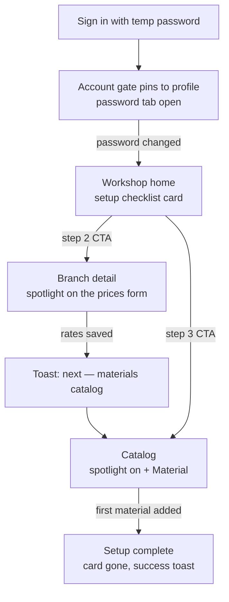

# Workshop onboarding

A freshly provisioned workshop can take orders only after three owner actions: change the
temp password, set the branch's cutting/banding rates, and put materials into the branch
catalog. This page owns the guided path through those actions — the derived **setup
checklist** and the **spotlight hints** that walk the owner through each screen. The
password gate and provisioning mechanics live in
[`access-management.md`](access-management.md); the settings and catalog screens keep their
own specs ([`workshop.md`](workshop.md), [`catalog-inventory.md`](catalog-inventory.md)).

## Problem

A new owner signs in with a temp password into an empty tenant and has to discover the
setup order alone: while the branch rates are unset, order pricing fails; while the catalog
is empty, clients see nothing to cut. The only guidance today is a single toast after
branch creation. Owners stall on the first screen or call the operator — the system knows
exactly what is missing and should lead.

## Domain rules

- **Three steps, in the order the platform already enforces:**

  | # | Step | Done when |
  | - | ---- | --------- |
  | 1 | Change the temp password | `password_reset_required = false` on the signed-in user |
  | 2 | Set branch prices | ≥ 1 `active` branch has **both** `cutting_rate_tiyin` and `edge_banding_rate_tiyin` set |
  | 3 | Add materials | ≥ 1 branch material selection exists in the workshop |

  Step 1 is hard-gated platform-wide (the account gate in
  [`access-management.md`](access-management.md) blocks every non-account route). Steps 2–3
  are display order, not a hard sequence — completing them in any order is fine.

- **Completion is derived, never stored.** Each step's done-state is computed from live
  data on request; there is no onboarding progress row, flag, or migration. Derived state
  cannot drift from reality: an owner who configures the workshop without the guide — or
  before this feature shipped — is simply done. Revisit only if a step ever needs manual
  sign-off that no data change can witness.
- **Setup-complete** = steps 2 and 3 both done (step 1 is enforced before the surface is
  reachable). A later operator password reset re-raises the account gate but does **not**
  resurface the setup checklist — setup is about the workshop, not the credential.
- **Owner-only surface.** The checklist and the hints render only for `is_owner`; steps
  2–3 are owner / `manage_catalog` actions, so staff are never nagged with setup they may
  not be able to perform. Staff experience only the password gate. The onboarding status
  read is likewise owner-only.
- **Spotlight hints force the real control, never a fake one.** A hint dims the screen
  except its target control and explains the step; the user advances by clicking the
  actual control — the click performs the real action, so the guide teaches by doing. A
  hint is always skippable (explicit "Keyinroq" and `Esc`); skipping marks it seen, and
  the checklist remains the way back.
- **A hint auto-shows once.** Each hint is keyed and bound to a screen + step: it shows
  when the owner enters that screen while the step is pending and the hint is not yet
  seen. Navigating from the checklist re-shows it regardless of seen-state. Seen-state is
  client-local (per principal, browser storage) — deliberately not server state in v1;
  the worst case is a hint repeating on a new device, which is acceptable re-teaching.
  Revisit if the hint set grows past setup or cross-device repetition draws complaints.

## User stories

- As a new workshop owner, I want the system to lead me through first-time setup so that I
  can start taking orders without calling the operator.
- As a new workshop owner, I want each finished step to point at the next one so that I
  never wonder what remains.
- As a staff user, I want to see only the password gate — not setup tasks I cannot
  perform.

## UX

- **Setup checklist card** — on the workshop home, above the dashboard content, while the
  owner's setup is incomplete. Title "Ishni boshlash"; the three steps as rows — done rows
  get a check and muted text, pending rows a short explanation; the **first pending step
  carries the card's single CTA**, which navigates to the owning screen and lights its
  spotlight. States: skeleton on first load; hidden for staff, for complete setup, and on
  status-read error (the card is a helper — it never breaks the dashboard). The card is
  not dismissible: while setup is incomplete the workshop cannot price an order, so the
  card is the truthful state of the tenant, not a nag.
- **Spotlight hint** — a scrim dims and blocks the whole screen except the target
  control, which stays live; an elevated callout beside it carries the step title, one or
  two plain sentences, a step counter, and "Keyinroq". Clicking the target dismisses the
  hint and lets the real action proceed; `Esc` or "Keyinroq" skips. If the target leaves
  the screen (route change, modal) the hint dismisses itself. Motion respects
  `prefers-reduced-motion`.
- **Continuation** — the system leads between steps: after the forced password change an
  owner with incomplete setup lands on the home checklist; after the rates save with
  materials still missing, an action toast offers the catalog; after the first material,
  a success toast announces the workshop is ready to take orders.
- **v1 hints**: the branch-detail prices form (step 2) and the catalog's **+ Material**
  button (step 3). The hint registry is the extension point — a future first-visit hint
  is a new entry, not a new mechanism.

## Edge cases

- **Workshop configured before the feature shipped** → every step derives done; the card
  never renders.
- **Owner does a step on their own, out of order** → it derives done wherever they did
  it; the checklist and CTA move to the next pending step.
- **The only configured branch goes `inactive`** → step 2 regresses to pending and the
  card returns — truthfully: the workshop can no longer price an order.
- **Only one of the two rates set** → step 2 stays pending; both rates are required to
  price an order.
- **Materials added while rates still unset** → step 3 done, step 2 pending — the card's
  CTA points at step 2.
- **Multiple branches** → any single `active` branch with both rates satisfies step 2;
  the step-2 CTA deep-links to the oldest active branch.
- **Owner skips a hint** → marked seen, no re-show on next visit; the checklist CTA
  re-shows it on demand.
- **Staff with `manage_catalog` on a fresh workshop** → no card, no hints; the catalog
  screen's own empty state ("add materials to this branch") still applies.

## Next

- [`access-management.md`](access-management.md) — the account gate and provisioning that
  precede this flow.
- [`workshop.md`](workshop.md) — the branch settings the guide points at.
- [`catalog-inventory.md`](catalog-inventory.md) — the material selection that completes
  setup.
