# Orders

The single home for the order lifecycle, pricing, payments, refunds, the warehouse contract,
and the per-screen UX — **placement** (client), **fulfilment** (workshop staff),
**modification** (both, by status), and **cancellation & refunds** (both, manual in v1).

## Problem

An order today is a phone call, a verbal price, and a whiteboard. The client can't see the
price or the cutting plan, the workshop can't trace who advanced what, and a paid cancellation
has no record of where the money went. v1 makes ordering self-serve, pricing automatic, the
workflow restricted to the state machine, and every payment and refund a recorded row — with
no in-app gateway: v1 *tracks* money, it doesn't *move* it.

## What an order is

A **client's request for panels cut to size at a branch** — the header that owns the items,
payments, status history, cancellation, and refunds. Created **only by a client**, **only
from a confirmed cutting draft** (no order without one — the draft becomes `confirmed` and is
bound on creation). It carries a snapshot of its pricing and a reference to its current
cutting result.

Two axes are set at creation:

- **Material source** — `own` (the client brings the material; cutting service only, no
  stock movement) or `shop` (the workshop supplies the material; stock is reserved /
  consumed / released as the order moves).
- **Delivery type** — `pickup` (free) or `delivery` (a **fixed fee** from a static zone
  resolved from `(branch, lat, lng)` — workshop-entered, no geocoder in v1; out-of-zone ⇒
  the client must switch to pickup or another branch).

## The state machine

States: `new` → `pending_payment` → `confirmed` → `cutting` → (`edge_banding`) → `ready` →
(`in_delivery`) → `completed`. Any pre-`completed` state can reach `cancelled` per the matrix
below. `edge_banding` is **skipped when no part of the order has an edge-banding spec**.

```mermaid
stateDiagram-v2
    [*] --> new : client places order
    new --> pending_payment : (post-v1) gateway redirect
    new --> confirmed : staff record covering payment
    new --> confirmed : owner approve pay-later + reason
    new --> cancelled : cancel + reason

    pending_payment --> confirmed : (post-v1) gateway confirms
    pending_payment --> new : (post-v1) failed / timeout
    pending_payment --> cancelled : cancel + reason

    confirmed --> cutting : cutter claims<br/>(+ reserve stock if shop)
    confirmed --> cancelled : staff / owner cancel + reason<br/>(release stock, refund if paid)

    cutting --> edge_banding : cutter marks cut done<br/>(+ consume stock if shop)<br/>[has banding parts]
    cutting --> ready : cutter marks cut done<br/>(+ consume stock if shop)<br/>[no banding]
    cutting --> cancelled : owner force-cancel + reason<br/>(release reservation; spoilage handled offline)

    edge_banding --> ready : edger marks banding done
    edge_banding --> cancelled : owner force-cancel + reason

    ready --> in_delivery : driver claims<br/>(balance recorded)
    ready --> completed : staff mark picked up<br/>(balance recorded)
    ready --> cancelled : owner force-cancel + reason

    in_delivery --> completed : driver marks delivered
    in_delivery --> cancelled : owner force-cancel + reason

    completed --> [*]
    cancelled --> [*]
```

`cancelled` is terminal — if the order was paid, a `pending` refund was created.

Rules:

- **Cutting and edge-banding are explicit phases.** Two physical operations, often two
  workers, often different piece rates. The `edge_banding` state is skipped at runtime when
  the order has no banded parts (the cutter's "Cut done" then transitions straight to `ready`
  — the system inspects the parts to decide).
- **Workers claim from a queue (pull, with optional pre-assignment).** The cutter sees the
  branch's `confirmed` orders sorted by `priority_score` then age and taps **Start cutting**
  to claim. The office can optionally pre-assign a cutter (sets `assigned_cutter_user_id` as
  a hint); pre-assigned orders pin to the top of that cutter's queue. Same model for edgers
  (`edge_banding` queue) and drivers (`ready` + delivery queue).
- **Every transition is recorded** as an `order_status_event` (who, from → to, reason,
  metadata), append-only, mirrored into the audit `status_change_log`.
- **Optimistic locking** on transitions (a `version` column): concurrent staff edits
  serialize; the loser is told to refresh and retry.
- **Advance-balance gate** — for `advance` orders, the balance payment must be **recorded**
  before `ready → in_delivery` (delivery) or `ready → completed` (pickup).
- **`completed`** is terminal: no modify, no cancel (a complaint / return flow is post-v1).
  An order is **never deleted** — it goes `cancelled`.
- **Cancellation always requires a reason.** Cancelling a *paid* order creates a `pending`
  refund.

### Production stamps

The cutter, edger, and driver are all **workshop users** with `process_production` /
`process_delivery` on the order's branch — no separate worker entity. The system stamps the
order at each transition:

| Stamp | Set at | Read by |
|---|---|---|
| `cutter_user_id`, `cut_started_at` | `confirmed → cutting` | display · payroll (cutter) |
| `cut_completed_at`, `sheets_used_snapshot`, `cut_count_snapshot` | `cutting → next` | payroll (`per_sheet`, `per_cut`) |
| `edger_user_id`, `edge_started_at` | `cutting → edge_banding` | display · payroll (edger) |
| `edge_completed_at`, `edge_length_snapshot` | `edge_banding → ready` | payroll (`per_metre_banding`) |
| `driver_user_id`, `driver_started_at` | `ready → in_delivery` | display · payroll (driver) |
| `delivered_at` | `in_delivery → completed` | payroll (`per_delivery`) · client notify |
| `picked_up_at` | `ready → completed` (pickup) | client notify · audit |

One cutter, one edger, one driver per order in v1. The office (with `manage_orders`) can do
production transitions as a fallback (worker absent, system issue) — the transition dialog
asks "who did this work?" and defaults to the assigned production user; the chosen user is
what gets credited.

### Stock action map

| Transition | Stock action (`shop` orders only) |
|---|---|
| `→ confirmed` | **reserve** |
| `cutting → edge_banding` or `cutting → ready` | **consume** (cutting completed) |
| `confirmed → cancelled` | **release** (the reservation) |
| `cutting → cancelled` | **release** the reservation; staff record an `adjust-stock` for any sheets the cutter physically used (waste write-off) |
| any state after consume | no release; the material is gone |

This is the v2 timing: consume moves to *cutting completion* (physically accurate), not
`→ ready`. Refund / cancellation semantics for the money side are unchanged.

### Cancellation eligibility & refund

| Status when cancelled | Who may cancel | Refund | Stock |
|---|---|---|---|
| `new` | client / staff / owner | no payment yet → none | n/a |
| `pending_payment` | client / staff / owner | full refund if a payment was completed | reservation not yet held |
| `confirmed` | staff / owner (not the client) | full or partial — staff / owner decision | reservation **released** |
| `cutting` | **owner only** (force-cancel) | partial — labor underway, material partly consumed | reservation **released**; staff write off any sheets used via `adjust-stock` |
| `edge_banding` | **owner only** (force-cancel) | partial — cutting done, banding partial | already consumed; no release |
| `ready` | **owner only** (force-cancel) | full or rework — product defect | already consumed; no release |
| `in_delivery` | **owner only** (force-cancel) | negotiated | already consumed; no release |
| `completed` | nobody | — | — |

Force-cancel of any `cutting`+ order, and reverting a completed refund, are **owner-only**
(carve-outs of `manage_orders`); the owner force-cancel takes a longer mandatory reason.

## Pricing

The system computes everything; clients and staff never type a price — the **discount is the
only human input**, and it requires a reason.

| Component | When | Source |
|---|---|---|
| Cutting service | always | the branch's cutting model — `per_sheet` (× sheets used) or `per_cut` (× cut count) — applied to the cutting result's metrics |
| Materials | `shop` source only | Σ (the material's snapshot price per sheet × sheets attributable to it), from the cutting result |
| Edge banding | parts with banding | Σ (edge length at thickness × the branch's edge-banding rate for that thickness), from the cutting result's `edge_length_by_thickness` |
| Delivery fee | `delivery` only | the static zone fee resolved from `(branch, lat, lng)` |
| Discount | when staff add one | percent or fixed sum; subtracted; **reason + the staff user id recorded** (audited); no enforced cap in v1 — the reason + audit + a "has discount" flag are the control |

**Total = cutting + materials + edge banding + delivery fee − discount.**

- **Snapshot at creation / re-pricing.** When the order is created (or re-priced on modify),
  every component value, the material details + the unit prices used, and the cutting-result
  reference are **frozen** onto the order and its items; later changes to the catalog, the
  branch pricing, or the delivery zones do **not** reach existing orders.
- **Recalculation on modify** (below) recomputes against the *current* rates → a fresh
  snapshot → the payment difference handled per *Cancellation & refunds → recording
  payments*.
- **Operational setup gaps fail loudly.** If the branch has no cutting model set, or no
  edge-banding rate for a thickness a part uses, order pricing fails with a clear error (the
  owner must fix it; the client can't work around it).

## Modification

Allowed fields shrink as the order advances:

| Status | Modifiable by |
|---|---|
| `new` | client & staff — items, delivery type, delivery address, note |
| `pending_payment` | staff — items, delivery type; client — delivery address, note |
| `confirmed` | staff — items (limited), delivery type, delivery address, note |
| `cutting` | staff — delivery address, note |
| `edge_banding` | staff — delivery address, note |
| `ready` and later | staff — delivery address (before dispatch), note |

Anything outside the matrix → `order_not_modifiable`. A **modify-preview** (dry-run) returns
`pricing_before`, `pricing_after`, `requires_additional_payment`, and `refund_amount` without
persisting — for the confirmation dialog.

Applying a modify: if **items changed**, the system re-runs the cutting optimisation → a new
`draft` cutting result → binds it (→ `confirmed`) and **invalidates** the old one (see
[`cutting.md`](cutting.md)), rebuilds the order items, re-prices against current rates → a
fresh snapshot. If **delivery type or address changed**, the system re-resolves the zone and
fee. Then:

- Price **up** on an already-paid order → it returns to `pending_payment` for the difference.
- Price **down** → a difference `pending` refund is created.
- Unchanged → no payment side effect.

## Cancellation & refunds

Cancelling a paid order (or down-modifying one) creates a **`pending` refund** against the
relevant payment for the amount owed; for a `shop` order cancelled before production, the
reserved stock is released in the same operation. The single `order_cancellation` row
records who, in what capacity, the mandatory reason, whether `is_owner_force_cancel`, and
`refund_required`.

**Refunds are manual in v1.** The system creates the `pending` refund; the workshop moves the
money **offline** (bank / cash); staff **record** it — method
(`cash` / `bank_transfer` / `payme_manual` / `click_manual` / `other`), amount (≤ the
payment's completed amount; partials allowed, summing to ≤ that amount), a **mandatory
`note`** (bank reference / receipt id), an optional receipt scan — and the refund goes
`completed`, the payment `refunded`, and `processed_by_user_id` is recorded; the client is
notified. The **owner** can **revert** a completed refund on dispute (exceptional, audited
→ `failed` with a reason). A `pending` refund older than **7 days** is flagged stale
(dashboard counter + a daily owner notification).

### Recording payments (v1)

There is **no payment gateway in v1** — no redirect, no `initiate-payment` flow, no
automatic refund. Instead:

- Workshop staff (`manage_orders` on the branch, or owner) **record** payments the client
  made at the counter — type `full` / `advance` / `balance`, method `cash` / `bank_transfer`,
  amount (validated ≤ the order's outstanding), optional receipt scan; the recording user is
  logged (`received_by_user_id`). Recording a payment that **covers** the order (or the
  advance) transitions it → `confirmed`.
- The owner can approve **pay-later** for a trusted customer — mandatory reason → `confirmed`
  without a payment (the reason + audit are the control). The client pays before handover
  (recorded as a payment); if they never do, staff cancel the order
  (`reason = no_payment`) — for `shop`, the material is already consumed (no release), the
  loss is the workshop's, surfaced as a dispute the owner can review.
- **Stock on confirm.** For a `shop` order, `reserve` runs atomically on → `confirmed`. If
  the payment **already moved** (a recorded `completed` payment) and the reserve fails, the
  order stays `confirmed` with `reserve_status = failed` and the owner is alerted — no
  rollback after money moved (manual resolution: retry, or refund + cancel). If it's a
  **no-money confirm** (pay-later, or recording a payment whose unit-of-work hasn't
  committed yet), a reserve failure rolls the whole thing back with `insufficient_stock`.
  (The post-v1 gateway path will keep this shape — `pending_payment` → an idempotent signed
  webhook → `confirmed`; the `reserve_status` field and the `pending_payment` state are the
  seams.)

## Warehouse contract (`shop` orders)

Driven entirely by the order state machine — see the *Stock action map* above. The short
version: **reserve at `→ confirmed`** (atomic; `reserved += qty`; fails `insufficient_stock`
if `available` doesn't cover it — with the money-already-moved exception described under
*Cancellation & refunds*), **consume at cutting completion** (`reserved -= qty`,
`on_hand -= qty` when `cutting →` either next state), **release at `confirmed → cancelled`
or `cutting → cancelled`**. After cutting completes, the material is consumed — no release;
any earlier cancellation releases the reservation cleanly. An `own`-source order never
touches stock. See [`catalog-inventory.md`](catalog-inventory.md) for the inventory side.

## UX — client app

- **Branch picker** (`/c/branches`, also the client home) — hero copy, search, grid of branch
  cards (name, address, today's hours, status badge; `active` → "Start cutting" CTA;
  `temporarily_closed` → reason + disabled CTA). Empty: "No active branch found."
- **Cutting wizard** — see [`cutting.md`](cutting.md).
- **Order create wizard** (`/c/orders/new?cutting=:id`) — pre-checks the draft is still
  `draft` (else redirect to its detail with a toast); a 3-step stepper with a sticky summary
  card (subtotals: cutting, material, edge banding, delivery, discount = 0; total in UZS):
  1. **Confirm parts** — read-only parts list + the cutting summary + PDF link; "need to
     change parts? go back to cutting" link.
  2. **Delivery** — toggle "pick up at the branch" / "delivery"; pickup shows the branch
     address + hours; delivery shows address fields (street, city, lat / lng numeric, note)
     and, on change, probes the delivery fee against `(branch, lat, lng)` → shows the fee, or
     "this address isn't in any delivery zone — choose pickup or another branch."
  3. **Payment** — radio: "pay in full" (`full`) / "advance + balance" (`advance`, shows the
     advance % from the workshop settings + the computed advance and balance); a `bnpl` chip
     shown **disabled** with a "coming soon" pill. Confirm → places the order.
  - On success → `/c/orders/:id` with a banner: "Order placed — it'll be confirmed once the
    workshop records your payment" (and, for `advance`, the advance amount to pay).
  - On `cutting_result_not_usable` (race) → toast + back to the cutting wizard;
    `delivery_out_of_zone` / `branch_closed` / `workshop_blocked` → step 2 with an inline
    error.
- **My orders** (`/c/orders`) — filter chips (All / Active / Completed / Cancelled), search
  by order number, cards (order #, branch, date, status badge, total, primary action —
  "Pay info" if awaiting payment, "Track" otherwise), pagination. Empty: "No orders yet —
  start from a cutting."
- **Order detail** (`/c/orders/:id`) — header (order number, branch, status badge, times,
  total) with status-appropriate actions ("Modify" / "Cancel" only in
  `new` / `pending_payment`; otherwise "Track" expands the timeline). **Client-facing status
  is simplified to five phases** — Placed → Paid → **In production** → **Ready** (or
  **Delivering**) → Done — collapsing `cutting` and `edge_banding` into one "In production"
  chip with optional sub-text ("Cutting now" / "Edge banding now"). Tabs: Overview (item
  snapshots, pricing breakdown, delivery info, notes), Cutting (the SVG + PDF link; a note
  if the bound result is `invalidated`), Payments (the list), Refunds (only if any),
  Timeline.
- **Modify wizard** (`/c/orders/:id/modify`) — reuses the order create wizard with the
  order's current values pre-filled; if the client edits parts, step 1 routes back into the
  cutting wizard (parts prefilled) → a new draft is produced; before submit, the
  modify-preview runs and a **confirmation modal** shows: "Price changed: was {X} → now {Y}.
  {You'll need to pay {diff} / We'll refund {diff} / No change.} Continue?" Confirm → applies
  the modify.

## UX — workshop app

- **Orders** (`/workshop/orders`) — branch-scoped queue, two modes (toggle in the toolbar):
  - **Board** — columns `new` / `pending_payment` / `confirmed` / `cutting` / `edge_banding` /
    `ready` / `in_delivery`; each column header has a count; cards: order #, client name +
    phone, total, payment chip (paid / unpaid / partial / pay-later), delivery icon, item
    count, age, the assigned cutter / edger / driver chip (when set), a pending-refund flag.
    **No drag-and-drop** between status columns — status changes go through the card's
    action menu. Within a column, drag-to-reorder updates `priority_score`.
  - **Table** — sortable headers; columns: order #, branch (if multi-branch), client, status,
    payment status, total, items, created, action menu. Filter strip: status chips,
    payment-status chips, has-pending-refund toggle, search, date range. Branch filter for
    multi-branch users. Empty: "No orders in your branch(es)." Zero branches: "No branches
    assigned — ask your workshop owner."
- **Order detail** (`/workshop/orders/:id`) — header (order #, branch chip, client (link to
  a mini-card), status badge, total) with the status-appropriate action set:

  | Status | Actions | Powered by |
  |---|---|---|
  | `new` | Cancel (reason) · Modify · Mark pay-later (owner; reason) · Record payment | `manage_orders` |
  | `pending_payment` | Cancel (reason) · Modify · Record payment · Cancel | `manage_orders` |
  | `confirmed` | Start cutting (→ `cutting`; stamps the cutter) · Pre-assign cutter (sets the hint) · Modify · Cancel | start-cutting: `process_production` (the cutter, from their workspace) or `manage_orders` (office, on behalf) · pre-assign / modify / cancel: `manage_orders` |
  | `cutting` | Mark cut done (→ `edge_banding` or `ready`; stamps cutter snapshot + consumes stock) · Apply discount (reason) · Force-cancel (owner; reason) | mark cut done: `process_production` or `manage_orders` (with cutter picker) · discount / force-cancel: `manage_orders` / owner |
  | `edge_banding` | Mark banding done (→ `ready`; stamps edger snapshot) · Apply discount · Force-cancel (owner) | mark banding done: `process_production` or `manage_orders` (with edger picker) · discount / force-cancel: `manage_orders` / owner |
  | `ready` (pickup) | Mark picked up (blocked until balance recorded for advance) · Record payment · Force-cancel (owner) | `manage_orders` |
  | `ready` (delivery) | Start delivery (driver claims; blocked until balance recorded) · Pre-assign driver · Record payment · Force-cancel (owner) | start delivery: `process_delivery` or `manage_orders` (with driver picker) · pre-assign / record-payment / force-cancel: `manage_orders` |
  | `in_delivery` | Mark delivered · Force-cancel (owner) | `process_delivery` (the driver) or `manage_orders` |
  | `completed` | (read-only) | — |
  | `cancelled` | Complete refund (if a pending refund exists) | `manage_orders` |

  When the office triggers a production transition (cutter sick, system issue), the action
  dialog asks **"Who did this work?"** — defaults to the assigned (or last-stamped) user;
  the chosen user is what gets credited for payroll.

  Tabs: Overview (item snapshots, pricing breakdown, delivery info, the internal note —
  inline editable), Cutting (the SVG + PDF link; an invalidated note if applicable), Payments
  (list; "Record payment" inline → modal with amount / method / receipt), Refunds (only if
  any; "Complete refund" → modal), Timeline (status events + audit), Notes.

  **Discount dialog** — percent or fixed sum + reason, with a live new-total preview.
  **Pay-later dialog** — reason + confirms the client name.
  **Cancel dialog** — reason + a warning if `shop` material is reserved (stock will be
  released).
  **Process-refund modal** — method, amount (defaults to owed, validated), mandatory note
  (bank ref / receipt), optional receipt-scan upload.
- **Cutter workspace** (`/workshop/cutting-queue`, `process_production`) — tablet-optimised,
  large-touch UI for the cutter at the saw. Two columns:
  - **Queue** — `confirmed` orders at this branch, sorted by `priority_score` (set by the
    office) then age. **Pre-assigned orders pin to the top** of the assigned cutter's queue
    with a "Assigned to you" badge. Card: order #, parts count, sheets needed, age, cutting
    plan link (SVG / PDF for the saw operator).
  - **In progress** — `cutting` orders this user has claimed.
  Actions: **Start cutting** (claims; → `cutting`; stamps `cutter_user_id`, `cut_started_at`;
  reservation already in place from `→ confirmed`) · **Cut done** (stamps `cut_completed_at`
  + the snapshot; consumes stock; routes to `edge_banding` if any part has banding, else to
  `ready`). Empty: "Nothing waiting — nice."
- **Edger workspace** (`/workshop/banding-queue`, `process_production`) — same shape for
  edge banding. Queue: `edge_banding` orders at this branch (orders the cutter has finished
  cutting). In progress: this edger's claimed orders. Card: order #, parts count, total
  metres of banding (by thickness, from the cutting result), age. Actions: **Start banding**
  (stamps the edger + `edge_started_at`) · **Banding done** (stamps `edge_completed_at` +
  the edge-length snapshot; → `ready`).
- **Driver workspace** (`/workshop/delivery-queue`, `process_delivery`) — queue: `ready`
  delivery orders whose balance is recorded. In progress: `in_delivery` orders this driver
  claimed. Card: order #, client, address (with "Open in maps"), age. Actions: **Start
  delivery** (→ `in_delivery`; stamps driver + `driver_started_at`) · **Delivered**
  (→ `completed`; stamps `delivered_at`; optional receipt-scan upload).
- **Refund queue** (`/workshop/refunds`) — table: refund id (short), order #, client, amount,
  payment ref (external_ref + method), days pending, branch, action menu ("Complete refund").
  Toolbar: stale-only toggle (with a count badge), branch filter, min-amount filter; sorted
  oldest-first. Owner-only: "Revert refund" on `completed` refunds in the order detail's
  Refunds tab → dialog with a mandatory reason. Empty: "No pending refunds."
- **Dashboard** (`/workshop/dashboard`, `view_dashboard`) — date-range + branch filter; KPI
  cards (orders, revenue completed, avg order value, completed / cancelled ratio, pending
  refunds + stale subcount); status donut; orders / revenue timeseries (client-side
  zero-filled); refund-SLA panel ("N stale, oldest age" → link to refunds); top branches
  (owner); recent critical audit entries. Empty for an empty period: "No orders in this
  period."

States: list / detail / dashboard each have loading / empty / error; actions show a busy
state and end in success or a recoverable error; the optimistic-lock conflict surfaces as
"this order changed — refresh and try again"; no infinite spinners. Accessibility: the board
is keyboard-navigable (focus a card, open via Enter); status actions are in a labelled menu,
not drag targets; destructive actions (cancel, force-cancel, revert) are danger-styled and
name their effect; modal focus management; the balance gate is explained when an action is
disabled.

## Edge cases

- **Cutting draft already used / not the client's / not `draft`** → `cutting_result_not_usable`;
  redirect to its detail.
- **Branch went `inactive` / `temporarily_closed` between cutting and order** → `branch_closed`;
  the client picks another branch.
- **Workshop blocked** between cutting and order → `workshop_blocked`.
- **Delivery address out of all zones** → `delivery_out_of_zone`; switch to pickup or another
  branch.
- **Branch pricing incomplete** → order creation fails at pricing; the client sees a "this
  branch can't take orders right now" message (the owner must finish pricing); the workshop
  app flags the branch.
- **Material price changed since the draft** → the order prices at the price as of
  confirmation, then snapshots it.
- **Recording a payment larger than the outstanding** — rejected.
- **Stock reserve fails on a money-already-moved confirm** → order stays `confirmed`,
  `reserve_status = failed`, owner alerted; on a no-money confirm → whole UOW rolls back,
  `insufficient_stock`. Manual resolution: retry the reserve, or cancel + refund. (Rare —
  cutting doesn't check stock, so a race is possible.)
- **Cutting result invalidated mid-flow** (concurrent modify) → the detail shows the prior
  result with a note; the order's bound result is always a single current one.
- **Out-of-zone delivery address at modify time** → modify rejected for delivery; switch to
  pickup.
- **Advancing past `ready` with the balance unrecorded** (advance order) — the action is
  disabled with an explanation; record the balance first.
- **Concurrent staff transitions / cancel / modify** — optimistic-lock conflict on the
  second; refresh and retry.
- **Cutter / edger / driver from another branch / a blocked workshop user / a user without
  the matching `process_*` grant on this branch** — rejected at claim or assignment.
- **No edger available** — orders queue up in `edge_banding`. The board flags the column
  count; the manager can act on behalf (`manage_orders` with the edger picker) or extend
  hours. No automatic timeout.
- **Cancel during `cutting` after the cutter has used some sheets** — the reservation is
  released; the cutter taps "Mark waste" on the cancel dialog to fill a quantity (defaults
  to 0); the system writes an `adjust-stock` for that quantity with the cancel reason as the
  note. The cutter is still credited for `cut_count` actually cut up to that moment? — v1:
  **no piece-rate credit** on a force-cancel during cutting (the order didn't ship; the
  owner can record a discretionary bonus in payroll if warranted).
- **Order has no banding parts** — `edge_banding` state is skipped at runtime; the cutter's
  "Cut done" goes straight to `ready`.
- **The same workshop user has both `process_production` and `process_delivery`** — fine;
  their tablet shows both queues (e.g., a tabbed view). They're credited per the
  per-component rate in their compensation policy.
- **Pay-later order unpaid past the handover deadline** — staff cancel it
  (`reason = no_payment`); for `shop`, consumed material is the workshop's loss; the owner
  can review.
- **Items changed but the new optimization fails** (modify) → modify rejected with the
  cutting error; the order is unchanged.
- **Re-price lands exactly equal** → no `pending_payment` bounce, no refund.
- **Partial refunds** — a payment can have several `completed` refunds; their amounts sum to
  ≤ the payment amount; each needs its own note.
- **Refund left `pending` > 7 days** — flagged stale; dashboard counts it; the owner gets a
  daily notification; it doesn't auto-resolve.
- **Branch goes `inactive` while orders are open** → those orders complete normally; the
  branch just accepts no new orders.

## Next

- [`cutting.md`](cutting.md) — the cutting-result lifecycle the order depends on, the
  immutability invariant.
- [`catalog-inventory.md`](catalog-inventory.md) — the warehouse the `shop` flow drives.
- [`finance.md`](finance.md) — how the cutter / driver production stamps feed payroll.
