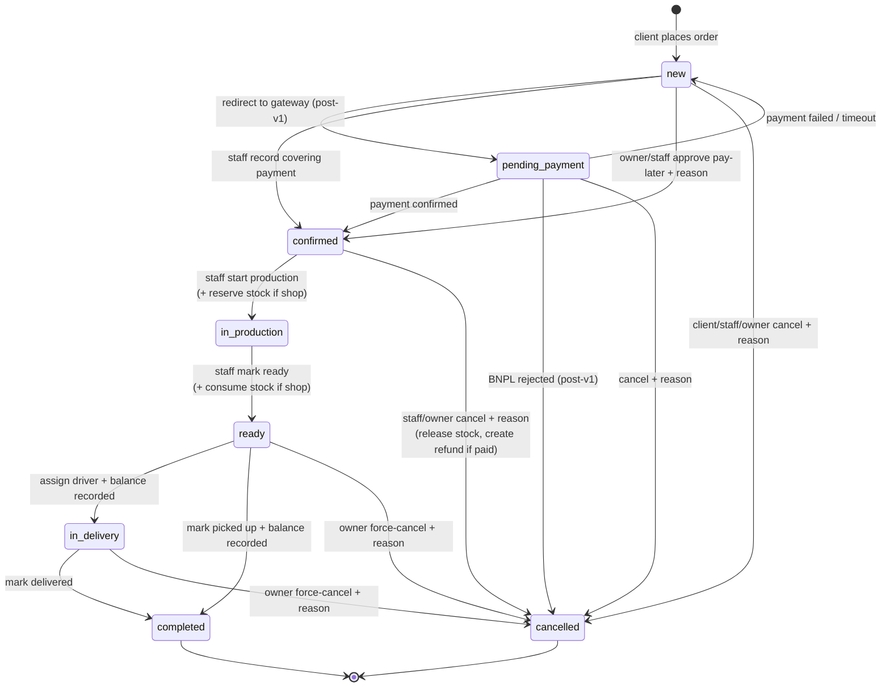

# Orders

The single home for the order lifecycle, pricing, payments, refunds, the warehouse contract, and
the per-screen UX — **placement** (client), **fulfilment** (workshop staff), **modification**
(both, by status), and **cancellation & refunds** (both, manual in v1). Who-may-do-what is in
[`access.md`](../../access.md); the cross-cutting invariants this relies on (integer tiyin,
snapshots, append-only history, optimistic lock, atomic stock) are in
[`architecture.md`](../../architecture.md) → *Data model invariants*.

## Problem

An order today is a phone call, a verbal price, and a whiteboard. The client can't see the price
or the cutting plan, the workshop can't trace who advanced what, and a paid cancellation has no
record of where the money went. v1 makes ordering self-serve, pricing automatic, the workflow
restricted to the state machine, and every payment/refund a recorded row — with no in-app
gateway: v1 *tracks* money, it doesn't *move* it.

## What an order is

A **client's request for panels cut to size at a branch** — the header that owns the items,
payments, status history, cancellation, and refunds. Created **only by a client**, **only from a
confirmed cutting draft** (no order without one — the draft becomes `confirmed` and bound on
creation). It carries a **snapshot** of its pricing and a reference to its current cutting
result.

Two axes set at creation:

- **Material source** — `own` (the client brings the material; cutting service only — no stock
  movement) or `shop` (the workshop supplies the material — stock reserved / consumed / released
  as the order moves).
- **Delivery type** — `pickup` (free) or `delivery` (a **fixed fee** from a static zone resolved
  from `(branch, lat, lng)` — workshop-entered, no geocoder in v1; out-of-zone ⇒ the client must
  switch to pickup or another branch).

## The state machine

States: `new` → `pending_payment` → `confirmed` → `in_production` → `ready` → (`in_delivery`) →
`completed`; any pre-`completed` state can reach `cancelled` per the matrix below.

`cancelled` is terminal — if the order was paid, a pending refund was created (see *Cancellation
& refunds* below).

Rules:

- **Every transition is recorded** as an `order_status_event` (who, from→to, reason, metadata) —
  append-only, mirrored into the audit `status_change_log`.
- **Optimistic locking** on transitions (a `version` column) — concurrent staff edits serialize;
  the loser is told to refresh and retry.
- **Advance-balance gate** — for `advance` orders, the balance payment must be **recorded**
  before `ready → in_delivery` (delivery) or `ready → completed` (pickup).
- A **`completed`** order is terminal — no modify, no cancel (a complaint/return flow is post-v1).
  An order is **never deleted** — it goes `cancelled`.
- **Cancellation requires a reason** (always). Cancelling a *paid* order creates a `pending`
  refund.

**Cancellation eligibility & refund:**

| Status when cancelled | Who may cancel | Refund |
|---|---|---|
| `new` | client / staff / owner | no payment yet → none |
| `pending_payment` | client / staff / owner | full refund if a payment was completed |
| `confirmed` | staff / owner (not the client) | full or partial — staff/owner decision; stock released if `shop` and not yet in production |
| `in_production` | **owner only** (force-cancel, exceptional) | partial — material is cut; cost stays with the client |
| `ready` | **owner only** (force-cancel, exceptional) | full refund or rework — product defect |
| `in_delivery` | **owner only** (force-cancel, exceptional) | negotiated |
| `completed` | nobody | — |

Force-cancel of an `in_production`+ order, and reverting a completed refund, are **owner-only**
(carve-outs of `manage_orders`); the owner force-cancel takes a longer mandatory reason.

## Pricing

The system computes everything; clients and staff never type a price — the **discount is the only
human input**, and it requires a reason. Money is **integer tiyin** throughout (1 UZS = 100
tiyin); the frontend converts for display only.

| Component | When | Source |
|---|---|---|
| Cutting service | always | the branch's cutting model — `per_sheet` (× sheets used) or `per_cut` (× cut count) — applied to the cutting result's metrics |
| Materials | `shop` source only | Σ (the material's snapshot price per sheet × sheets attributable to it), from the cutting result |
| Edge banding | parts with banding | Σ (edge length at thickness × the branch's edge-banding rate for that thickness), from the cutting result's `edge_length_by_thickness` |
| Delivery fee | `delivery` only | the static zone fee resolved from `(branch, lat, lng)` |
| Discount | when staff add one | percent or fixed sum; subtracted; **reason + the staff user id recorded** (audited); no enforced cap in v1 — the reason + audit + a "has discount" flag are the control |

**Total = cutting + materials + edge banding + delivery fee − discount.**

- **Snapshot at creation/re-pricing.** When the order is created (or re-priced on modify), every
  component value, the material details + the unit prices used, and the cutting-result reference
  are **frozen** onto the order/order-items; later changes to the catalog, the branch pricing, or
  the delivery zones do **not** reach existing orders. (Why → [`architecture.md`](../../architecture.md)
  → *Data model invariants*.)
- **Recalculation on modify** (below) recomputes against the *current* rates → a fresh snapshot →
  the payment difference handled as described under *Cancellation & refunds → recording
  payments*.
- **Operational setup gaps fail loudly** — if the branch has no cutting model set, or no
  edge-banding rate for a thickness a part uses, order pricing fails with a clear error (the
  owner must fix it; the client can't work around it).

## Modification

Allowed fields shrink as the order advances:

| Status | Modifiable by |
|---|---|
| `new` | client & staff — items, delivery type, delivery address, note |
| `pending_payment` | staff — items, delivery type; client — delivery address, note |
| `confirmed` | staff — items (limited), delivery type, delivery address, note |
| `in_production` | staff — delivery address, note |
| `ready` and later | staff — delivery address (before dispatch), note |

Anything outside the matrix → `order_not_modifiable`. A **modify-preview** (dry-run) returns
`pricing_before` / `pricing_after` / `requires_additional_payment` / `refund_amount` without
persisting — for the confirmation dialog. Applying a modify: if **items changed**, re-run
`cutting.optimize` → a new `draft` cutting result → bind it (`→ confirmed`) and **invalidate**
the old one ([`cutting.md`](cutting.md)), rebuild the `order_item`s, re-price against current
rates → a fresh snapshot; if **delivery type/address changed**, re-resolve the zone + fee. Then:
price **up** on an already-paid order → it returns to `pending_payment` for the difference; price
**down** → a difference `pending` refund is created; unchanged → no payment side-effect.

## Cancellation & refunds

Cancelling a paid order (or down-modifying one) creates a **`pending` refund** against the
relevant payment for the amount owed; for a `shop` order cancelled before production, the
reserved stock is released in the same operation; the single `order_cancellation` row records
who, in what capacity, the mandatory reason, whether `is_owner_force_cancel`, and
`refund_required`.

**Refunds are manual in v1** (the *why* — gateways/auto-refund deferred — is in
[`scope.md`](../../scope.md)): the system creates the `pending` refund; the workshop moves
the money **offline** (bank / cash); staff **record** it — method (`cash` / `bank_transfer` /
`payme_manual` / `click_manual` / `other`), amount (≤ the payment's completed amount; partials
allowed, summing to ≤ that amount), a **mandatory `note`** (bank reference / receipt id), an
optional receipt scan → the refund goes `completed`, the payment `refunded`,
`processed_by_user_id` recorded, the client notified. The **owner** can **revert** a completed
refund on dispute (exceptional, audited → `failed` with a reason). A `pending` refund older than
**7 days** is flagged stale (dashboard + a daily owner notification).

### Recording payments (v1)

There is **no payment gateway in v1** — no redirect, no `initiate-payment` flow, no automatic
refund. Instead:

- Workshop staff (`manage_orders` on the branch, or owner) **record** payments the client made at
  the counter — type `full` / `advance` / `balance`, method `cash` / `bank_transfer`, amount
  (validated ≤ the order's outstanding), optional receipt scan; the recording user is logged
  (`received_by_user_id`). Recording a payment that **covers** the order (or the advance)
  transitions it `→ confirmed`.
- The owner can approve **pay-later** for a trusted customer — mandatory reason → `→ confirmed`
  without a payment (the reason + audit are the control). The client pays before handover
  (recorded as a payment); if they never do, staff cancel the order (`reason = no_payment`) — for
  `shop`, the material is already consumed (no release), the loss is the workshop's, surfaced as
  a dispute the owner can review.
- **Stock on confirm:** for a `shop` order, `inventory.reserve` runs atomically on `→ confirmed`.
  If the payment **already moved** (a recorded `completed` payment) and the reserve fails, the
  order stays `confirmed` with `reserve_status = failed` and the owner is alerted — no rollback
  after money moved (manual resolution: retry, or refund + cancel). If it's a **no-money**
  confirm (pay-later, or recording a payment whose unit-of-work hasn't committed yet), a reserve
  failure rolls the whole thing back with `insufficient_stock`. (The post-v1 gateway path will keep
  this shape — `pending_payment` → an idempotent signed webhook → `confirmed`; the
  `reserve_status` field and the `pending_payment` state are the seams.)

## Warehouse contract (`shop` orders)

Driven entirely by the order state machine. On `→ confirmed`: `reserve` (atomic; `reserved +=
qty`; fails `insufficient_stock` if `available` doesn't cover it — see above for the
money-already-moved exception). On `→ ready`: `consume` (`reserved -= qty`, `on_hand -= qty`).
On cancel **before production**: `release` (`reserved -= qty`). After production starts, the
material is consumed — no release. An `own`-source order never touches stock.

## Who does what

- **Client** — creates the order; cancels or modifies it while `new` / `pending_payment`; sees
  its status & timeline; pays (recorded by staff in v1).
- **Workshop staff with `manage_orders` on the order's branch** — records payments; approves
  pay-later¹; moves the order `confirmed → in_production` (optionally assigning a cutter) →
  `ready` → (`in_delivery`, assigning a driver) → `completed`; applies discounts; processes
  refunds.
- **Workshop owner** — all of the above on every branch, **plus** force-cancel an
  `in_production`+ order and revert a completed refund.
- **System** — auto-transitions on a payment recorded (and, post-v1, on a payment webhook);
  reserves / consumes / releases stock; writes status events; runs the overdue/stale notification
  jobs.

¹ Pay-later approval is owner-discretion in practice but covered by `manage_orders` in v1, with
the mandatory reason as the control — see [`open-questions.md`](../../open-questions.md) Q12.
Assigned cutters/drivers must belong to the order's branch.

## Endpoints

| Endpoint | Caller | What |
|---|---|---|
| `list-branches?status=active,temporarily_closed` | client | branch picker; cross-workshop |
| `resolve-delivery-fee { branch_id, lat, lng }` | client | returns `{ zone_id, fee_tiyin }` or `delivery_out_of_zone`; no side effects |
| `create-order` | client only | from a `draft` cutting result the client owns; snapshots pricing; binds cutting `→ confirmed`; returns the order |
| `list-my-orders` / `get-my-order` | client | own orders with timeline, items, cutting summary, payments, refunds |
| `modify-order-preview` | client / staff (per matrix) | dry-run: `{ pricing_before, pricing_after, requires_additional_payment, refund_amount }` |
| `modify-my-order` / `modify-order` | client / staff (per matrix) | applies; re-optimizes cutting if items changed; re-prices; may bounce to `pending_payment` or create a pending refund |
| `cancel-my-order` / `cancel-order` / `force-cancel-order` | per eligibility | writes the single `order_cancellation`; releases stock if applicable; creates `pending` refund if paid |
| `list-branch-orders` / `get-order` | staff with `manage_orders` / owner | branch-scoped queue + detail |
| `record-payment` | staff with `manage_orders` / owner | creates an `order_payment` `completed`; triggers `→ confirmed` when it covers |
| `mark-pay-later` | owner (covered by `manage_orders` in v1) | mandatory reason → `→ confirmed` without money |
| `change-order-status` | staff with `manage_orders` / owner | the allowed transitions only (optimistic-lock) |
| `assign-driver` | staff with `manage_orders` / owner | branch worker in position `driver`; part of `ready → in_delivery` |
| `apply-discount` | staff with `manage_orders` / owner | percent or fixed sum + mandatory reason; recomputes total |
| `list-pending-refunds` | owner; staff with `manage_orders` for their branches | filter by branch / stale-only / min amount; oldest-first |
| `process-refund` | staff with `manage_orders` / owner | method, amount, **mandatory note** (bank ref / receipt) → `completed`; payment → `refunded` |
| `revert-refund` | **owner only** | dispute reversal → `failed` with mandatory reason |

Every action is audited; status changes write status-change-log rows; the client (and relevant
workshop staff) get notifications on status changes, payment recorded, discount, etc.

## UX — client app

- **Branch picker** (`/c/branches`, also the client home) — hero copy, search, grid of branch
  cards (name, address, today's hours, status badge; `active` → "Start cutting" CTA;
  `temporarily_closed` → reason + disabled CTA). Empty: "No active branch found."
- **Cutting wizard** — see [`cutting.md`](cutting.md).
- **Order create wizard** (`/c/orders/new?cutting=:id`) — pre-check the draft is still `draft`
  (else redirect to its detail with a toast); a 3-step stepper with a sticky summary card
  (subtotals: cutting, material, edge banding, delivery, discount = 0; total in UZS from tiyin):
  1. **Confirm parts** — read-only parts list + the cutting summary + PDF link; a "need to
     change parts? go back to cutting" link.
  2. **Delivery** — toggle "pick up at the branch" / "delivery"; pickup shows the branch
     address + hours; delivery shows address fields (street, city, lat/lng numeric, note) and,
     on change, calls `resolve-delivery-fee` → shows the fee, or "this address isn't in any
     delivery zone — choose pickup or another branch."
  3. **Payment** — radio: "pay in full" (`full`) / "advance + balance" (`advance`, shows the
     advance % from the workshop settings + the computed advance and balance); a `bnpl` chip
     shown **disabled** with a "coming soon" pill. Confirm → `create-order`.
  - On success → `/c/orders/:id` with a banner: "Order placed — it'll be confirmed once the
    workshop records your payment" (and, for `advance`, the advance amount to pay).
  - On `cutting_result_not_usable` (race) → toast + back to the cutting wizard;
    `delivery_out_of_zone` / `branch_closed` / `workshop_blocked` → step 2 with an inline error.
- **My orders** (`/c/orders`) — filter chips (All / Active / Completed / Cancelled), search by
  order number, cards (order #, branch, date, status badge, total, primary action — "Pay info"
  if awaiting payment, "Track" otherwise), pagination. Empty: "No orders yet — start from a
  cutting."
- **Order detail** (`/c/orders/:id`) — header (order number, branch, status badge, times, total)
  with status-appropriate actions ("Modify" / "Cancel" only in `new`/`pending_payment`;
  otherwise "Track" expands the timeline). Tabs: Overview (items snapshots, pricing breakdown,
  delivery info, notes), Cutting (the SVG + PDF link; a note if the bound result is
  invalidated), Payments (the list), Refunds (only if any), Timeline.
- **Modify wizard** (`/c/orders/:id/modify`) — reuses the order create wizard with the order's
  current values pre-filled; if the client edits parts, step 1 routes back into the cutting
  wizard (parts prefilled) → a new draft is produced; before submit, `modify-order-preview` runs
  and a **confirmation modal** shows: "Price changed: was {X} → now {Y}. {You'll need to pay
  {diff} / We'll refund {diff} / No change.} Continue?" Confirm → `modify-my-order`.

## UX — workshop app

- **Orders** (`/workshop/orders`) — branch-scoped queue, two modes (toggle in the toolbar):
  - **Board** — columns `new` / `pending_payment` / `confirmed` / `in_production` / `ready` /
    `in_delivery`; each column header has a count; cards: order #, client name + phone, total,
    payment chip (paid/unpaid/partial/pay-later), delivery icon, item count, age, a
    pending-refund flag. **No drag-and-drop** — status changes go through the card's action menu.
  - **Table** — sortable headers; columns: order #, branch (if multi-branch), client, status,
    payment status, total, items, created, action menu. Filter strip: status chips,
    payment-status chips, has-pending-refund toggle, search, date range. Branch filter for
    multi-branch users. Empty: "No orders in your branch(es)." Zero branches: "No branches
    assigned — ask your workshop owner."
- **Order detail** (`/workshop/orders/:id`) — header (order #, branch chip, client (link to a
  mini-card), status badge, total) with the status-appropriate action set:

  | Status | Actions |
  |---|---|
  | `new` | Cancel (reason) · Modify · Mark pay-later (owner; reason) · Record payment |
  | `pending_payment` | Cancel (reason) · Modify · Record payment |
  | `confirmed` | Start production (→ `in_production`; optional cutter) · Cancel (reason) |
  | `in_production` | Mark ready (→ `ready`) · Apply discount (reason) · Force-cancel (owner; reason) |
  | `ready` (pickup) | Mark picked up (blocked until balance recorded for advance) · Record payment · Force-cancel (owner) |
  | `ready` (delivery) | Assign driver (blocked until balance recorded) · Record payment · Force-cancel (owner) |
  | `in_delivery` | Mark delivered · Force-cancel (owner) |
  | `completed` | (read-only) |
  | `cancelled` | Complete refund (if a pending refund exists) |

  Tabs: Overview (items snapshots, pricing breakdown, delivery info, the internal note — inline
  editable), Cutting (the SVG + PDF link; invalidated note if applicable), Payments (list;
  "Record payment" inline → modal with amount/method/receipt), Refunds (only if any; "Complete
  refund" → modal), Timeline (status events + audit), Notes.

  Discount dialog: percent or fixed sum + reason, with a live new-total preview. Pay-later
  dialog: reason + confirms the client name. Cancel dialog: reason + a warning if `shop`
  material is reserved (stock will be released). Process-refund modal: method, amount (defaults
  to owed, validated), mandatory note (bank ref / receipt), optional receipt-scan upload.
- **Refund queue** (`/workshop/refunds`) — table: refund id (short), order #, client, amount, payment
  ref (external_ref + method), days pending, branch, action menu ("Complete refund"). Toolbar:
  stale-only toggle (with a count badge), branch filter, min-amount filter, sorted oldest-first.
  Owner-only: "Revert refund" on `completed` refunds in the order detail's Refunds tab → dialog
  with a mandatory reason. Empty: "No pending refunds."
- **Dashboard** (`/workshop/dashboard`, `view_dashboard`) — date-range + branch filter; KPI cards
  (orders, revenue completed, avg order value, completed/cancelled ratio, pending refunds +
  stale subcount); status donut; orders/revenue timeseries (client zero-filled); refund-SLA
  panel ("N stale, oldest age" → link to refunds); top branches (owner); recent critical audit
  entries. Empty for an empty period: "No orders in this period."

States: list/detail/dashboard each have loading/empty/error; actions show a busy state and end
in success or a recoverable error; the optimistic-lock conflict surfaces as "this order changed
— refresh and try again"; no infinite spinners. Accessibility: the board is keyboard-navigable
(focus a card, open via Enter); status actions are in a labelled menu, not drag targets;
destructive actions (cancel, force-cancel, revert) are danger-styled and name their effect;
modal focus management; the balance-gate is explained when an action is disabled. Component
specs are in [`web/DESIGN.md`](../../../web/DESIGN.md).

## Edge cases

- **Cutting draft already used / not the client's / not `draft`** → `cutting_result_not_usable`;
  redirect to its detail.
- **Branch went `inactive`/`temporarily_closed` between cutting and order** → `branch_closed`;
  the client picks another branch.
- **Workshop blocked** between cutting and order → `workshop_blocked`.
- **Delivery address out of all zones** → `delivery_out_of_zone`; switch to pickup or another
  branch.
- **Branch pricing incomplete** → order creation fails at pricing; the client sees a "this
  branch can't take orders right now" message (the owner must finish pricing); the workshop app flags
  the branch.
- **Material price changed since the draft** → the order prices at the price as of confirmation,
  then snapshots it.
- **Recording a payment larger than the outstanding** — rejected.
- **Stock reserve fails on a money-already-moved confirm** → order stays `confirmed`,
  `reserve_status = failed`, owner alerted; on a no-money confirm → whole UOW rolls back,
  `insufficient_stock`. Manual resolution: retry the reserve, or cancel + refund. (Rare —
  cutting doesn't check stock, so a race is possible.)
- **Cutting result invalidated mid-flow** (concurrent modify) → the detail shows the prior
  result with a note; the order's bound result is always a single current one.
- **Out-of-zone delivery address at modify time** → modify rejected for delivery; switch to
  pickup.
- **Advancing past `ready` with the balance unrecorded** (advance order) — the action is
  disabled with an explanation; record the balance first.
- **Concurrent staff transitions / cancel / modify** — optimistic-lock conflict on the second;
  refresh and retry.
- **Assigning a worker from another branch / an inactive worker** — rejected.
- **Pay-later order unpaid past the handover deadline** — staff cancel it (`reason =
  no_payment`); for `shop`, consumed material is the workshop's loss; the owner can review.
- **Items changed but the new optimization fails** (modify) → modify rejected with the cutting
  error; the order is unchanged.
- **Re-price lands exactly equal** → no `pending_payment` bounce, no refund.
- **Partial refunds** — a payment can have several `completed` refunds; their amounts sum to ≤
  the payment amount; each needs its own note.
- **Refund left `pending` > 7 days** — flagged stale; dashboard counts it; the owner gets a
  daily notification; it doesn't auto-resolve.
- **Branch goes `inactive` while orders are open** → those orders complete normally; the branch
  just accepts no new orders.

## Next

[`cutting.md`](cutting.md) — the cutting-result lifecycle the order depends on, the immutability
invariant. [`catalog-inventory.md`](catalog-inventory.md) — the warehouse the `shop` flow drives.
