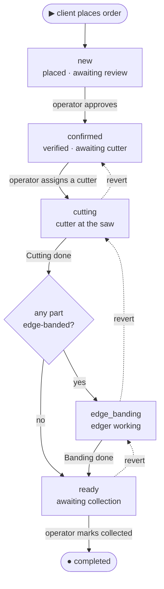

# Orders

The order lifecycle: a client places an order from a finished cutting, the workshop verifies
it, two production phases run, and the client collects it. v1 is **pickup-only**, the order
**never moves money** (the finance module records what the client paid —
[`finance.md`](finance.md)) and **never holds stock balances** (the inventory module
auto-decrements as production completes — [`catalog-inventory.md`](catalog-inventory.md)).
The order is the production spine; money and material are separate modules it triggers.

## Problem

An order today is a phone call, a verbal price, and a whiteboard. The client can't see the
price or the cutting plan, and the workshop can't trace who cut what. v1 makes ordering
self-serve, pricing automatic, the workflow restricted to a small state machine, and every
transition a recorded row.

## What an order is

A **client's request for panels cut to size at one branch** — the header that owns the
items, the status history, the production stamps, and a frozen price snapshot. Created
**only by a client**, from a cutting **draft** with a **chosen algorithm result** (no order
without one — the draft becomes `confirmed` and is bound on creation; see
[`cutting.md`](cutting.md)).

Set at creation:

- **Branch** — the client picks one active branch that can fulfil the cutting's material
  set; branches that don't carry every `shop`-source material in the cutting aren't shown.
  The pick **freezes pricing** against that branch's rates.
- **Material source — per item.** Each part is `shop` (the workshop supplies the material;
  inventory auto-decrements for it) or `own` (the client brings it; cutting service only, no
  stock movement). An order can mix sources; a fully-`own` order touches no stock and can
  be placed at any active branch with a saw.
- **Handover — pickup only.** The client collects at the branch. Delivery is out of v1
  ([`scope.md`](../../scope.md)).

There is **no post-placement modification.** If anything is wrong, the order is cancelled
(with a reason) and the client re-cuts and re-orders — one rule, no re-pricing machinery.

## The state machine

One straight spine with a single gateway — *does any part need edge banding?* Read it top to
bottom: the solid path is the happy flow and the dashed arrows are the operator **revert**
(one step back, a mistake fix). **Cancellation is not drawn** — it would cross every box: any
non-terminal status can go to `cancelled` (see the table below).

`completed` and `cancelled` are **terminal**. A post-collection problem (return, complaint)
is out of v1 ([`scope.md`](../../scope.md)) — `completed` is final by design.
`edge_banding` is skipped when no part is banded (the gateway's *no* branch).

### Transitions

Who triggers each step (by per-branch grant — there are no fixed roles), and its effects:

| From → To | Trigger · who | Effect |
|---|---|---|
| — → `new` | client places the order from a chosen cutting result | price snapshot frozen |
| `new → confirmed` | **Approve** · `manage_orders` (reviewed, client called) | — |
| `new → cancelled` | **Cancel** · client (only while `new`) or `manage_orders` + reason | — |
| `confirmed → cutting` | **Assign a cutter** · `manage_orders` — the assignment *is* the trigger; the edger is assigned now too if any part is banded | — |
| `cutting → edge_banding` | **Cutting done** · `process_production`, or `manage_orders` on-behalf — *gateway: a part is banded* | stamp the cutter + snapshot; **decrement sheet stock** (`shop`) |
| `cutting → ready` | **Cutting done** · same — *gateway: no part is banded* | stamp the cutter + snapshot; **decrement sheet stock** (`shop`) |
| `edge_banding → ready` | **Banding done** · `process_production`, or `manage_orders` on-behalf | stamp the edger + snapshot; **decrement edge stock** (`shop`) |
| `ready → completed` | **Mark collected** · `manage_orders` | stamp `picked_up_at` |
| `* → cancelled` | **Cancel** · `manage_orders` + reason (any pre-`completed` status) | already-decremented material stays consumed |
| revert: `cutting→confirmed`, `edge_banding→cutting`, `ready→edge_banding\|cutting` | **Revert** one step · `manage_orders` + reason | clears that step's stamps; **re-increments** the stock it decremented |

### Rules

- **One button per job; no per-item work.** Workers don't manage line items. The cutter
  views the cutting plan read-only and marks **Cutting done** once; the edger marks
  **Banding done** once. A `manage_orders` user may complete a job **on behalf** (worker
  absent / system issue) — the dialog asks **"Who did this work?"**, defaulting to the
  assignee; the chosen user is who gets **credited** for the production reports
  ([`finance.md`](finance.md)).
- **Re-assignment** of the cutter or edger is allowed until that job is marked done.
- **Revert is mistake-correction only** — one step, never out of `completed` or `cancelled`.
- **Every transition is an `order_status_event`** (actor, from → to, reason, metadata),
  append-only, mirrored to the audit log.
- **Optimistic locking** on transitions (a `version` column): concurrent staff actions
  serialize; the loser is told to refresh and retry.

### Production stamps

The cutter and edger are workshop users holding `process_production` on the order's branch,
with `home_branch_id = order.branch_id` — **except the owner**, who holds
`process_production` on every branch implicitly and may be assigned as cutter or edger on
any branch regardless of their `home_branch_id` (a one-person shop's owner floats between
branches; the constraint exists to keep non-owner staff at the branch they physically work
at, and the owner has no such home). No separate worker entity — see
[`access-patterns.md`](../../access-patterns.md). The system stamps the order at each job's
completion; these stamps are the **only** input to the worker-production reports the
accountant uses ([`finance.md`](finance.md)).

| Stamp | Set at | Read by |
|---|---|---|
| `cutter_user_id`, `cut_completed_at`, `sheets_used_snapshot`, `cut_count_snapshot` | `cutting → next` | production report (sheets / cuts) |
| `edger_user_id`, `edge_completed_at`, `edge_length_snapshot` | `edge_banding → ready` | production report (metres of banding) |
| `picked_up_at` | `ready → completed` | client notify · audit |

One cutter, one edger per order in v1. Stamps are immutable once set, written in the same
atomic transaction as the transition, and **cleared by a revert** of the step that set them.

## The stock seam

Driven entirely by this state machine; the mechanics live in
[`catalog-inventory.md`](catalog-inventory.md). The contract:

- **No reservation.** Verification is **never blocked** by low stock — some workshops buy
  per order. At approval the operator sees a **warning** if a `shop` material's projected
  balance won't cover this order (projected = on-hand minus the not-yet-decremented demand
  of active orders ahead), so they can prompt the warehouseman. It is a warning, not a gate.
- **Auto-decrement at job completion.** Sheets decrement when **Cutting done** is marked;
  edge material decrements when **Banding done** is marked. A revert re-increments exactly
  what its step decremented.
- **`own` items never touch stock.** An order with no `shop` items skips this seam entirely.
- **After decrement, material is spent.** Cancelling an order whose sheets/edges were
  already decremented does **not** restore them (they were physically cut); the loss is the
  workshop's, recorded offline.

## The money seam

The order **never holds payments or refunds**. All money lives in the finance module
([`finance.md`](finance.md)): an accountant (`manage_finance`) records an *income* against
the order — the amount the client actually paid (full or partial) and the date — at the
counter. No in-system payment, no gateway, no payment-driven status.

- **One disclosure rule.** Split the order's money into two parts and gate them
  differently:
  - The **frozen total + price breakdown** is visible to the client **from placement
    onward** (the Overview tab). The client already saw these figures in the order wizard;
    pricing is frozen at creation and never re-priced, so there is nothing to hide and
    hiding it only confuses ("what will this cost?").
  - The **settlement figures** — recorded-so-far and balance — appear to the client
    **only at `ready` and `completed`** (the Finance tab), the moment they need to settle
    on collection and the receipt afterwards. There is no in-app payment action; a
    discrepancy ("I paid, it's not marked") is resolved out-of-system by calling the
    workshop.
  - **Workshop side.** Staff with `view_finance_reports` or `manage_finance` see a
    read-only settlement summary (total / recorded / balance) on the order detail at
    **any** status, sourced from the finance module — distinct from the client's
    ready/completed gate. This is not a payments tab; recording and correcting money stays
    in the finance module ([`finance.md`](finance.md)).
- **Cancellation never creates a refund record.** If money must go back, the accountant
  books an *expense* in the finance module. A cancelled order carries only its reason.

## Pricing

The system computes everything; the **discount is the only human input** and needs a reason.
Frozen onto the order at creation against the chosen branch's rates; later catalog or pricing
changes never reach an existing order (there is no re-pricing — there is no modification).

| Component | When | Source |
|---|---|---|
| Cutting service | always | the branch's cutting model — `per_sheet` (× sheets used) or `per_cut` (× cut count) — applied to the cutting result |
| Materials | items with `source = shop` | Σ (the material's snapshot price per sheet × sheets attributable to that material's `shop` parts) |
| Edge banding | parts with banding | Σ (edge length at thickness × the branch's edge-banding rate for that thickness) |
| Discount | when a `manage_orders` user adds one | percent or fixed sum; subtracted; **reason + the user id recorded** (audited); no enforced cap in v1 — the reason + audit are the control |

**Total = cutting + materials + edge banding − discount.**

**Operational setup gaps fail loudly.** If the branch has no cutting model set, or no
edge-banding rate for a thickness a part uses, order creation fails with a clear error and
the client picks another branch — the owner must fix the branch's pricing
([`catalog-inventory.md`](catalog-inventory.md)).

## UX — client app

The client app's home is the cutting wizard entry (**New cutting** + **My drafts** + **My
orders**). Branch is chosen later, at placement, against a specific cutting.

- **Cutting wizard** — see [`cutting.md`](cutting.md). Entry point and where the client
  spends most of their time.
- **Order create wizard** (`/c/orders/new/:draftId`) — opens from the cutting result's
  **Place order with this cutting** button. Pre-checks the draft is still `draft` with a
  chosen result (else redirect with a toast). Two screens, a sticky summary card on each
  (parts, sheets per material, waste %, total once a branch is picked):

  1. **Branch pick.** Active branches that can fulfil the cutting's material set (a
     fully-`own` cutting accepts any active branch with a saw). Each card: name, address,
     today's hours, and a **price breakdown** at that branch's rates (cutting, materials per
     material — `shop` share only, edge banding by thickness, **subtotal**). Tapping a card
     commits the branch and freezes pricing. Empty / error states: no branch carries the set
     (inline panel listing the offending materials + a "flip these to *I'll bring it*"
     link); branch went `temporarily_closed` (greyed card with reason); branch pricing
     incomplete (greyed, "this branch can't take orders right now").
  2. **Checkout** — one scrollable page, two sections:
     - **Contact** — phone and name, prefilled from the client's profile, editable inline,
       with a non-dismissible note: *"This is shared with the workshop so they can call you
       about your order."* and a reset-to-profile link per field.
     - **Review** — the final price breakdown + pickup branch (address + hours) + contact.
       A primary **Place order** button; an Edit link returns to the relevant field.

  The client does not choose a payment plan and pays nothing online — payment is recorded by
  the workshop's accountant at the counter ([`finance.md`](finance.md)). On success →
  `/c/orders/:id` with a banner: *"Order placed — the workshop will review and call you."*

- **My orders** (`/c/orders`) — filter chips (All / Active / Completed / Cancelled), search
  by order number, cards (order #, branch, date, status badge, the **frozen total** —
  shown from placement, never "price after confirm" since pricing is frozen at creation —
  primary action "Track", which opens the order detail). Empty: "No orders yet — start
  from a cutting."
- **Order detail** (`/c/orders/:id`) — header (order #, branch, status badge, times). The
  client-facing status is **five phases**: Placed → **Confirmed** → **In production** →
  **Ready** → Done — collapsing `cutting`/`edge_banding` into "In production" with optional
  sub-text. Tabs: Overview (item snapshots, price breakdown, notes), Cutting (the SVG + PDF
  link; a note if the bound result was `invalidated`), **Finance** (visible **only at
  `ready` and `completed`** — total, recorded so far, balance; read-only; "contact the
  workshop about a payment" hint), Timeline. "Cancel" shows only while `new`.
- **Branches page** (`/c/branches`) — a passive directory (name, address, hours, materials
  carried); not the start of the flow; no per-branch CTAs.

## UX — workshop app

Permission names below are the per-branch grants from
[`access-management.md`](access-management.md); a single user may hold all of them.

- **Orders** (`/workshop/orders`, `view_dashboard` to see; `manage_orders` to act) —
  branch-scoped, two modes:
  - **Board** — columns `new` / `confirmed` / `cutting` / `edge_banding` / `ready`; each
    header has a count; cards: order #, client name + phone, total, item count, age, the
    assigned cutter / edger chip when set. **No drag between status columns** — status
    changes go through the card's action menu.
  - **Table** — sortable; columns: order #, branch (if multi-branch), client, status,
    total, items, created, action menu. Filters: status chips, search, date range, branch.
    Empty: "No orders in your branch(es)." Zero branches: "No branches assigned — ask your
    workshop owner."
- **Order detail** (`/workshop/orders/:id`) — header (order #, branch chip, client mini-card
  link, status badge, total) with the status-appropriate actions:

  | Status | Actions | Permission |
  |---|---|---|
  | `new` | Approve (→ `confirmed`) · Cancel (reason) · Apply discount (reason) | `manage_orders` |
  | `confirmed` | Assign cutter (→ `cutting`) · Assign / change edger · Apply discount · Cancel (reason) | `manage_orders` |
  | `cutting` | Cutting done (→ `edge_banding`/`ready`; decrements sheets) · Revert → `confirmed` (reason) · Cancel (reason) | done: `process_production` or `manage_orders` on-behalf · revert/cancel: `manage_orders` |
  | `edge_banding` | Banding done (→ `ready`; decrements edges) · Revert → `cutting` (reason) · Cancel (reason) | done: `process_production` or `manage_orders` on-behalf · revert/cancel: `manage_orders` |
  | `ready` | Mark collected (→ `completed`) · Revert → `edge_banding`/`cutting` (reason) · Cancel (reason) | `manage_orders` |
  | `completed` / `cancelled` | (read-only) | — |

  On-behalf job completion asks **"Who did this work?"** (defaults to the assignee; the
  chosen user is credited). Destructive actions (cancel, revert) and "Mark collected" use a
  danger / confirm dialog that names the effect ("client collected everything?").

  Tabs: Overview (item snapshots, price breakdown, a **read-only settlement summary**
  — total / recorded / balance, sourced from the finance module, shown at any status to
  staff with `view_finance_reports`/`manage_finance`; hidden otherwise — the warehouse
  warning if a `shop` material is short, the internal note — inline editable), Cutting
  (SVG + PDF; an invalidated note if applicable), Timeline (status events + audit), Notes.
  There is **no** Payments or Refunds tab here — recording and correcting money is the
  finance module; the summary is a read-only mirror.

- **Cutter workspace** (`/workshop/cutting`, `process_production`) — tablet-optimised. Lists
  orders **assigned to this user** that are `confirmed` (assigned, awaiting cut) and
  `cutting` (theirs, in progress). Card: order #, parts count, sheets needed, age, cutting
  plan link (SVG / PDF for the saw). One action: **Cutting done** (stamps the cutter +
  snapshot, decrements sheets, routes to `edge_banding` if any banded part else `ready`).
  Empty: "Nothing assigned — nice."
- **Edger workspace** (`/workshop/banding`, `process_production`) — same shape for
  `edge_banding` orders assigned to this user. Card: order #, parts, total metres by
  thickness, age. One action: **Banding done** (stamps the edger + metres snapshot,
  decrements edge material, → `ready`).

States: list / detail each have loading / empty / error; actions show a busy state and end
in success or a recoverable error; the optimistic-lock conflict surfaces as "this order
changed — refresh and try again"; no infinite spinners. Accessibility: the board is
keyboard-navigable; status actions are in a labelled menu, not drag targets; destructive
actions are danger-styled and name their effect; modal focus is managed.

## Edge cases

- **Cutting draft already used / not the client's / not `draft`** → `cutting_result_not_usable`;
  redirect to its detail.
- **Branch went `inactive` / `temporarily_closed` between cutting and order** →
  `branch_closed`; the client picks another branch.
- **Workshop blocked between cutting and order** → `workshop_blocked`.
- **Branch pricing incomplete** → order creation fails at pricing; the client sees "this
  branch can't take orders right now"; the workshop app flags the branch.
- **`shop` material short at verification** → approval is **not** blocked; the operator sees
  a warning and prompts the warehouseman ([`catalog-inventory.md`](catalog-inventory.md)).
- **Cancel before any decrement** (`new` / `confirmed` / `cutting`) → no stock change.
- **Cancel after a decrement** (`edge_banding` / `ready`) → the cut material is spent, not
  restored; money returned, if any, is an accountant expense ([`finance.md`](finance.md)).
- **Revert** → exactly reverses the prior step's stamps and re-increments the stock that
  step decremented; never out of `completed`.
- **Order has no banded parts** → `edge_banding` is skipped; **Cutting done** goes straight
  to `ready`.
- **One person holds `manage_orders` + `process_production`** → fine; they approve, assign
  themselves, and complete the jobs (credited to themselves). v1 assumes **no separation of
  duties**.
- **Concurrent staff transitions / cancel** → optimistic-lock conflict on the second;
  refresh and retry.
- **Cutter / edger from another branch, a blocked user, or one without `process_production`
  on this branch** — rejected at assignment. The **owner is exempt** from the
  same-branch (`home_branch_id = order.branch_id`) check — they hold `process_production`
  everywhere and may self-assign on any branch.
- **No worker available** — the order waits in `confirmed` (or `edge_banding`); the board
  flags the column count; a `manage_orders` user can complete on-behalf. No auto-timeout.
- **Client disputes a recorded payment** — out-of-system; the client calls the workshop and
  the accountant corrects the income in the finance module.
- **Cutting result invalidated** (its draft re-cut elsewhere) → the order's bound result is
  unchanged; the detail shows a note.

## Next

- [`cutting.md`](cutting.md) — the cutting-result lifecycle the order binds and depends on.
- [`catalog-inventory.md`](catalog-inventory.md) — materials, the warehouse, and the
  auto-decrement contract this state machine drives.
- [`finance.md`](finance.md) — order income, the worker-production reports, and expenses.
