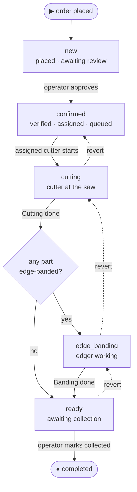

# Orders

The order lifecycle: a client places an order from a finished cutting — or workshop staff
place it for a walk-in client (see [Staff-created orders](#staff-created-orders-walk-in-clients))
— the workshop verifies it, two production phases run, and the client collects it. v1 is **pickup-only**, the order
**never moves money** (the finance module records what the client paid —
[`finance.md`](finance.md)) and **never holds stock balances** (the inventory module
auto-decrements as production completes — [`catalog-inventory.md`](catalog-inventory.md)).
The order is the production spine; money and material are separate modules it triggers.

## Problem

An order today is a phone call, a verbal price, and a whiteboard. The client can't see the
price or the cutting plan, and the workshop can't trace who cut what. v1 makes ordering
self-serve, pricing automatic, the workflow restricted to a small state machine, and every
transition a recorded row.

## What an order is

A **client's request for panels cut to size at one branch** — the header that owns the
items, the status history, the production stamps, and a frozen price snapshot. Created
**by the client — or by workshop staff on behalf of a walk-in client** — from a cutting
**draft** with a **chosen algorithm result** (no order without one — the draft becomes
`confirmed` and is bound on creation; see [`cutting.md`](cutting.md)).

Set at creation:

- **Branch** — the client picks one active branch that can fulfil the cutting's material
  set; branches that don't carry every `shop`-source panel **and every `shop`-source edge
  material** in the cutting aren't shown. The pick **freezes pricing** against that
  branch's rates.
- **Material source — per-item for panels, per-side for edges.** Each part is `shop` (the
  workshop supplies the panel; inventory auto-decrements for it) or `own` (the client
  brings the panel; cutting service only, no stock movement for that panel). Each banded
  edge side is independently `shop` (workshop supplies that tape; inventory decrements
  consumed length as integer millimetres internally, shown and priced as metres) or `own`
  (client brings the tape; no stock movement for that side). The data model and pricing
  support mixing sources at every level, but the **client cutting editor no longer offers
  `own`** ([`cutting.md`](cutting.md#parts-and-materials)) — new orders are fully `shop`;
  `own` remains meaningful for historical orders.
- **Handover — pickup only.** The client collects at the branch. Delivery is out of v1
  ([`scope.md`](../../scope.md)).

Post-placement modification is **workshop-side only**, pre-production — a staff **revision**
(see [Revising a placed order](#revising-a-placed-order)). The client's own path stays
cancel-and-reorder while `new`.

## Staff-created orders (walk-in clients)

A walk-in customer at the counter has no app and no OTP session. Staff holding
`manage_orders` on the branch place the order **for** them, through the **same cutting
editor the client app uses** ([`cutting.md`](cutting.md#workshop-side)) — the walk-in flow
parameterizes the client flow, it doesn't fork it. The flow:

1. **Entry** — a **+ New order** action on the Orders screen, enabled only when the staffer
   holds `manage_orders` on the **current topbar branch** and that branch is `active`;
   otherwise it's disabled with a hint to switch branch.
2. **Walk-in resolve** — phone-first find-or-create: the staffer enters the client's phone;
   an existing client's registered name comes back and must be explicitly **confirmed**
   before continuing; the name is asked only when the number is new; a blocked client is
   rejected. Semantics, guardrails, and the decision rationale live in
   [`access-management.md`](access-management.md#staff-resolved-walk-ins-find-or-create).
3. **Shared editor** — the client app's editor in fixed-branch mode: the branch is locked
   to the entry branch and frozen into the draft at creation, and a persistent strip names
   the walk-in (name + phone). Draft visibility and lifecycle rules:
   [`cutting.md`](cutting.md#access).
4. **Checkout** — single-branch: a quote at the locked branch, contact prefilled from the
   resolved client, **Place order**. Pricing setup gaps fail with the same error codes as
   the client path (see [Pricing](#pricing)); the error copy names the branch and that the
   owner sets its pricing.
5. **The order lands `confirmed`** and opens on its detail. From `confirmed` onward a
   staff-created order is indistinguishable from a client-placed one — same state machine,
   same stock and money seams.

**Create + auto-confirm.** A staff-placed order is created and confirmed in one operation:
two append-only status events are written (`∅ → new`, `new → confirmed`), both with
`actor_type = workshop_user` and the acting staffer's id, and **`confirmed_at` is set to
creation time**. The standard `order.confirmed` client notification fires as usual — the
walk-in sees it, along with the order in their history, after they first log in via OTP
with the same phone.

**Why auto-confirm.** The `new → confirmed` gate exists so staff verify a *client's*
self-serve order; a staff-placed order is verified by construction — the same staffer just
built it with the client at the counter. Landing it at `new` for a second Approve tap would
be ceremony (two events, same actor, seconds apart), while skipping the `∅ → new` event
would break the append-only spine every timeline and report reads — so both events are
written atomically, by the same actor. Revisit if workshops ask for a second-person review
of staff-placed orders — then drop the auto-confirm and land staff orders at `new` like any
other.

## Revising a placed order

Staff holding `manage_orders` on the order's branch may revise the order's **cutting
content** — parts, dimensions, quantities, materials, per-side edge picks — while the order
is `new` or `confirmed`. From `cutting` onward nothing is editable (material may already be
cut; if the start itself was the mistake, revert first). The client has no self-serve edit —
their path stays cancel-and-reorder while `new`; revisit if workshops field frequent
pre-approval "change one size" calls that a phone-driven staff revision doesn't cover.

The revision is a **scratchpad draft, applied atomically**:

1. **Edit** on the order detail creates — or resumes — the order's **revision draft**: a
   staff-scoped cutting draft seeded from the confirmed result's parts, branch-locked to the
   order's branch, linked back to the order (`revision_of_order_id`,
   [`cutting` entities](../entities/cutting.md)). One revision per order; Edit is
   idempotent. The order itself is untouched — approving, assigning, discounting, and
   cancelling all stay available while a revision sits open.
2. Staff edit in the **same shared cutting editor** as the walk-in flow — parts UI,
   optimise, result pick — with a persistent strip naming the order being revised.
3. **Review & save** shows the current frozen price next to the new quote at the order's
   branch. Saving atomically: rebinds the order to the new chosen result (the superseded
   confirmed result and its panels are deleted), replaces the item snapshots, **re-freezes
   pricing at the branch's current rates**, clears any discount, clears the edger assignment
   when no side needs banding any more, bumps the order `version`, appends an `edited`
   status event (same-status, staff actor, old/new totals in metadata), mirrors to the audit
   log, and notifies the client (`order.updated`).
4. **Discard** deletes the revision draft; the order never notices.

Rules:

- **Same branch, same client — always.** A different branch or client is a cancel +
  re-create; keeping both fixed lets one quote path and one carry check serve create and
  revise alike.
- **Re-pricing is whole-snapshot, at current rates.** A revision replaces the frozen price;
  it never patches line items. If catalog prices moved since placement the new freeze
  reflects them — the review screen makes the delta explicit before saving.
- **The discount never survives a revision.** It was granted against the old contents;
  re-apply it (reason + audit, as always) if still warranted.
- **Save is guarded like a transition**: optimistic `version` check, status re-checked at
  save (`order_edit_not_allowed` once production started or the order went terminal), and
  the same pricing/carry error codes as placement. A revision that outlived its window can
  only be discarded.
- **Status never changes on a revision** — `new` stays `new`, `confirmed` stays `confirmed`.
  The staffer saving the revision has just re-verified the content; forcing a re-approve
  would be the same ceremony the staff-create auto-confirm avoids.
- **A revision draft never places a new order.** Checkout rejects it; its only exit is
  apply or discard. It is invisible to the client like any staff-minted draft.

## The state machine

One straight spine with a single gateway — *does any part need edge banding?* Read it top to
bottom: the solid path is the happy flow and the dashed arrows are the operator **revert**
(one step back, a mistake fix). **Cancellation is not drawn** — it would cross every box:
any non-terminal status can go to `cancelled` (see the table below).

`completed` and `cancelled` are **terminal**. A post-collection problem (return, complaint)
is out of v1 ([`scope.md`](../../scope.md)) — `completed` is final by design.
`edge_banding` is skipped when no part is banded (the gateway's *no* branch).

### Transitions

Who triggers each step (by per-branch grant — there are no fixed roles), and its effects:

| From → To | Trigger · who | Effect |
|---|---|---|
| — → `new` | client places the order from a chosen cutting result · or `manage_orders` staff place it for a walk-in ([Staff-created orders](#staff-created-orders-walk-in-clients)) | price snapshot frozen |
| `new → confirmed` | **Approve** · `manage_orders` (reviewed, client called) · automatic on a staff-created order (same staff actor, same operation) | — |
| `new → cancelled` | **Cancel** · client (only while `new`) or `manage_orders` + reason | — |
| `confirmed → cutting` | **Start cutting** · `process_production` (the assigned cutter), or `manage_orders` on-behalf — requires a cutter assigned, and an edger too if any part is banded | stamp `cutting_started_at` |
| `cutting → edge_banding` | **Cutting done** · `process_production`, or `manage_orders` on-behalf — *gateway: a part is banded* | stamp the cutter + snapshot; **decrement panel stock** (`shop` panels) |
| `cutting → ready` | **Cutting done** · same — *gateway: no part is banded* | stamp the cutter + snapshot; **decrement panel stock** (`shop` panels) |
| `edge_banding → ready` | **Banding done** · `process_production`, or `manage_orders` on-behalf | stamp the edger + snapshot; **decrement edge stock per edge material** (`shop` sides only) |
| `ready → completed` | **Mark collected** · `manage_orders` | stamp `picked_up_at` |
| `* → cancelled` | **Cancel** · `manage_orders` + reason (any pre-`completed` status) | already-decremented material stays consumed |
| revert: `cutting→confirmed`, `edge_banding→cutting`, `ready→edge_banding\|cutting` | **Revert** one step · `manage_orders` + reason | clears that step's stamps; **re-increments** the stock it decremented |

### Rules

- **Assignment is metadata, not a trigger.** `manage_orders` staff assign the cutter and
  edger from `confirmed` onward; assigning stamps `cutter_assigned_at` /
  `edger_assigned_at` and orders the station queue, but the order **stays `confirmed`**
  until the cutter starts. There is **no self-claiming** — a worker only sees and starts
  work already assigned to them. *Why the split:* when assignment itself flipped the
  status, "cutting" meant "a name was typed into a form", the queue/in-progress
  distinction was fake, and job durations were unknowable. Revisit if workshops routinely
  skip the start tap and lean on on-behalf — then fold start back into assign.
- **The worker starts the job.** **Start cutting** (`confirmed → cutting`) and **Start
  banding** (a stamp within `edge_banding`, no status change) are one-tap actions by the
  assigned worker — or `manage_orders` on-behalf. "In production" therefore means a
  machine is actually running — including for the client, whose tracker enters *In
  production* only at the start, not at assignment.
- **One button per job; no per-item work.** Workers don't manage line items. The cutter
  views the cutting plan read-only and marks **Cutting done** once; the edger marks
  **Banding done** once. A `manage_orders` user may complete a job **on behalf** (worker
  absent / system issue) — the dialog asks **"Who did this work?"**, defaulting to the
  assignee; the chosen user is who gets **credited** for the production reports
  ([`finance.md`](finance.md)).
- **Re-assignment** of the cutter or edger is allowed until that job is marked done.
- **Revert is mistake-correction only** — one step, never out of `completed` or
  `cancelled`.
- **Every transition is an `order_status_event`** (actor, from → to, reason, metadata),
  append-only, mirrored to the audit log.
- **Optimistic locking** on transitions (a `version` column): concurrent staff actions
  serialize; the loser is told to refresh and retry.

### Production stamps

The cutter and edger are workshop users holding `process_production` on the order's branch,
with `home_branch_id = order.branch_id` — **except the owner**, who holds
`process_production` on every branch implicitly and may be assigned as cutter or edger on
any branch regardless of their `home_branch_id` (a one-person shop's owner floats between
branches; the constraint exists to keep non-owner staff at the branch they physically work
at, and the owner has no such home). No separate worker entity — see
[`access-patterns.md`](../../access-patterns.md). The system stamps the order at each job's
completion; these stamps are the **only** input to the worker-production reports the
accountant uses ([`finance.md`](finance.md)).

| Stamp | Set at | Read by |
|---|---|---|
| `cutter_assigned_at`, `edger_assigned_at` | assignment (re-assignment restamps) | station queue order (FIFO by assignment) |
| `cutting_started_at` | **Start cutting** (`confirmed → cutting`) | station WIP · start→done durations |
| `banding_started_at` | **Start banding** (within `edge_banding`) | station WIP · start→done durations |
| `cutter_user_id`, `cut_completed_at`, `panels_used_snapshot`, `cut_count_snapshot` | `cutting → next` | production report (panels / cuts) |
| `edger_user_id`, `edge_completed_at`, `edge_length_snapshot` (by edge material) | `edge_banding → ready` | production report (metres of banding) |
| `picked_up_at` | `ready → completed` | client notify · audit |

One cutter, one edger per order in v1. Completion stamps are immutable once set, written in
the same atomic transaction as the transition, and **cleared by a revert** of the step that
set them. Start stamps follow the phase: a revert that leaves a phase clears its start
(`cutting → confirmed` clears `cutting_started_at`; `edge_banding → cutting` clears
`banding_started_at`), while `ready → edge_banding` keeps `banding_started_at` — banding had
genuinely started. Assignment stamps persist across reverts.

## The stock seam

Driven entirely by this state machine; the mechanics live in
[`catalog-inventory.md`](catalog-inventory.md). The contract:

- **No reservation.** Verification is **never blocked** by low stock — some workshops buy
  per order. At approval the operator sees a **warning** if a `shop` material's projected
  balance won't cover this order (projected = on-hand minus the not-yet-decremented demand
  of active orders ahead), so they can prompt the warehouseman. It is a warning, not a
  gate.
- **Auto-decrement at job completion.** `shop` panels decrement when **Cutting done** is
  marked; each `shop` edge material's **consumed length** decrements when **Banding done** is
  marked (one inventory transaction per edge material the order's `edge_length_snapshot`
  carries with shop millimetres — these are **consumed** metres when displayed/priced, see *Pricing*). A
  revert re-increments exactly what its step decremented.
- **`own` parts and `own` edge sides never touch stock.** An order with no `shop` panels
  and no `shop` edge sides skips this seam entirely.
- **After decrement, material is spent.** Cancelling an order whose panels/edges were
  already decremented does **not** restore them (they were physically cut); the loss is
  the workshop's, recorded offline.

## The money seam

The order **never holds payments or refunds**. All money lives in the finance module
([`finance.md`](finance.md)): an accountant (`manage_finance`) records an *income* against
the order — the amount the client actually paid (full or partial) and the date — at the
counter. No in-system payment, no gateway, no payment-driven status.

- **One disclosure rule.** Split the order's money into two parts and gate them
  differently:
  - The **frozen total + price breakdown** is visible to the client **from placement
    onward** (the Overview tab). The client already saw these figures in the order
    wizard; pricing is frozen at creation and never re-priced, so there is nothing to
    hide and hiding it only confuses ("what will this cost?").
  - The **settlement figures** — recorded-so-far and balance — appear to the client
    **only at `ready` and `completed`** (the Finance tab), the moment they need to settle
    on collection and the receipt afterwards. There is no in-app payment action; a
    discrepancy ("I paid, it's not marked") is resolved out-of-system by calling the
    workshop.
  - **Workshop side.** Staff with `view_finance_reports` or `manage_finance` see a
    read-only settlement summary (total / recorded / balance) on the order detail at
    **any** status, sourced from the finance module — distinct from the client's
    ready/completed gate. This is not a payments tab; recording and correcting money
    stays in the finance module ([`finance.md`](finance.md)).
- **Cancellation never creates a refund record.** If money must go back, the accountant
  books an *expense* in the finance module. A cancelled order carries only its reason.

## Pricing

The system computes everything; the **discount is the only human input** and needs a
reason. Frozen onto the order at creation against the chosen branch's rates; later catalog
or pricing changes never reach an existing order on their own — the one re-pricing path is
a workshop [revision](#revising-a-placed-order), which replaces the whole freeze at the
branch's current rates.

| Component | When | Source |
|---|---|---|
| Cutting service | always | the branch's `cutting_rate_tiyin` × the chosen result's total panels — one rate, applied per panel cut (v1's only model) |
| Panel materials | parts with `material_source = shop` | Σ (the branch's per-panel price × panels attributable to that material's `shop` parts) |
| Edge materials | per side, when the side has an edge material and `source = shop` | Σ (**consumed metres** of that edge material × the branch's per-metre **raw material** price on its Branch material `edge` selection) |
| Edge banding labour | when any `shop` side has banding | total `shop` **consumed metres** of banding × the branch's `edge_banding_rate_tiyin` (one labour rate, all thicknesses) |
| Discount | when a `manage_orders` user adds one | percent or fixed sum; subtracted; **reason + the user id recorded** (audited); no enforced cap in v1 — the reason + audit are the control |

**Total = cutting + panel materials + edge materials + edge banding labour − discount.**

**Consumed metres.** A banded side eats more tape than its visible edge: the master glues
it long and trims it flush after — ~3 cm per side (15 mm at each end). So edge metres — the
single figure behind the edge-material price, the banding labour, the client's tape total,
**and** the stock decrement — are **consumed**, not geometric:

> consumed metres (per edge material) = the cutting result's geometric `edge_length_by_material`
> + a fixed **30 mm trim overhang** × the order's banded `shop` sides for that material

The 30 mm overhang is a **system constant — the same at every branch** (3 cm per banded side
is the workshop standard, so it is not branch-configurable). The banded-side count comes from
the order's own per-side edge picks; `own` sides are neither billed nor decremented, so they
don't enter the sum. Because the overhang is constant, the consumed figure is known from the
**cutting result** onward — not just once a branch is chosen — so the client sees real metres
in the wizard ([`cutting.md`](cutting.md)); only the *price* waits on the branch's rates. One
figure — no separate geometric-vs-consumed columns downstream.

**Operational setup gaps fail loudly.** If the branch has no cutting rate set, or has banded
parts but no edge-banding labour rate set, or doesn't carry an edge material a part uses,
order creation fails with a clear error and the client picks another branch — the owner must
fix the branch's pricing or selection
([`catalog-inventory.md`](catalog-inventory.md)). The relevant error codes:
`missing_cutting_rate`, `missing_edge_banding_rate`, `branch_does_not_carry_panel`,
`branch_does_not_carry_edge`.

## UX — client app

The client app's home (`/c`) is an **order-status-first dashboard**, with the cutting wizard
one tap away (**New cutting** + **My drafts** + **My orders** all reachable from it). Branch is
chosen at placement, against a specific cutting — defaulted from the draft's
`preferred_branch_id` if set.

- **Home dashboard** (`/c`) — greets the client by first name and leads with whatever most
  needs attention. When an order is `ready`, a **ready-for-pickup** banner surfaces the first
  such order (number, branch, total, a pickup action into its detail, and a *N more ready* hint
  when several are waiting); the subtitle and a three-up count strip summarise **active
  orders**, **in production** (`cutting` + `edge_banding`), and **saved drafts**. Below, the
  **active orders** list shows each order as a row — number, branch, placed-at, a phase-progress
  bar with the current and next phase, the status pill, total, and a track/detail action — and a
  **continue** list opens drafts with a chosen result on the result stage and unfinished drafts
  in the editor. A client with nothing
  active and no saved drafts sees a single first-run start prompt instead of empty sections;
  New cutting is always one action away in the header.
- **Cutting wizard** — see [`cutting.md`](cutting.md). Entry point and where the client
  spends most of their time.
- **Order confirmation** (`/c/orders/new/:draftId`) — opens from the cutting result's
  **Place order with this cutting** button. The branch was already chosen before detail entry;
  this stage never lists or compares branches. It pre-checks that the draft still has a chosen
  result and preferred branch, quotes only that branch, then renders one scrollable page with a
  sticky cutting summary (parts, panels, consumed edge metres, waste, total):

  - **Pickup** — the chosen branch, address, today's hours, and phone as read-only context. A
    client who needs another branch returns to the detail editor, where changing the branch also
    exposes material-carrying conflicts at their source.
  - **Checkout** — two sections:
     - **Contact** — phone and name, prefilled from the client's profile, editable
       inline, then frozen onto the order as the workshop-facing contact snapshot. It
       has a non-dismissible note: *"This is shared with the workshop so they can call
       you about your order."* and a reset-to-profile link per field.
     - **Review** — the final price breakdown + pickup branch (address + hours) +
       contact. A primary **Place order** button; an Edit link returns to the relevant
       field.

  A closed branch, incomplete branch pricing, or material-carrying failure blocks confirmation
  with the branch-specific reason and a retry/back-to-details path; it never falls back to a
  comparison list. The client does not choose a payment plan and pays nothing online — payment is
  recorded by the workshop's accountant at the counter ([`finance.md`](finance.md)). On
  success → `/c/orders/:id` with a banner: *"Order placed — the workshop will review and
  call you."*

- **My orders** (`/c/orders`) — status dropdown (All / Active / Completed / Cancelled),
  search by order number, cards (order #, branch, date, status badge, the **frozen
  total** — shown from placement, never "price after confirm" since pricing is frozen at
  creation — primary action "Track", which opens the order detail). Empty: "No orders
  yet — start from a cutting."
- **Order detail** (`/c/orders/:id`) — header (order #, branch, status badge, times).
  The client-facing status is **five phases**: Placed → **Confirmed** → **In production**
  → **Ready** → Done — collapsing `cutting`/`edge_banding` into "In production" with
  optional sub-text. Tabs: Overview (item snapshots, price breakdown, notes), Cutting
  (the SVG + PDF link), **Finance**
  (visible **only at `ready` and `completed`** — total, recorded so far, balance;
  read-only; "contact the workshop about a payment" hint), Timeline. "Cancel" shows only
  while `new`.
- **Branches page** (`/c/branches`) — a passive directory (name, address, hours, contact);
  materials are **not** listed here (browsed in the cutting editor's per-branch catalog
  instead); not the start of the flow; no per-branch CTAs.

## UX — workshop app

Permission names below are the per-branch grants from
[`access-management.md`](access-management.md); a single user may hold all of them.

- **Orders** (`/workshop/orders`, `view_dashboard` to see; `manage_orders` to act) —
  branch-scoped, two modes:
  - **Board** — columns `new` / `confirmed` / `cutting` / `edge_banding` / `ready`; each
    header has a count; cards: order #, client name + phone, total, item count, age, the
    assigned cutter / edger chip when set. **No drag between status columns** — status
    changes go through the card's action menu.
  - **Table** — sortable; columns: order #, branch (if multi-branch), client, status,
    total, items, created, action menu. Filters: status dropdown, the app-wide
    date-range picker (preset shortcuts + a calendar for custom spans), and a **client
    phone** field — digits-contains against the order's contact phone, so a partial tail
    or a formatted number both match (non-digits in the input are ignored); branch and
    search come from the topbar. The filters apply to both modes and to the CSV export.
    Empty: "No orders in your
    branch(es)." Zero branches: "No branches assigned — ask your workshop owner."
- **New order — walk-in flow** (`manage_orders`) — the **+ New order** button on the Orders
  screen starts the [staff-creation flow](#staff-created-orders-walk-in-clients); it's
  enabled per the entry gate there, disabled with a "switch branch" hint otherwise. Screens:
  - `/workshop/orders/new` — walk-in resolve: a phone field; on a match, a confirm card with
    the registered name; on a new number, a name field; the target (topbar) branch named
    throughout.
  - `/workshop/orders/new/cutting?client=` — the shared editor, new-draft mode.
  - `/workshop/orders/cutting/:id` — the shared editor on a saved walk-in draft.
  - `/workshop/orders/new/:draft_id/checkout` — the single-branch checkout (quote at the
    locked branch, contact prefilled from the resolved client, **Place order**).

  Success routes to the order detail, already `confirmed`.
- **Revision — edit a placed order** (`manage_orders`, status `new` / `confirmed`) — **Edit**
  on the order detail opens the shared editor on the order's revision draft
  (`/workshop/orders/cutting/:draft_id`, with a strip naming the order); the editor's
  forward action goes to `/workshop/orders/edit/:draft_id/review` — current vs. new price
  side by side, the discount-reset note when a discount is set, **Save** (applies
  atomically, returns to the detail) and **Discard**. While a revision sits open the order
  detail surfaces it (resume + discard); mechanics and guards:
  [Revising a placed order](#revising-a-placed-order).
- **Order detail** (`/workshop/orders/:id`) — header (order #, branch chip, client
  mini-card link, status badge, total) with the status-appropriate actions:

  | Status | Actions | Permission |
  |---|---|---|
  | `new` | Approve (→ `confirmed`) · Edit ([revision](#revising-a-placed-order)) · Cancel (reason) · Apply discount (reason) | `manage_orders` |
  | `confirmed` | Assign / change cutter and edger (metadata) · Edit ([revision](#revising-a-placed-order)) · Start cutting (→ `cutting`) · Apply discount · Cancel (reason) | assign/edit/discount/cancel: `manage_orders` · start: the assigned cutter (`process_production`) or `manage_orders` on-behalf |
  | `cutting` | Cutting done (→ `edge_banding`/`ready`; decrements panels) · Revert → `confirmed` (reason) · Cancel (reason) | done: `process_production` or `manage_orders` on-behalf · revert/cancel: `manage_orders` |
  | `edge_banding` | Start banding (stamp) · Banding done (→ `ready`; decrements edges per material) · Revert → `cutting` (reason) · Cancel (reason) | start/done: `process_production` or `manage_orders` on-behalf · revert/cancel: `manage_orders` |
  | `ready` | Mark collected (→ `completed`) · Revert → `edge_banding`/`cutting` (reason) · Cancel (reason) | `manage_orders` |
  | `completed` / `cancelled` | (read-only) | — |

  On-behalf job completion asks **"Who did this work?"** (defaults to the assignee; the
  chosen user is credited). Destructive actions (cancel, revert) and "Mark collected"
  use a danger / confirm dialog that names the effect ("client collected everything?").

  Tabs: Overview (item snapshots showing per-side edge materials, price breakdown, a
  **read-only settlement summary** — total / recorded / balance, sourced from the
  finance module, shown at any status to staff with
  `view_finance_reports`/`manage_finance`; hidden otherwise — the warehouse warning if a
  `shop` material is short, the internal note — inline editable), Cutting (SVG + PDF),
  Timeline (status events + audit), Notes. There is
  **no** Payments or Refunds tab here — recording and correcting money is the finance
  module; the summary is a read-only mirror.

- **Production stations** (`/workshop/cutting` "Kesish", `/workshop/banding` "Krom",
  `process_production`) — the shop-floor terminal, tablet-first, as **two separate sidebar
  pages** (replacing the tabbed "Ishlarim" workspace, whose URL redirects to Kesish). Each
  station is a priority stack, not columns: the started job pinned on top ("Hozirgi ish"),
  the assigned queue below in **FIFO by assignment
  time** (`cutter_assigned_at` / `edger_assigned_at`), today's completed jobs collapsed at
  the bottom. The page stays fresh on its own (~15 s poll + refresh on focus) — no manual
  refresh button. Cards: order #, material, panel / part counts (cutting station) or
  metres by edge material (banding station), assignment age, and the client's **first
  name only** — production surfaces never show prices, discounts, or client phone
  numbers; the payload is **server-trimmed**, not hidden client-side. A non-owner sees
  only their own assignments; an **owner / `manage_orders`** user sees the whole branch
  queue grouped by assignee, with unassigned `confirmed` work surfaced as a call to
  action into Orders, and may start / complete **on behalf**. **Boshlash** on a queued
  card starts the job and opens its Chizma sheet in one tap. Empty: "Nothing assigned —
  nice."
- **"Chizma" job sheet** (`/workshop/production/:order_id`) — the worker-grade job view
  and the pure-`process_production` replacement for the office order detail: the cutting
  plan SVG (zoomable) with a **panels rail** beside it — panels stacked vertically, each
  with a mark toggle the worker uses as their own cut checkpoints (stored on the tablet
  only, never synced; marking a panel advances the drawing to the next unmarked one), the
  parts list under it (part **names**, never refs; dimensions in large mono type; a
  per-part edge glyph marking which sides get banding), and a sticky action bar with the
  single state-appropriate action (**Boshlash** / **Tugatdim**). The sheet stays fresh
  like the queues and re-fetches right before start / complete so a stale version can't
  conflict. The PDF lives on the office order page, not here.
- **Completion** — a success-styled confirm (not danger) naming the order and what
  happens next ("moves to banding — <edger>'s queue"); the manager-revert-only caveat is
  a quiet secondary line. The terminal credits **the assignee**; the on-behalf "who did
  this work?" choice lives only in the office order page's completion dialog. After
  confirming, the next queued job is highlighted.

States: list / detail each have loading / empty / error; actions show a busy state and end
in success or a recoverable error; the optimistic-lock conflict surfaces as "this order
changed — refresh and try again"; no infinite spinners. Accessibility: the board is
keyboard-navigable; status actions are in a labelled menu, not drag targets; destructive
actions are danger-styled and name their effect; modal focus is managed.

## Edge cases

- **Cutting draft already used / not the client's / not `draft`** →
  `cutting_result_not_usable`; redirect to its detail.
- **Branch went `inactive` / `temporarily_closed` between cutting and order** →
  `branch_closed`; the client picks another branch.
- **Workshop blocked between cutting and order** → `workshop_blocked`.
- **Branch's `cutting_rate_tiyin` not set** → `missing_cutting_rate`; the client sees
  "this branch can't take orders right now"; the workshop app flags the branch.
- **Order has banded parts but the branch's `edge_banding_rate_tiyin` is not set** →
  `missing_edge_banding_rate`; same gating + flag.
- **Branch doesn't carry a `shop` panel the cutting uses** → `branch_does_not_carry_panel`;
  the cutting wizard's recovery affordance (material swap) covers this earlier; the
  order step is the final gate.
- **Branch doesn't carry a `shop` edge material a side uses** →
  `branch_does_not_carry_edge`; same affordance path.
- **`shop` material short at verification** → approval is **not** blocked; the operator
  sees a warning and prompts the warehouseman
  ([`catalog-inventory.md`](catalog-inventory.md)).
- **Cancel before any decrement** (`new` / `confirmed` / `cutting`) → no stock change.
- **Cancel after a decrement** (`edge_banding` / `ready`) → the cut material is spent,
  not restored; money returned, if any, is an accountant expense
  ([`finance.md`](finance.md)).
- **Revert** → exactly reverses the prior step's stamps and re-increments the stock that
  step decremented (for edges, one restore per edge material the step had consumed);
  never out of `completed`.
- **Order has no banded sides** → `edge_banding` is skipped; **Cutting done** goes
  straight to `ready`.
- **Order has banded sides but every side is `own`** → the `edge_banding` step still
  runs (the edger applies the tape the client brought), but no inventory transactions
  fire at `Banding done` — `shop` metres-by-material is empty.
- **Assigned but not started** → the order stays `confirmed`: queued in the assignee's
  station, grouped under them in the owner's view, still "Confirmed" to the client. No
  auto-start, no timeout.
- **Start guards** → starting cutting without an assigned cutter (`cutter_required`), or
  on a banded order without an edger (`edger_required`), is rejected; a non-assigned
  `process_production` user starting someone else's job is rejected; **Start banding**
  twice is rejected (`banding_already_started`).
- **One person holds `manage_orders` + `process_production`** → fine; they approve,
  assign themselves, start, and complete the jobs (credited to themselves). v1 assumes
  **no separation of duties**.
- **Concurrent staff transitions / cancel** → optimistic-lock conflict on the second;
  refresh and retry.
- **Cutter / edger from another branch, a blocked user, or one without
  `process_production` on this branch** — rejected at assignment. The **owner is
  exempt** from the same-branch (`home_branch_id = order.branch_id`) check — they hold
  `process_production` everywhere and may self-assign on any branch.
- **No worker available** — the order waits in `confirmed` (or `edge_banding`); the
  board flags the column count; a `manage_orders` user can start and complete
  on-behalf. No auto-timeout.
- **Client disputes a recorded payment** — out-of-system; the client calls the workshop
  and the accountant corrects the income in the finance module.
- **Client re-cuts from the same idea after placing** → the existing order's confirmed
  result stays authoritative. v1 has no client modification path; the workshop can
  [revise pre-production](#revising-a-placed-order), otherwise the client cancels and
  places a new order.
- **Revision saved after production started or the order went terminal** →
  `order_edit_not_allowed`; the leftover revision draft can only be discarded (the order
  detail keeps surfacing it with a discard action at any status).
- **Concurrent revision save and another staff action** → optimistic-lock conflict on the
  loser; refresh and retry.
- **Revision removes every banded side** → the edger assignment is cleared with the save;
  banding added back later re-assigns as usual.
- **Revision applied after the client already paid** → the settlement summary recomputes
  against the new total; an overpayment is corrected by the accountant in the finance
  module, like any recorded-payment dispute.

## Next

- [`cutting.md`](cutting.md) — the cutting-result lifecycle the order binds and depends
  on.
- [`catalog-inventory.md`](catalog-inventory.md) — materials, the warehouse, and the
  auto-decrement contract this state machine drives.
- [`finance.md`](finance.md) — order income, the worker-production reports, and
  expenses.
