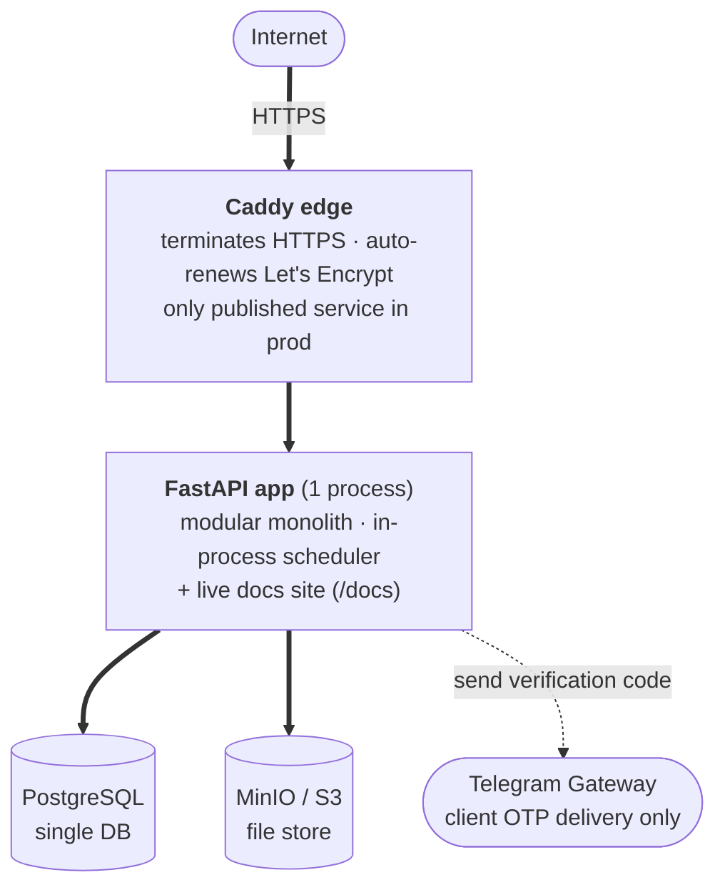

# Architecture

System'ning vaziyati, undan kelib chiqadigan technical shape va har bir modul respect qiladigan
invariant'lar va convention'lar.

## Operating envelope

**Tier 2 — internal/business SaaS.** Multi-tenant, modest scale, kichik jamoa tomonidan
yuritiladi. High-traffic emas, regulated emas — ammo u bir oʻqda money harakatlantiradi, shuning
uchun shu oʻq real rigor oladi.

| Axis                | Where we are                                                                                                                                                                                            | Consequence                                                                                                                                                                                                            |
| ------------------- | ------------------------------------------------------------------------------------------------------------------------------------------------------------------------------------------------------- | ---------------------------------------------------------------------------------------------------------------------------------------------------------------------------------------------------------------------- |
| **Scale**           | Tens of workshops · low hundreds of branches · low thousands of clients · low tens of thousands of orders/year. Flat-to-modest growth. Read-heavy. Hottest op: cutting (≤ 100 parts, synchronous, 5 s). | One Postgres, one FastAPI process (replicas if needed). No sharding, no cache layer until something is _measured_ slow.                                                                                                |
| **Criticality**     | Money (recorded income / expenses) and real stock movement back the orders. A wrong balance or a lost stock decrement is real harm.                                                                     | Integer-tiyin money (never float); atomic stock decrement / restore; append-only audit; idempotent seams; money tracked, not moved (recorded by hand in v1, no order-held payments).                                    |
| **Security**        | Public on the internet. Holds personal data, staff credentials, and operational business records. Worth attacking.                                                                                      | Hard authn/authz on every request; opaque DB-backed sessions with instant revocation; password hashing + lockout; least-privilege admin scope; multi-tenant isolation at the service layer on every read and write.   |
| **Latency**         | Back-office-ish — "a second or two" is fine. The one visible expensive op is cutting (5 s budget, synchronous; bigger jobs rejected, not queued in v1).                                                 | No async/queue on the hot path; cutting runs in-process within budget; background jobs on an in-process scheduler.                                                                                                     |
| **Lifespan × team** | Years; moderate change; ~2-person team.                                                                                                                                                                 | Modular monolith, boring tech (FastAPI · SQLAlchemy · Postgres · Vue · Tailwind), structure two people can operate at 3 a.m.                                                                                           |

**Not built for:** high traffic (multi-region / cache / CDN yoʻq — capacity work _agar_ kerak
boʻlsa boʻladi); regulatory yoki audit-grade kafolatlar (audit log foydali,
tamper-evident emas); v1 da real-money movement (gateway yoʻq, auto-refund yoʻq, settlement
yoʻq); offline operation; ogʻir analytics / BI (dashboard'lar — operational-DB
aggregate'lar).

## Current stage

**Pre-production prototyping** — `web/prototypes/` dagi prototype'ga qarab business logic va
UX'ni shakllantirish. Hech narsa real user'lar uchun deploy qilinmagan: production data yoʻq,
API'ning external consumer'i yoʻq, ishlab turishini saqlash kerak boʻlgan installed client yoʻq.
Shu sababli bugungi shakl'ni oʻzgartirish arzon, va biz bu erkinlikni sarflaymiz: corrective
migration'lar ustiga uyish oʻrniga mavjud migration'larni joyida edit qilib history'ni toza
saqlaymiz, schema va contract'larni backward-compat shim'siz oʻzgartiramiz va deprecation cycle
oʻtkazish oʻrniga delete-and-replace qilamiz. Guardrail'lar hamon amal qiladi — docs source of
truth boʻlib qoladi, security default'lar locked boʻlib qoladi, check gate'lar ishlaydi. Bu
posture birinchi real workshop saqlashga arzigulik data bilan onboard qilinganda oʻzgaradi.

## Topology

Caddy (`deploy/Caddyfile` dagi config) yagona apex (`BASE_DOMAIN`, masalan
`mebel-pro.uz`) ostida **subdomain** boʻyicha route qiladi:

| Host                    | Target                                                                                                    |
| ----------------------- | --------------------------------------------------------------------------------------------------------- |
| `mebel-pro.uz`          | static SEO landing (1 HTML)                                                                               |
| `app.mebel-pro.uz`      | client SPA (+ `/api/*` → backend)                                                                         |
| `workshop.mebel-pro.uz` | workshop SPA (+ `/api/*` → backend)                                                                       |
| `admin.mebel-pro.uz`    | superadmin SPA (+ `/api/*` → backend, + `/docs` · `/api-docs` · `/api-redoc` → backend, HTTP Basic-gated) |

Har bir SPA oʻz API'si bilan same-origin qoladi (CORS yoʻq).

- **One FastAPI process** — Python 3.12, boshidan oxirigacha async (asyncio + asyncpg +
  SQLAlchemy 2.0, Alembic, pydantic-settings). Shuningdek `docs/` ni live sayt sifatida render
  qiladi.
- **One PostgreSQL** — barcha modullar tomonidan share qilinadi; har bir modul oʻz table'lariga
  egalik qiladi.
- **One MinIO / S3** — material image'lari, logo'lar, refund / delivery receipt'lari,
  cutting PDF'lari. `files` moduli unga egalik qiladi; boshqalari id boʻyicha attach/detach qiladi.
- **In-process scheduler** — expired session'larni prune qilish, kunlik low-stock summary.
- **Three SPAs + a static landing.** API `/api` ostida same-origin.
- **One external integration** — Telegram Gateway, faqat client sign-in OTP code'larini deliver qilish uchun.
- **Deployment** — Docker Compose: Postgres + MinIO + FastAPI + nginx-served web + Caddy edge
  (prod'da yagona published service — HTTPS + Let's Encrypt). `main` ga push.

## Three SPAs + a static landing

`/` da static SEO landing sahifasi (oddiy HTML, indexable) plus **three SPAs** quruvchi Vue 3 /
Vite repo, har biri oʻz entry'si, auth surface va route set: **client** (Telegram OTP-auth
mijozlar — cut, order, track), **workshop** (workshop owner va staff — har bir ekran
permission-gated), **superadmin** (platform operator'lar — provisioning, block'lar, jobs console,
error monitor). Uch auditoriya zoʻrgʻa overlap qiladi va marketing sahifasi indexable boʻlishi
kerak — bitta SPA ikkalasini ham yaxshi qila olmaydi. Share qilinadigan primitive'lar, API
client'i, design token'lari va i18n repoda bir marta yashaydi. Design system: web/DESIGN.md

## Data-model invariants

Har bir modul respect qiladigan ikki qoida.

- **Integer-tiyin money.** Har bir currency value — DB column, API field, oraliq computation —
  integer tiyin (1 UZS = 100 tiyin). Frontend faqat display uchun convert qiladi. Money —
  high-criticality oʻq; float currency — kutib turgan bug.
- **No deletes for business entities.** Workshop'lar, branch'lar, material'lar, worker'lar,
  workshop va platform user'lar `inactive` / `blocked` status'ga oʻtadi — `DELETE` path yoʻq va
  `deleted_at` / `is_deleted` flag yoʻq; active state — status enum. History (order'lar, audit,
  status event'lar, cutting result'lar) abadiy saqlanadi; delete uni orphan qilib qoldirar edi.

## Quality requirements

Yuqoridagi shape satisfy qilishi kerak boʻlgan non-feature requirement'lar. Feature/entity
hujjati specifics'ga egalik qilgan joyda, bu boʻlim shunchaki requirement'ni bildiradi.

### Audit & traceability

- Har bir mutating use case append-only `action_log` qatori yozadi; har bir order status
  transition append-only `status_change_log` qatori yozadi.
- Har bir API response `X-Trace-ID` olib yuradi; error'lar body'da `trace_id` ni oʻz ichiga oladi.

### Performance budgets

- API read'lar: kutilgan load ostida p95 < 500 ms.
- Cutting optimisation: 5 s hard timeout, synchronous; > 100 parts reject qilinadi; ≤ 30 parts
  target < 1 s.
- PDF generation: synchronous, in-process; soniyalar, daqiqalar emas.

### Observability

- Har bir qatorda trace id bilan structured logging (structlog).
- `GET /api/v1/healthz` (liveness) va `GET /api/v1/readyz` (DB check) — ikkalasi ham
  unauthenticated.
- Application error'lar `platform` error monitor tomonidan yoziladi (code, count, last
  occurrence) — superadmin app'da surface qilinadi.

### Internationalization

v1 faqat Uzbek'ni ship qiladi. String'lar namespaced, shuning uchun `ru` / `en` qoʻshish
mechanical. Money, sanalar, telefonlar (`+998XXXXXXXXX`) va dimension'lar (millimetrlar)
fixed display convention'lariga ega.

## Next

Tafsilotga:

- [`ref/features/`](ref/features/) — feature spec'lar.
- [`ref/entities/`](ref/entities/) — bounded context boʻyicha entity'lar.
