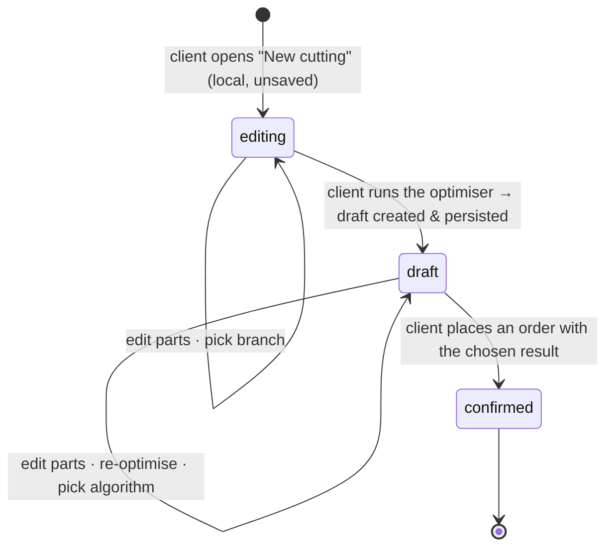

# Cutting optimization

2D guillotine cutting-stock solver: kiruvchi tomondan har bir part oʻzining panel
material'ini va per-side edge material'larini tanlaydigan part'lar list'i; chiquvchi
tomondan per-material panel layout, weighted waste % va order'ga pricing uchun kerakli
structural metric'lar. Cutting oʻzining alohida module'i — pricing yoʻq, payment yoʻq,
stock logic yoʻq — va result'larni order flow'ga [`orders.md`](orders.md)'da chiqaradi.

## Problem

Bugun customer'lar telefon orqali part'larni tasvirlaydi; workshop qoʻl bilan yoki desktop
tool bilan optimise qiladi. Customer shop unga aytmaguncha layout'ni, waste'ni yoki
price'ni koʻrmaydi. Va haqiqiy ish — shkaf, oshxona — bir vaqtning oʻzida bir nechta
material'dan foydalanadi: DSP polkalar, MDF orqa devorlar, fanera tortma ostlari, plus
customer oldingi ishdan olib kelgan panel va turli yuzlar uchun turli rang va
thickness'dagi PVC edge tape'lar. Bir material'li flow ishning yarmini rad etadi; bir
material uchun bitta cutting majburlash qolgan yarmini rad etadi (user run'lar boʻyicha
panel'larni va price'larni reconcile qilishi kerak); haqiqiy tape'ni nomlamasdan faqat
edge *thickness*'ni tanlaydigan flow workshop'ni qaysi manufacturer'ning spool'ini yuklash
kerakligini taxmin qilishga majbur qiladi va client'larni counter'da kutilmagan narsalar
bilan toʻqnashtiradi.

## Domain rules

### What's in a cutting

**Cutting draft** — client tahrirlaydigan va order joylashtirgunicha qayta optimise
qiladigan ish yuzasi. Client'ga private va cheksiz saqlanadi (expiry yoʻq; 50 ochiq
draft'gacha cap). Draft **birinchi optimise**'da server entity boʻladi — editor local va
unsaved holda ochiladi, shuning uchun tashlab ketilgan/boʻsh editor hech qachon draft
yaratmaydi (*Lifecycle*'ga qarang).

Draft ushlab turadi:

- **Ixtiyoriy `preferred_branch_id`.** Client'ning
  [profile default](../entities/identity.md#client)'idan seed olinadi; client uni profile
  default'iga tegmasdan draft'da oʻzgartirishi yoki tozalashi mumkin. Set boʻlganda,
  material picker shu branch'ning selection'iga **pre-filter** qilinadi va order step shu
  branch'ga default boʻladi — lekin filter yordam beradi, hech qachon data operation emas:
  list'da allaqachon mavjud part'lar yangi branch olib yurmaydigan material'larga ega
  boʻlsa ham editable qoladi (*Recovery affordances*'ga qarang).
- **Parts.** Har bir part platform catalog'idan oʻzining **panel** material'ini, oʻzining
  source'ini (`shop` / `own`), oʻlchamlarini (length × width × quantity) va per-side
  **edge** material'ini tanlaydi (top, bottom, left, right — har biri banding boʻlmasa
  `null` yoki oʻz source'iga ega catalog edge material). Grain — per-part tanlov **emas**
  — bu tanlangan panel material'ning xususiyati. Edge thickness va color — tanlangan edge
  material'ning xususiyatlari — user thickness emas, tape'ni tanlaydi.
- **Algorithm results.** Optimiser'ni qayta ishga tushirish bitta call'da bir xil input'ga
  qarshi har bir mavjud algorithm uchun bittadan result ishlab chiqaradi. Keyingi run ularni
  almashtirgunicha barcha N ta result draft'da saqlanadi. Client bittasini **chosen** sifatida
  tanlaydi; chosen bo'lgani order'ga bind qilinadi.

Har bir algorithm result yozadi: `algorithm_name`, `algorithm_version`, per-material
panel'lar va ularning placement'lari, weighted `waste_percentage`,
`panels_used_by_material`, `total_cut_length_mm`, `total_edge_length_mm`,
`edge_length_by_material` (har bir edge material uchun integer millimetres; UI/pricing metres
sifatida ko'rsatadi; faqat `shop`-source length order'ning billed va consumed total'lariga kiradi;
`own` length cutting plan uchun alohida kuzatiladi).

### Lifecycle

- `editing` — **local va unsaved**, birinchi optimise'gacha boʻlgan editor. Hali server draft
  yoʻq, shuning uchun chiqib ketish kiritilgan ma'lumotni tashlab yuboradi (editor avval
  ogohlantiradi). Draft **birinchi optimise**'da yaratiladi va saqlanadi — autosave ham aynan
  shunda boshlanadi.
- `draft` mutable. `confirmed` immutable va cheksiz saqlanadi — u order ishora qilayotgan
  tarixiy yozuv.
- `draft`'da optimiser'ni qayta ishga tushirish barcha algorithm result'larini joyida
  almashtiradi. Intermediate-run history yoʻq.
- Order placement'da **chosen** algorithm result draft'ning frozen snapshot'i boʻladi va
  draft `confirmed`'ga oʻtadi. Oʻsha run'dan boshqa algorithm result'lar bu nuqtada
  oʻchiriladi.

**Nega lazily yaratiladi.** Draft'ni faqat birinchi optimise'da yaratish tashlab ketilgan va
boʻsh editor'larni draft list'idan hamda 50-draft cap'idan tashqarida tutadi; qabul qilingan
narx — birinchi optimise'gacha kiritilgan ma'lumot autosave qilinmaydi (editor uni tashlashdan
oldin ogohlantiradi). Agar client'lar pre-optimise ma'lumotni yoʻqotishdan shikoyat qilsa qayta
koʻrib chiqing — unda unsaved editor'ni local storage bilan qoʻllab-quvvatlang yoki eager
yaratishni qaytaring.

### Parts and materials

- Part'ning panel material'i **platform catalog**'ga reference (platform operator'lar
  tomonidan curate qilingan ulashilgan list). Editor'da hamma catalog `panel` material'lar
  branch availability'siz tanlanadigan; branch indicator (pastda) bu composition qayerda
  fulfil qilinishi mumkinligini flag qiladi.
- Part'ning `material_source = shop` panel'ni workshop yetkazib berishini bildiradi; `own`
  esa client uni olib kelishini va oʻsha part uchun faqat cutting service xarid
  qilinishini bildiradi. Turli part'lar turli source'larga ega boʻlishi mumkin — bir xil
  material'ning part'lari ham (baʼzilari shop'dan, baʼzilari olib kelingan).
- `own` part hali ham catalog material'ni tanlaydi — entry panel oʻlchamlarini,
  thickness'ni, kerf-relevant data'ni va grain rule'ni taʼminlaydi. Non-catalog
  material'lar v1'dan tashqarida.
- **Edge tape ham catalog material.** Part'ning har bir side'i yo `null` (banding yoʻq) yo
  `(edge material, source)`. Picker UX decor-matching edge'larni bitta material list
  tepasiga pin qiladi, shuning uchun umumiy holat ("panel decor'iga 0.4 mm'da mos kel")
  rest of catalog yashirilmasdan single tap boʻladi (*UX*'ga qarang). Panel'lar kabi,
  edge'lar ham `shop` (workshop yetkazib beradi) yoki `own` (client oʻz spool'ini olib
  keladi) boʻlishi mumkin; side'ning source'i bir xil part'dagi panel'ning source'iga ham,
  boshqa side'larning source'iga ham bogʻliq emas.

### The optimiser

- **Bitta run, koʻp material, koʻp algorithm.** Run barcha part'larni oladi, ularni
  panel material boʻyicha guruhlaydi va har bir material uchun mustaqil layout ishlab
  chiqaradi (panel'lar material'lar boʻyicha ulashilmaydi — turli thickness, turli
  color). Har bir mavjud algorithm bir xil input'ga qarshi shu request'da run boʻladi;
  barcha result qaytariladi.
- **Winner = eng past weighted waste %.** Chosen result sifatida oldindan tanlanadi;
  client agar tradeoff kamroq panel yoki boshqa cut topology foydasiga boʻlsa boshqa
  algorithm'ning result'iga oʻtishi mumkin.
- **Faqat guillotine kesim.** Kesim chetidan chetiga oʻtadi; algorithm panel'ni rekursiv
  ravishda kichikroq toʻrtburchaklarga ajratadi. Non-guillotine, L-shaped va CNC path'lar
  scope'dan tashqarida.
- **Grain — panel material'ning xususiyati, part'ning emas.** Har bir catalog `panel`
  material koʻrinadigan grain direction'ga ega-yoʻqligini eʼlon qiladi. **Grained
  material** uchun ushbu material'dagi har bir part'ning length'i panel'ning grain'iga
  (uzun tomon) tekislangan boʻladi; algorithm part'ni 90° rotate qila olmaydi.
  **Non-grained material** uchun algorithm part'larni rotate qilishda erkin. Agar grained
  material'dagi part majburiy orientation'da sigʻmasa, run `impossible_grain` bilan fail
  boʻladi. User'dan hech qachon part uchun grain set qilish soʻralmaydi.
- **Bitta catalog material → bitta standart panel size.** Boshqa size'dagi bir xil spec
  — alohida catalog material (size uning identity va name'ining bir qismi); per-run
  custom panel size'lar kelajakda.
- **Global konstantalar.** Kerf 4 mm. Edge trim har bir tomon uchun 10 mm (foydalanish
  mumkin area = panel − 2× edge trim).
- **Edge-banding length shu yerda hisoblanadi.** Banding material'i set qilingan har bir
  part edge uchun, edge length part'ning length (top/bottom) yoki width (left/right).
  Total'lar **edge material boʻyicha** roll-up qilinadi (`edge_length_by_material`, integer
  millimetres) — bu **geometric banded length**. Order aslida **bill qiladigan va consume qiladigan**
  metr'lar har bir banded side uchun fixed trim overhang
  qoʻshadi (master'lar tape'ni uzunroq yopishtiradi, soʻng tekis qirqadi) — bu har bir
  branch'da bir xil system constant — shuning uchun **consumed** figura geometry + oʻsha
  trim; qoida uchun [`orders.md`](orders.md#pricing)'ga qarang. Optimiser geometry'ni
  beradi, va overhang constant boʻlgani uchun consumed metr'lar branch'siz ham maʼlum.
- **Cutting vaqtida stock check yoʻq.** Optimiser faqat "X material uchun N panel kerak"
  va "Y edge material uchun L metr kerak" deydi. Stock hech qachon gate emas: operator
  order verification'da non-blocking low-stock warning koʻradi va inventory module
  production tugashi bilan avto-decrement qiladi ([`orders.md`](orders.md)'ga qarang).
- **Pricing shu yerda hisoblanmaydi.** Pricing branch'ga bogʻliq — branch'lar oʻzlarining
  per-panel cutting rate'larini va per-metre edge price'larini belgilaydi. Optimiser
  faqat structural metric'larni beradi; price birinchi marta order step'da paydo boʻladi.

### Limits

| Constraint | Value |
|---|---|
| Part minimum | 50 mm × 50 mm |
| Part maximum | panel − 2× edge trim (for the part's chosen panel material) |
| Parts per optimisation | ≤ 100 (across all materials) |
| Panels per material per result | ≤ 20 (a single material above this must be split into separate orders) |
| Open drafts per client | ≤ 50 (anti-abuse; client deletes to add more) |
| Hard timeout per run | 5 s → `optimization_timeout` |

### Access

Client faqat oʻzining draft'larini va confirmed result'larini koʻradi. Workshop staff va
owner oʻz scope'idagi order'larga bind qilingan confirmed result'larni koʻradi; PDF
download ham xuddi shu tarzda gate qilinadi. Har bir optimisation run audit qilinadi.

## User stories

- Client sifatida, men barcha part'larimni bir cutting'da xohlayman, hatto turli
  material kerak boʻlsa ham, shunda koʻp cutting ishga tushirib panel'lar / price'larni
  reconcile qilmayman.
- Client sifatida, men baʼzi part'larni yoki baʼzi edge'larni "Men buni oʻzim olib
  kelaman" deb belgilashni xohlayman, shunda allaqachon menda mavjud bo'lgan qoldiqdan
  foydalanishim mumkin.
- Client sifatida, men commit qilishdan oldin algorithm result'larini taqqoslashni
  xohlayman, shunda offcut'ga qaraganda cost muhimroq boʻlganda "lowest waste"
  oʻrniga "fewer panels"ni tanlay olaman.
- Client sifatida, men catalog'ni bir branch'ning selection'iga pre-filter qilishni
  xohlayman, shunda oʻsha branch fulfil qila olmaydigan material'larni tanlamasligim
  kerak — lekin men oʻsha filter allaqachon kiritilgan part'larimni tashlab yuborishini
  xohlamayman.
- Client sifatida, men catalog'ni manufacturer boʻyicha filter qilishni xohlayman,
  shunda men yashaydigan joyda workshop ishonchli olib yuradigan brendni olishim mumkin
  (Egger vs. Kronospan).
- Client sifatida, men panel decor'imga mos keladigan edge birinchi taklif qilinishini
  xohlayman, shunda men aniq tanlov uchun oʻnlab edge SKU orasidan qidirib yurmayman.
- Client sifatida, men draft'ning avto-saqlanishini xohlayman, shunda brauzer
  yopilganda yoʻqotmayman.
- Workshop user (cutter) sifatida, men confirmed layout va PDF'ni saw'da tablet'imda
  xohlayman, shunda men tarjimasiz kesa olaman.

## UX — the cutting wizard (client app)

`/c/cutting/:id`'da bitta workspace (birinchi optimise'gacha `/c/cutting/new`; stepper yoʻq —
tepada bitta tahrirlash yuzasi, pastda bitta result panel). Entry — client app'ning home'idagi
**New cutting** tugmasi, bu boʻsh, unsaved editor'ni ochadi; draft birinchi **Optimise**'da
yaratiladi va saqlanadi (*Lifecycle*'ga qarang). Ikkinchi darajali **My drafts** entry
unbound draft'larni list qiladi.

### Branch pre-filter (top of the editor)

Sahifa header'i ostida active pre-filter'ni nomlaydigan kichik affordance:

- **Pre-filter yoʻq** → "Catalog: all branches" + **Pick a branch** link.
- **Pre-filter set** → "Catalog: Yunusobod · Furniture House" + **Clear** va **Change**
  tugmasi.

Branch'ni tanlash yoki oʻzgartirish workshop-and-branch picker'ni ochadi (chap tomonda
workshop'lar, oʻng tomonda workshop'ning active va `temporarily_closed` branch'lari).
Confirm qilish draft'ning `preferred_branch_id`'ini set qiladi. Clearing uni olib
tashlaydi. **Hech biri parts list'ni tahrirlamaydi.** Yangi branch olib yurmaydigan
material'larga reference qiladigan row'lar per-row warning + recovery affordance'lar
oladi (pastda).

### Parts editor (top)

Tepada mode switch: **Manual entry** (default) · **Upload file** (`.bas` / `.xlsx`;
v1'da "Coming soon" pill bilan disabled).

Parts table:

| Column | Behaviour |
| --- | --- |
| **#** | row number |
| **Panel** | platform catalog (`panel` kind) uchun searchable dropdown; har result manufacturer + decor / colour + thickness + size ko'rsatadi; relevance / decor / manufacturer bo'yicha sort qilinadi. Yuqoridagi dropdown filters: `Manufacturer` (multi-select), `Type` (`dsp` / `mdf` / `plywood` / …), `Thickness`. `preferred_branch_id` set bo'lsa, picker defaultda shu branch selection'iga pre-filtered bo'ladi; `Show all catalog` toggle uni kengaytiradi. Selected row picked panel short label'ini ko'rsatadi (masalan, `Egger DSP H1334 18 mm · 2750×1830`) va inline source chip beradi: `From shop` ↔ `I'll bring it` |
| **L mm** | numeric; validated against the part-min / part-max bounds of the chosen panel |
| **W mm** | same |
| **Qty** | integer ≥ 1 |
| **Edges** | per-side summary — kichik panel diagram (line weight thickness'ni bildiradi) + bir qatorli label (masalan, `H1334 · 0.4 mm` · `T·B · H1334 2.0` · `Mixed · 2 edges` · `None`). Tap → edge picker |
| **⋯** | duplicate row · delete row |

Grain indicator (kichik strelka) tanlangan panel grain'ga ega boʻlganda **panel chip'ning
oʻzida** paydo boʻladi — control emas, passive cue.

**Edge picker** (Edges cell'idan ochiladi — desktop'da popover, mobile'da bottom sheet):

- **One surface, no modes.** Picker avval ikki savolni beradi: qaysi sides edge banding
  oladi va qaysi tape ishlatiladi. Alohida "match panel" section, "browse other
  materials" section, "customise per side" button yoki standalone "apply to all" button
  yoʻq.
- **Side choice tepada turadi.** Quick patterns common shapes'ni yopadi: **None**, **All
  sides**, **Top + bottom**, **Left + right**. Patterns ostidagi interactive panel diagram
  client'ga picker'dan chiqmasdan individual sides'ni toggle qilishga beradi. Hech qanday
  side tanlanmaganida tape tanlash uni four sides'ga qoʻllaydi; sides tanlangandan keyin
  tape tanlash faqat oʻsha sides'ga qoʻllaydi.
- **Material choice is one ranked list.** Panel bilan bir xil `decor_code`ga ega edges
  birinchi pinned bo'ladi va **Recommended** marker oladi; same-`color` matches undan
  keyin keladi; qolgan barcha active edge materials shu bitta listda davom etadi. Search
  va thickness dropdown shu listni filter qiladi. Panel tanlanmagan bo'lsa, picker matching
  panel tanlangandan keyin chiqishini aytadi, lekin catalog search'ni baribir ruxsat qiladi.
- **Source default holatda quiet.** `shop` default. Segmented source control (`Workshop
  supplies` / `I'll bring it`) currently banded sides'ga qoʻllanadi; mixed per-side source
  diagram orqali mumkin boʻlib qoladi, lekin separate step sifatida koʻrsatilmaydi.
- **Apply v1'da faqat this row'ga yozadi.** Footer'da faqat **Cancel** va **Apply** bor.
  **Apply** selected side pattern, tape va source'ni picker'ni ochgan **Edges** cell'ning
  row'iga saqlaydi; sibling rows'ni hech qachon tahrirlamaydi. **Same panel material** yoki
  **All rows** kabi bulk helpers v1'dan tashqarida, chunki ular kichik mobile form'ga
  propagation va overwrite decisions qoʻshadi. Bulk edge editing keyin qaytsa, picker ichida
  default control emas, explicit list-level action yoki row apply'dan keyingi follow-up
  confirmation boʻlishi kerak.

Per-row inline validation; optimiser'ni bloklaydigan biror narsa boʻlsa, jadval ostida
bitta roll-up xabar.

### Recovery affordances — preferred branch'da olib yurilmaydigan material'lar

`preferred_branch_id` set boʻlganda va row branch olib yurmaydigan material'larga
reference qiladigan boʻlsa, row **disabled emas**, **drop qilinmaydi**, **koʻchirilmaydi**.
U oʻz oʻrnida, editable holatda qoladi, quyidagilar bilan:

- Parts table tepasida **dismissible summary banner**: *"N parts use materials not
  carried at <branch>. Bring your own, swap them, or place this order at a different
  branch."* + **Clear preferred branch** action.
- Har bir taʼsirlangan row'da **per-row warning**: *"Not at <branch>."* va ikkita inline
  tugma bilan:
  - **I'll bring my own** — row'ning panel source'ini (yoki taʼsirlangan edge side
    uchun, oʻsha side'ning source'ini) `own`'ga flip qiladi. Endi branch uni olib
    yurishi kerak emas.
  - **Pick a different material** — picker'ni yangi branch'ga pre-filter qilingan
    holatda ochadi (panel cell'da panel swap; edge picker ichida affected side allaqachon
    active boʻlgan edge swap, u yerda ham xuddi shu inline note paydo boʻladi).
- Row'ning mavjud **⋯ → Delete row** menu'si hali ham ishlaydi; olib tashlash opt-in va
  hech qachon avtomatik emas.

`own`-source panel'ga ega row uchun (yaʼni client allaqachon panel'ni olib keladi)
warning yoʻq — `own` qaysi branch olib yurishidan hayron emas. `own` edge side'lar
uchun ham xuddi shunday.

### Clearing the parts list (deliberate)

**Sahifa header yonidagi "⋯" menu** **Clear parts list** action'ini olib yuradi
(danger-styled, confirmation: *"Remove all N parts? This can't be undone."*). Bu ommaviy
parts wipe'ning yagona usuli; branch pre-filter hech qachon uni chaqirmaydi.

### Run and the result panel

Editor ostida primary **Optimise** tugma. Run paytida disabled (5 s cap), keyin biror row
oʻzgargunicha disabled (shunda qayta tap stale layout'ni qayta ishga tushirmaydi). Yangi
(unsaved) editor'da birinchi **Optimise** run'dan oldin draft'ni ham yaratadi va saqlaydi,
shundan soʻng URL `/c/cutting/:id`'ga oʻtadi va autosave ishni oladi.

Success'da, panel uchta region bilan view'ga scroll qiladi:

1. **Headline metrics.**
   - Weighted **waste %** (barcha panel material'lar boʻyicha).
   - **Panels used** total va per-material breakdown.
   - **Edge tape** total length — **consumed** metres (geometric banding + har banded side
     uchun fixed 30 mm trim overhang), metres bor har bir edge material bo'yicha breakdown
     bilan (masalan, `Rehau H1334 0.4 — 8.4 m · Rehau H1334 2.0 — 3.2 m`). Ba'zi
     sides `own` bo'lsa, breakdown shop va own metres'ni material bo'yicha split qiladi.
     Metric compact split ko'rsatadi, masalan `edge sides 12.8 m + trim overhang 0.6 m`;
     flow ichida uzun explanation message ko'rsatilmaydi. Trim overhang fixed system constant
     bo'lgani uchun bu cutting result'dan boshlab real figure; faqat price branch rates'ni
     kutadi ([`orders.md`](orders.md#pricing)).
   - **Cut length total** (m), informational.
   - **Parts placed** count, masalan, `24 / 24` ✓ (agar baʼzilari sigʻmasa per-part
     list bilan qizil).
   - Tanlangan **algorithm** nomi va **Compare algorithms** link → har bir algorithm uchun
     bitta row bilan expander (nomi, waste %, panel'lar, cut length) va visualisation'ni
     almashtirish uchun har bir row'da **Use this one** tugmasi.

2. **Panel layout visualiser.**
   - Material tab strip (`DSP H1334 18mm · 2750×1830 · 3 panels` ·
     `MDF Qum 16mm · 2800×2070 · 1 panel`). Material ichida panel tab'lari
     (`Panel 1 / 2 / 3`).
   - Active panel interactive SVG sifatida render boʻladi (mobile'da pan / zoom).
     Placement ustida hover yon legend'da uni highlight qiladi (part #, oʻlchamlar,
     quantity index, rotation indicator).

3. **Actions.**
   - **Place order with this cutting** → order wizard'ga route qiladi
     ([`orders.md`](orders.md)'ga qarang).
   - **Download PDF** — saw operator uchun chop etishga tayyor cutting map (har bir panel
     uchun bitta sahifa, header material + panel index + waste bilan, footer algorithm
     stamp bilan).
   - **Edit parts** editor'ga scroll qiladi; har qanday row oʻzgarishi result'ni stale
     deb belgilaydi; keyingi **Optimise** uni almashtiradi.

Pricing bu ekranda **koʻrsatilmaydi** — total'lar branch'ga bogʻliq va order step'da
paydo boʻladi.

### My drafts (`/c/cutting/drafts`)

Unbound draft'lar list'i. Har bir row: qisqa label (`14 parts · 6 panels`), dominant
panel material, last-edited time (relative), set boʻlsa preferred branch chip, Delete
action. Empty: "No saved cuttings — start a new one." Expiry chip yoʻq — draft'lar
client uni oʻchirgunicha yoki cap'ga yetgunicha saqlanadi.

### Read-only view (`/c/cutting/:id` when `confirmed`)

Xuddi shu workspace, editing disabled, bind qilingan order'ni nomlaydigan banner bilan.

### Workshop side

Order'ning **Cutting** tab'i order'ning confirmed result'ining SVG'ini va PDF link'ni
embed qiladi.

## Edge cases

- **`material_not_found`** — part missing yoki olib tashlangan catalog id'ga reference
  qiladi → editor row'ni flag qiladi; optimiser ishga tushishni rad etadi.
- **`part_too_large` / `part_too_small`** — tanlangan panel material'ning bounds'idan
  tashqarida → wizard offending part'ni va max size'ni nomlaydi.
- **`impossible_grain`** — grained material'dagi part rotated-locked sigʻmaydi → row
  flag qilinadi.
- **`too_many_parts` / `too_many_panels_needed`** — cap'lardan oshib ketdi → rad etadi;
  ishni boʻling.
- **`optimization_timeout`** — 5 s ichida result yoʻq → qayta urinib koʻring yoki
  soddalashtiring.
- **`draft_limit_exceeded`** — > 50 ochiq draft → avval baʼzilarini oʻchiring.
- **All-`own` cutting** — umuman `shop` material yoʻq; order step saw'li har qanday
  active branch'ni qabul qiladi.
- **Edges all `own`** — order'ning `edge_length_by_material`'i hali ham har bir material
  uchun total metr'larni yozadi (cutting plan / PDF uchun informational), lekin
  `edge_banding → ready`'da stock decrement har bir side'ni oʻtkazib yuboradi chunki
  hech bir side `shop` emas.
- **Draft turganda catalog oʻzgardi** — agar part reference qilayotgan material keyinroq
  catalog'dan olib tashlansa, draft keyingi ochilishida shu row highlighted bilan
  flag qilinadi; client qayta optimise qilishdan oldin replacement tanlaydi.
- **`preferred_branch_id` set lekin branch keyinroq `inactive` boʻladi** — pre-filter
  oʻsha branch uchun "no carried materials" deb qaraladi; wizard har bir row'da xuddi
  shu not-carried recovery affordance'larini koʻrsatadi, plus branch'ning status'ini
  koʻrsatadigan banner; client unlock qilish uchun pre-filter'ni clear yoki change
  qiladi.
- **`cutting_result_not_usable`** — order step draft allaqachon `confirmed` ekanini topadi
  (concurrent placement, yoki place qilgandan keyin back-navigation) → uning detail'iga
  redirect qiladi.
- **Algorithm keyinroq almashtirildi** — eski `confirmed` result'lar qanday boʻlsa
  shundayligicha qoladi, eski algorithm version'i bilan stamp qilingan; ularning PDF'lari
  qayta generate qilinmaydi.
- **Workshop in-flight draft'da per-side preference sifatida set qilingan edge
  material'ni deactivate qiladi** — deactivated panel bilan bir xil handling: keyingi
  ochilishda row flag qilinadi, edge side shu side active boʻlgan edge picker'ni ochadigan
  bitta tap "pick replacement" affordance bilan tozalanadi.

## Next

- [`orders.md`](orders.md) — chosen cutting result qanday qilib placed order'ga aylanishi va
  qaysi cutting metric'lari qaysi price component'ni drive qilishi.
- [`catalog-inventory.md`](catalog-inventory.md) — the platform catalog (manufacturers,
  panels, edges) the wizard reads from, and the branch's selection that drives the
  pre-filter.
