# Cutting optimization

2D guillotine cutting-stock solver: in, har bir part o'z material'ini tanlaydigan part'lar
ro'yxati; out, per-material sheet-layout scheme, weighted waste % va order pricing uchun
kerakli structural metric'lar. Cutting — o'zining module'i — pricing yo'q, payment yo'q,
stock logic yo'q — va result'larni [`orders.md`](orders.md)'dagi order flow'ga ochib beradi.

## Problem

Customer'lar part'larni telefon orqali tasvirlaydi; workshop qo'lda yoki desktop tool bilan
optimise qiladi. Customer layout'ni, waste'ni yoki narxni shop aytmaguncha ko'ra olmaydi.
Va haqiqiy job — wardrobe, kitchen — bir vaqtning o'zida bir nechta material ishlatadi: DSP shelf'lar,
MDF back'lar, plywood drawer bottom'lar, plus customer oldingi job'dan olib kelgan leftover sheet.
Single-material flow ishning yarmini rad qiladi; per material bitta cutting'ga majburlash
boshqa yarmini rad qiladi (user run'lar bo'ylab sheet va narxlarni reconcile qilishi kerak).

## Domain rules

### What's in a cutting

**Cutting draft** — client order joylashtirgunga qadar edit qilib re-optimise qiladigan ishchi
yuza. U client'ga private va cheksiz persist qiladi (expiry yo'q; 50 ta open draft cap).

Draft quyidagilarga ega:

- **Parts.** Har bir part platform catalog'dan o'z material'ini, o'z source'ini
  (`shop` / `own`), o'lchamlarini (length × width × quantity) va per-side edge banding'ni (top,
  bottom, left, right — har biri `0.4` / `2.0` mm yoki none) tanlaydi. Grain per-part tanlov
  **emas** — u chosen material'ning property'si (quyiga qarang).
- **Algorithm results.** Optimiser'ni qayta ishga tushirish bitta call'da har bir mavjud
  algorithm uchun bitta result chiqaradi (hammasi bir xil input'ga parallel ishlaydi). Barcha N
  result keyingi run ularni almashtirgunga qadar draft'da saqlanadi. Client bittasini **chosen**
  result sifatida tanlaydi; chosen bo'lgani order'ga bog'lanadi.

Har bir algorithm result yozadi: `algorithm_name`, `algorithm_version`, per-material sheet'lar va
ularning placement'lari, weighted `waste_percentage`, `sheets_used_by_material`,
`total_cut_length_mm`, `total_edge_length_mm`, `edge_length_by_thickness`.

### Lifecycle

```mermaid
stateDiagram-v2
    [*] --> draft : client opens "New cutting"
    draft --> draft : edit parts · run optimiser · pick algorithm
    draft --> confirmed : client places an order with the chosen result
    confirmed --> invalidated : order modify re-runs the optimiser (a new result is bound; this one is kept for audit)
    confirmed --> [*]
    invalidated --> [*]
```

- `draft` mutable. `confirmed` va `invalidated` immutable va abadiy saqlanadi — ular
  order ko'rsatadigan historical record.
- `draft`'da optimiser'ni qayta ishga tushirish barcha algorithm result'larni in-place
  almashtiradi. Intermediate-run history yo'q (draft'ning *maqsadi* — iteration; har bir run'ni
  saqlash binding'dan oldin hech qanday audit value bermay storage'ni shishiradi).
- Order placement'da **chosen** algorithm result draft'ning frozen snapshot'i bo'ladi va
  draft `confirmed`'ga o'tadi. Shu run'dan boshqa algorithm result'lar bu nuqtada discard qilinadi.

### Parts and materials

- Part'ning material'i **platform catalog**'ga reference (platform operator tomonidan curate
  qilingan shared list). Editor'da barcha catalog material'lar branch availability'dan qat'i
  nazar pickable; branch indicator (quyida) bu composition qayerda bajarilishi mumkinligini flag qiladi.
- Part'ning `source = shop` workshop sheet'larni ta'minlaydi degani; `source = own` client
  material'ni olib keladi va faqat cutting service sotib olinadi degani. Turli part'lar
  turli source'ga ega bo'lishi mumkin — shu jumladan bir xil material'ning part'lari (ba'zilari shop'dan, ba'zilari olib kelingan).
- `own` part ham catalog material tanlaydi — entry sheet o'lchamlari, thickness,
  kerf-relevant data va edge-banding compatibility'ni ta'minlaydi. Non-catalog material'lar
  v1 uchun scope'dan tashqarida.

### The optimiser

- **One run, multiple materials, multiple algorithms.** Run barcha part'larni oladi, ularni
  material bo'yicha group qiladi va per material independent layout chiqaradi (sheet'lar
  material'lar bo'ylab share qilinmaydi — turli thickness, color). Har bir mavjud algorithm
  bir xil input'ga concurrent ishlaydi; barcha result'lar qaytariladi.
- **Winner = lowest weighted waste %.** Chosen result sifatida pre-selected; agar trade
  kamroq sheet yoki boshqa cut topology foydasiga bo'lsa client boshqa algorithm'ning
  result'iga o'tishi mumkin.
- **Guillotine cuts only.** Cut edge-to-edge ketadi; algorithm sheet'ni rekursiv ravishda
  kichikroq rectangle'larga bo'ladi. Non-guillotine, L-shaped va CNC path'lar scope'dan tashqarida.
- **Grain — material'ning property'si, part'niki emas.** Har bir catalog material visible grain
  direction'i bor-yo'qligini e'lon qiladi. **Grained material** uchun undagi har bir part'ning
  length'i sheet'ning grain'iga (uzun tomon) align qilingan; algorithm part'ni 90° rotate
  qila olmaydi. **Non-grained material** uchun algorithm part'larni rotate qilishda erkin. Agar
  grained material'dagi part o'zining forced orientation'ida sig'masa, run `impossible_grain`
  bilan fail bo'ladi. User'dan hech qachon part'da grain set qilish so'ralmaydi.
- **One catalog material → one standard sheet size.** Bir xil spec boshqa size'da — alohida
  catalog material (size uning identity'si va nomining bir qismi); per-run custom sheet
  size'lar — future.
- **Global constants.** Kerf 4 mm. Edge trim 10 mm per side (usable area = sheet − 2× edge
  trim).
- **Edge-banding length shu yerda hisoblanadi.** Banding thickness'i bor har bir part edge
  uchun edge length part'ning length'i (top/bottom) yoki width'i (left/right). Total'lar
  barcha material'lar bo'ylab thickness bo'yicha roll up qiladi (`edge_length_by_thickness`).
  Order pricing'i buni o'qiydi.
- **Cutting time'da stock check yo'q.** Optimiser faqat "material X'dan N sheet kerak" deydi.
  Stock hech qachon gate emas: operator order verification'da non-blocking low-stock warning
  ko'radi va inventory module production tugagani sayin auto-decrement qiladi
  (qarang [`orders.md`](orders.md)).
- **Bu yerda pricing hisoblanmaydi.** Pricing branch'ga bog'liq — branch'lar o'zlarining
  cutting model'lari, material price'lari va edge-banding rate'larini o'rnatadi. Optimiser
  faqat structural metric'lar beradi; price birinchi marta order step'da ko'rinadi.

### Limits

| Constraint | Value |
|---|---|
| Part minimum | 50 mm × 50 mm |
| Part maximum | sheet − 2× edge trim (for the part's chosen material) |
| Parts per optimisation | ≤ 100 (across all materials) |
| Sheets per material per result | ≤ 20 (a single material above this must be split into separate orders) |
| Open drafts per client | ≤ 50 (anti-abuse; client deletes to add more) |
| Hard timeout per run | 5 s → `optimization_timeout` |

### Access

Client faqat o'zining draft'lari va confirmed result'larini ko'radi. Workshop staff va owner
o'z scope'idagi order'larga bog'langan confirmed result'larni ko'radi; PDF download bir xil
tarzda gate qilinadi. Har bir optimisation run audited.

## User stories

- Client sifatida, men barcha part'larimni bitta cutting'da xohlayman, ular turli material
  talab qilsa ham, shunda men bir nechta cutting ishlatib keyin sheet / price reconcile qilmayman.
- Client sifatida, men ba'zi part'larni "I'll bring this material myself" deb belgilashni
  xohlayman, shunda men allaqachon bor leftover'ni ishlata olaman.
- Client sifatida, men commit qilishdan oldin algorithm result'larni solishtirishni
  xohlayman, shunda men offcut'dan ko'ra cost'ga ko'proq ahamiyat berganimda "lowest waste"
  ustidan "fewer sheets"'ni tanlay olaman.
- Client sifatida, men hali edit qilayotganimda — qaysi branch'lar bu list'ni bajara
  olishini ko'rishni xohlayman, shunda men order step'da hayron qolmayman.
- Client sifatida, men draft avtomatik saqlanishini xohlayman, shunda men browser'ni
  yopsam uni yo'qotmayman.
- Workshop user (cutter) sifatida, men saw'da tablet'imda confirmed layout va PDF'ni
  xohlayman, shunda men translation'siz kesa olaman.

## UX — the cutting wizard (client app)

`/c/cutting/:id`'da bitta workspace (stepper yo'q — yuqorida bitta editing surface, pastda
bitta results panel). Entry — client app'ning home **New cutting** button'i, u empty draft
yaratadi va shu yerga route qiladi. Secondary **My drafts** entry unbound draft'larni listlaydi.

### Parts editor (top)

Yuqorida mode switch: **Manual entry** (default) · **Upload file** (`.bas` / `.xlsx`;
v1'da "Coming soon" pill bilan disabled).

Parts table:

| Column | Behaviour |
| --- | --- |
| **#** | row number |
| **Material** | searchable dropdown of the platform catalog (by name / thickness / colour / size); shows the picked material's short label (e.g. `DSP 18mm Bel 2750×1830`) with an inline source chip: `From shop` ↔ `I'll bring it` |
| **L mm** | numeric; validated against the part-min / part-max bounds of the chosen material |
| **W mm** | same |
| **Qty** | integer ≥ 1 |
| **Edges** | compact `T·B·L·R` chip strip showing each side's banding (`–` / `0.4` / `2.0`); tap → popover |
| **⋯** | duplicate row · delete row |

Grain indicator (kichik arrow / icon) chosen material grain'ga ega bo'lganda **material
chip'ning o'zida** ko'rinadi — passive cue, control emas.

**Edges popover** — quick preset'lar `None` · `All 0.4` · `All 2.0` to'rt tomonni snap
qiladi; pastida, to'rt edge'i (top / bottom / left / right) per-side case uchun tap-to-cycle
(`None → 0.4 → 2.0`) bo'lgan panel diagram; pastda **Apply to all parts** checkbox
har bir mavjud row'ga propagate qiladi. Yangi row'lar banding'siz boshlanadi.

Per-row inline validation; biror narsa optimiser'ni block qilganda table ostida bitta
roll-up message.

### Branches indicator (sticky, bottom of the editor)

Qaysi active branch'lar bu composition'ni bajara olishini nomlovchi nozik strip:

- **N branches available** → "3 branches carry these materials — Toshkent · Chilonzor ·
  Yunusobod." Expand qilish uchun clickable; faqat informational.
- **Zero branches** → "No active branch carries `MDF 16mm Belyj` — flip that part to *I'll
  bring it*, or pick another material." Optimiser hali ham ishlay oladi; order step enforce qiladi.
- **All-`own` composition** → "Any active branch with a saw." Order step'gacha hech qanday constraint yo'q.

### Run and the result panel

Editor ostida primary **Optimise** button. Running paytida disabled (5 s cap), keyin biror
row o'zgargunga qadar disabled (shunda re-tapping stale layout'ni re-run qilmaydi).

Success'da panel uchta region bilan view'ga scroll qiladi:

1. **Headline metrics.**
   - Weighted **waste %** (barcha material'lar bo'ylab).
   - **Sheets used** total va per-material breakdown.
   - **KROM (edge banding)** total length plus thickness bo'yicha breakdown (`0.4: 8.4 m · 2.0:
     3.2 m`).
   - **Cut length total** (m), informational.
   - **Parts placed** count, masalan `24 / 24` ✓ (agar biror part sig'masa per-part list bilan red).
   - Chosen **algorithm** name plus **Compare algorithms** link → har bir algorithm uchun
     bitta row (name, waste %, sheets, cut length) va visualisation'ni almashtirish uchun
     row bo'yicha **Use this one** button bo'lgan expander.

2. **Sheet layout visualiser.**
   - Material tab strip (`DSP 18mm Bel 2750×1830 · 3 sheets` · `MDF 16mm 2800×2070 · 1 sheet`). Material
     ichida sheet tab'lar (`Sheet 1 / 2 / 3`).
   - Active sheet interactive SVG sifatida render bo'ladi (mobile'da pan / zoom). Placement'ga
     hover qilish uni side legend'da highlight qiladi (part #, dimensions, quantity index, rotation
     indicator).

3. **Actions.**
   - **Place order with this cutting** → order wizard'ga route qiladi
     (qarang [`orders.md`](orders.md)).
   - **Download PDF** — saw operator uchun print-ready cutting map (sheet bo'yicha bitta
     page, header material + sheet index + waste bilan, footer algorithm stamp bilan).
   - **Edit parts** editor'ga qaytib scroll qiladi; har qanday row o'zgarishi result'ni stale
     belgilaydi; keyingi **Optimise** uni almashtiradi.

Bu screen'da pricing **ko'rsatilmaydi** — total'lar branch'ga bog'liq va order step'da chiqadi.

### My drafts (`/c/cutting/drafts`)

Unbound draft'lar list'i. Har bir row: short label (`14 parts · 6 sheets`), dominant
material, last-edited time (relative), Delete action. Empty: "No saved cuttings — start a
new one." Expiry chip yo'q — client o'chirmaguncha yoki cap'ga yetmaguncha draft'lar persist qiladi.

### Read-only view (`/c/cutting/:id` when `confirmed` / `invalidated`)

Bir xil workspace, editing disabled, bound order'ni nomlovchi banner bilan. **invalidated**
result yana "a newer cutting result is bound to this order" deydi unga link bilan.

### Workshop side

Order'ning **Cutting** tab'i order'ning confirmed result'ining SVG'sini va PDF link'ni embed
qiladi. Agar result `invalidated` bo'lsa (modify fresher'ni chiqargan), tab buni flag qiladi va
current result'ga link qiladi.

## Edge cases

- **`material_not_found`** — part missing yoki removed catalog id'ga reference qiladi → editor
  row'ni flag qiladi; optimiser ishlashdan bosh tortadi.
- **`part_too_large` / `part_too_small`** — chosen material uchun bound'lardan tashqarida →
  wizard offending part'ni va max size'ni nomlaydi.
- **`impossible_grain`** — `required` part rotated-locked sig'a olmaydi → row flagged.
- **`too_many_parts` / `too_many_sheets_needed`** — cap'lardan oshib ketgan → reject; job'ni split qiling.
- **`optimization_timeout`** — 5 s ichida result yo'q → retry yoki simplify.
- **`draft_limit_exceeded`** — > 50 open draft → avval ba'zilarini o'chiring.
- **All-`own` cutting** — umuman `shop` material yo'q; branches indicator "Any
  active branch with a saw" ko'rsatadi; order step hali ham branch pick talab qiladi.
- **Draft turganda catalog o'zgarishi** — agar part reference qiladigan material keyinroq
  catalog'dan removed bo'lsa, draft keyingi open'da o'sha row highlight qilingan holda flag
  qilinadi; client re-run'dan oldin replacement tanlaydi.
- **`cutting_result_not_usable`** — order step draft allaqachon `confirmed` yoki
  `invalidated` ekanini topadi (concurrent placement, yoki placing'dan keyin back-navigation) → uning
  detail'iga redirect.
- **Algorithm keyinroq replaced** — eski `confirmed` / `invalidated` result'lar aynan
  qanday bo'lsa shunday qoladi, eski algorithm version bilan stamp qilingan; ularning PDF'lari regenerate qilinmaydi.

## Next

- [`orders.md`](orders.md) — chosen cutting result qanday placed order bo'ladi, qachon u
  invalidated bo'ladi, qaysi cutting metric'lar qaysi price component'ni boshqaradi.
- [`catalog-inventory.md`](catalog-inventory.md) — wizard o'qiydigan platform catalog.
