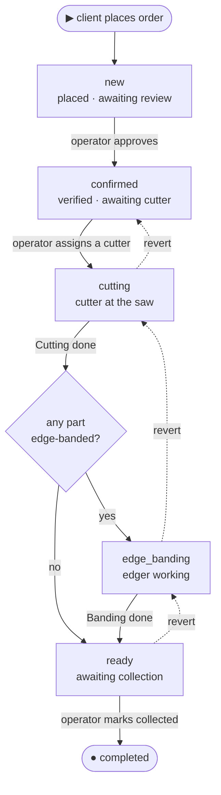

# Orders

Order lifecycle'i: client tugatilgan cutting'dan order joylashtiradi, workshop uni verify
qiladi, ikkita production phase ishlaydi va client uni olib ketadi. v1 **pickup-only**, order
**hech qachon money ko'chirmaydi** (finance module client nima to'laganini yozadi —
[`finance.md`](finance.md)) va **hech qachon stock balance saqlamaydi** (inventory module
production tugagani sayin auto-decrement qiladi — [`catalog-inventory.md`](catalog-inventory.md)).
Order — production spine'i; money va material — u trigger qiladigan alohida module'lar.

## Problem

Bugun order — bu telefon qo'ng'irog'i, og'zaki narx va whiteboard. Client narxni yoki cutting
plan'ni ko'ra olmaydi, workshop esa kim nimani kesganini kuzata olmaydi. v1 ordering'ni
self-serve qiladi, pricing'ni avtomatik, workflow'ni kichik state machine bilan cheklaydi va har bir
transition'ni yozilgan row qiladi.

## What an order is

**Client'ning bitta branch'da o'lchovga kesilgan panel'lar uchun so'rovi** — item'lar,
status history, production stamp'lar va frozen price snapshot'ga ega bo'lgan header. Faqat
**client tomonidan**, cutting **draft**'dan **chosen algorithm result** bilan yaratiladi (busiz
order yo'q — draft yaratishda `confirmed` bo'ladi va bog'lanadi; qarang
[`cutting.md`](cutting.md)).

Yaratishda o'rnatiladi:

- **Branch** — client cutting'ning material set'ini bajara oladigan bitta active branch'ni
  tanlaydi; cutting'dagi har bir `shop`-source material'ni olib bormaydigan branch'lar ko'rsatilmaydi.
  Tanlov o'sha branch'ning rate'lariga **pricing'ni freeze qiladi**.
- **Material source — per item.** Har bir part `shop` (workshop material'ni ta'minlaydi;
  inventory u uchun auto-decrement qiladi) yoki `own` (client uni olib keladi; faqat cutting service, hech qanday
  stock movement yo'q). Order source'larni aralashtirishi mumkin; to'liq-`own` order hech qanday stock'ga tegmaydi va
  saw'i bor istalgan active branch'da joylashtirilishi mumkin.
- **Handover — pickup only.** Client branch'da olib ketadi. Delivery v1'dan tashqarida
  ([`scope.md`](../../scope.md)).

Joylashtirilgandan keyin **modification yo'q.** Agar biror narsa noto'g'ri bo'lsa, order cancel qilinadi
(reason bilan) va client qayta kesadi va qayta order beradi — bitta rule, hech qanday re-pricing mexanizmi yo'q.

## The state machine

Bitta to'g'ri spine, bitta gateway bilan — *biror part edge banding kerakmi?* Uni yuqoridan
pastga o'qing: solid path — happy flow va dashed arrow'lar — operator **revert**
(bir qadam orqaga, xatoni tuzatish). **Cancellation chizilmagan** — u har bir box'ni kesib o'tar edi: istalgan
non-terminal status `cancelled`'ga o'tishi mumkin (quyidagi jadvalga qarang).

`completed` va `cancelled` — **terminal**. Olib ketilgandan keyingi muammo (return, complaint)
v1'dan tashqarida ([`scope.md`](../../scope.md)) — `completed` dizayn bo'yicha final.
`edge_banding` hech bir part band qilinmaganda o'tkazib yuboriladi (gateway'ning *no* branch'i).

### Transitions

Har bir qadamni kim trigger qiladi (per-branch grant bo'yicha — fixed role'lar yo'q) va uning effect'lari:

| From → To | Trigger · who | Effect |
|---|---|---|
| — → `new` | client chosen cutting result'dan order joylashtiradi | price snapshot frozen |
| `new → confirmed` | **Approve** · `manage_orders` (reviewed, client called) | — |
| `new → cancelled` | **Cancel** · client (faqat `new` paytida) yoki `manage_orders` + reason | — |
| `confirmed → cutting` | **Assign a cutter** · `manage_orders` — assignment'ning o'zi trigger; agar biror part band qilingan bo'lsa edger ham hozir assign qilinadi | — |
| `cutting → edge_banding` | **Cutting done** · `process_production`, yoki `manage_orders` on-behalf — *gateway: part band qilingan* | cutter'ni stamp qilish + snapshot; **decrement sheet stock** (`shop`) |
| `cutting → ready` | **Cutting done** · same — *gateway: hech bir part band qilinmagan* | cutter'ni stamp qilish + snapshot; **decrement sheet stock** (`shop`) |
| `edge_banding → ready` | **Banding done** · `process_production`, yoki `manage_orders` on-behalf | edger'ni stamp qilish + snapshot; **decrement edge stock** (`shop`) |
| `ready → completed` | **Mark collected** · `manage_orders` | `picked_up_at` stamp qilish |
| `* → cancelled` | **Cancel** · `manage_orders` + reason (har qanday pre-`completed` status) | allaqachon decrement qilingan material consumed bo'lib qoladi |
| revert: `cutting→confirmed`, `edge_banding→cutting`, `ready→edge_banding\|cutting` | **Revert** bir qadam · `manage_orders` + reason | o'sha qadamning stamp'larini tozalaydi; decrement qilgan stock'ni **re-increment** qiladi |

### Rules

- **Bir job uchun bir button; per-item ish yo'q.** Worker'lar line item'larni boshqarmaydi.
  Cutter cutting plan'ni read-only ko'radi va **Cutting done**'ni bir marta belgilaydi; edger
  **Banding done**'ni bir marta belgilaydi. `manage_orders` user job'ni **on behalf** yakunlashi mumkin
  (worker yo'q / system issue) — dialog **"Who did this work?"** so'raydi, default'i
  assignee; tanlangan user production report'lar uchun **credit** oladigan kishi
  ([`finance.md`](finance.md)).
- Cutter yoki edger'ni **re-assignment** o'sha job done belgilangunga qadar ruxsat etiladi.
- **Revert faqat xatoni tuzatish uchun** — bir qadam, hech qachon `completed` yoki `cancelled`'dan emas.
- **Har bir transition — `order_status_event`** (actor, from → to, reason, metadata),
  append-only, audit log'ga mirror qilingan.
- Transition'larda **Optimistic locking** (`version` column): bir vaqtdagi staff action'lar
  serialize bo'ladi; yutqazgan refresh va retry qilishi aytiladi.

### Production stamps

Cutter va edger — order'ning branch'ida `process_production` ushlab turgan workshop user'lar
(alohida worker entity yo'q — qarang [`access-patterns.md`](../../access-patterns.md)).
System har bir job tugaganda order'ni stamp qiladi; bu stamp'lar accountant ishlatadigan
worker-production report'larga **yagona** input ([`finance.md`](finance.md)).

| Stamp | Set at | Read by |
|---|---|---|
| `cutter_user_id`, `cut_completed_at`, `sheets_used_snapshot`, `cut_count_snapshot` | `cutting → next` | production report (sheets / cuts) |
| `edger_user_id`, `edge_completed_at`, `edge_length_snapshot` | `edge_banding → ready` | production report (metres of banding) |
| `picked_up_at` | `ready → completed` | client notify · audit |

v1'da order'ga bitta cutter, bitta edger. Stamp'lar bir marta set bo'lgach immutable, transition
bilan bir xil atomic transaction'da yoziladi va ularni o'rnatgan qadamning **revert'i bilan tozalanadi**.

## The stock seam

To'liq shu state machine tomonidan boshqariladi; mexanika
[`catalog-inventory.md`](catalog-inventory.md)'da. Contract:

- **Reservation yo'q.** Verification past stock bilan **hech qachon block qilinmaydi** — ba'zi
  workshop'lar per order sotib oladi. Approval'da operator agar `shop` material'ning projected
  balance'i bu order'ni qoplamasa **warning** ko'radi (projected = on-hand minus oldindagi active
  order'larning hali decrement qilinmagan demand'i), shunda ular warehouseman'ni ogohlantirishi mumkin.
  Bu warning, gate emas.
- **Job tugaganda auto-decrement.** **Cutting done** belgilanganda sheet'lar decrement bo'ladi;
  **Banding done** belgilanganda edge material decrement bo'ladi. Revert o'z qadami nima
  decrement qilgan bo'lsa aniq shuni re-increment qiladi.
- **`own` item'lar hech qachon stock'ga tegmaydi.** Hech qanday `shop` item'i yo'q order bu seam'ni butunlay o'tkazib yuboradi.
- **Decrement'dan keyin material sarflangan.** Sheet'lari/edge'lari allaqachon decrement qilingan
  order'ni cancel qilish ularni **tiklamaydi** (ular fizik kesilgan); zarar
  workshop'niki, offline yozib qo'yiladi.

## The money seam

Order **hech qachon payment yoki refund saqlamaydi**. Barcha money finance module'da
([`finance.md`](finance.md)): accountant (`manage_finance`) order'ga *income* yozadi —
client haqiqatda to'lagan summa (to'liq yoki partial) va sanasi — counter'da.
In-system payment yo'q, gateway yo'q, payment-driven status yo'q.

- **Client order'ning finance summary'sini faqat `ready` va `completed`'da ko'radi** (order
  total, hozirgacha recorded, balance) — collection'da hisob-kitob qilish uchun kerakli raqam va
  keyin receipt'i. In-app payment action yo'q; discrepancy ("Men to'ladim, belgilanmagan")
  workshop'ga qo'ng'iroq qilib system'dan tashqarida hal qilinadi.
- **Cancellation hech qachon refund record yaratmaydi.** Agar money qaytishi kerak bo'lsa, accountant
  finance module'da *expense* book qiladi. Cancel qilingan order faqat o'z reason'ini olib yuradi.

## Pricing

System hammasini hisoblaydi; **discount yagona human input** va reason talab qiladi.
Yaratishda chosen branch'ning rate'lariga qarshi order'ga frozen qilinadi; keyingi catalog yoki pricing
o'zgarishlari mavjud order'ga hech qachon yetib bormaydi (re-pricing yo'q — modification yo'q).

| Component | When | Source |
|---|---|---|
| Cutting service | always | branch'ning cutting model'i — `per_sheet` (× sheets used) yoki `per_cut` (× cut count) — cutting result'ga qo'llaniladi |
| Materials | items with `source = shop` | Σ (material'ning snapshot price per sheet × o'sha material'ning `shop` part'lariga tegishli sheet'lar) |
| Edge banding | parts with banding | Σ (edge length at thickness × branch'ning o'sha thickness uchun edge-banding rate'i) |
| Discount | `manage_orders` user qo'shganda | percent yoki fixed sum; ayriladi; **reason + user id recorded** (audited); v1'da enforced cap yo'q — reason + audit — control |

**Total = cutting + materials + edge banding − discount.**

**Operational setup gap'lar baland ovozda fail bo'ladi.** Agar branch'da cutting model set qilinmagan bo'lsa, yoki
part ishlatadigan thickness uchun edge-banding rate yo'q bo'lsa, order creation aniq error bilan
fail bo'ladi va client boshqa branch tanlaydi — owner branch'ning pricing'ini tuzatishi kerak
([`catalog-inventory.md`](catalog-inventory.md)).

## UX — client app

Client app'ning home'i cutting wizard entry'si (**New cutting** + **My drafts** + **My
orders**). Branch keyinroq, placement'da, aniq cutting'ga qarshi tanlanadi.

- **Cutting wizard** — qarang [`cutting.md`](cutting.md). Entry point va client vaqtining
  ko'pini sarflaydigan joy.
- **Order create wizard** (`/c/orders/new/:draftId`) — cutting result'ning **Place order with
  this cutting** button'idan ochiladi. Draft hali chosen result bilan `draft` ekanini
  pre-check qiladi (aks holda toast bilan redirect). Ikki ekran, har birida sticky summary
  card (parts, sheets per material, waste %, branch tanlangach total):

  1. **Branch pick.** Cutting'ning material set'ini bajara oladigan active branch'lar (
     to'liq-`own` cutting saw'i bor istalgan active branch'ni qabul qiladi). Har bir card: name, address,
     today's hours va o'sha branch'ning rate'larida **price breakdown** (cutting, materials per
     material — faqat `shop` share, edge banding by thickness, **subtotal**). Card'ga tegish
     branch'ni commit qiladi va pricing'ni freeze qiladi. Empty / error state'lar: hech bir branch set'ni
     olib bormaydi (offending material'larni sanab beruvchi inline panel + "flip these to *I'll bring it*"
     link); branch `temporarily_closed` bo'lgan (reason bilan greyed card); branch pricing
     incomplete (greyed, "this branch can't take orders right now").
  2. **Checkout** — bitta scrollable page, ikki section:
     - **Contact** — phone va name, Telegram profile'dan prefilled, inline editable,
       non-dismissible note bilan: *"This is shared with the workshop so they can call you
       about your order."* va field bo'yicha reset-to-profile link.
     - **Review** — final price breakdown + pickup branch (address + hours) + contact.
       Primary **Place order** button; Edit link tegishli field'ga qaytaradi.

  Client payment plan tanlamaydi va online hech narsa to'lamaydi — payment workshop'ning
  accountant'i tomonidan counter'da yoziladi ([`finance.md`](finance.md)). Success'da →
  `/c/orders/:id` banner bilan: *"Order placed — the workshop will review and call you."*

- **My orders** (`/c/orders`) — filter chip'lar (All / Active / Completed / Cancelled), order
  number bo'yicha search, card'lar (order #, branch, date, status badge, primary action — "Track").
  Empty: "No orders yet — start from a cutting."
- **Order detail** (`/c/orders/:id`) — header (order #, branch, status badge, times).
  Client-facing status — **besh phase**: Placed → **Confirmed** → **In production** →
  **Ready** → Done — `cutting`/`edge_banding`'ni "In production"'ga collapse qilib optional
  sub-text bilan. Tab'lar: Overview (item snapshots, price breakdown, notes), Cutting (SVG + PDF
  link; agar bound result `invalidated` bo'lsa note), **Finance** (faqat **`ready` va `completed`**'da
  ko'rinadi — total, hozirgacha recorded, balance; read-only; "contact the
  workshop about a payment" hint), Timeline. "Cancel" faqat `new` paytida ko'rinadi.
- **Branches page** (`/c/branches`) — passive directory (name, address, hours, materials
  carried); flow'ning boshlanishi emas; per-branch CTA yo'q.

## UX — workshop app

Quyidagi permission name'lar [`access-management.md`](access-management.md)'dan per-branch
grant'lar; bitta user ularning hammasini ushlab turishi mumkin.

- **Orders** (`/workshop/orders`, ko'rish uchun `view_dashboard`; act qilish uchun `manage_orders`) —
  branch-scoped, ikki mode:
  - **Board** — column'lar `new` / `confirmed` / `cutting` / `edge_banding` / `ready`; har bir
    header'da count; card'lar: order #, client name + phone, total, item count, age, set
    qilingan assigned cutter / edger chip. **Status column'lar orasida drag yo'q** — status
    o'zgarishlar card'ning action menu'si orqali ketadi.
  - **Table** — sortable; column'lar: order #, branch (agar multi-branch), client, status,
    total, items, created, action menu. Filter'lar: status chip, search, date range, branch.
    Empty: "No orders in your branch(es)." Zero branch: "No branches assigned — ask your
    workshop owner."
- **Order detail** (`/workshop/orders/:id`) — header (order #, branch chip, client mini-card
  link, status badge, total) status-appropriate action'lar bilan:

  | Status | Actions | Permission |
  |---|---|---|
  | `new` | Approve (→ `confirmed`) · Cancel (reason) · Apply discount (reason) | `manage_orders` |
  | `confirmed` | Assign cutter (→ `cutting`) · Assign / change edger · Apply discount · Cancel (reason) | `manage_orders` |
  | `cutting` | Cutting done (→ `edge_banding`/`ready`; decrements sheets) · Revert → `confirmed` (reason) · Cancel (reason) | done: `process_production` yoki `manage_orders` on-behalf · revert/cancel: `manage_orders` |
  | `edge_banding` | Banding done (→ `ready`; decrements edges) · Revert → `cutting` (reason) · Cancel (reason) | done: `process_production` yoki `manage_orders` on-behalf · revert/cancel: `manage_orders` |
  | `ready` | Mark collected (→ `completed`) · Revert → `edge_banding`/`cutting` (reason) · Cancel (reason) | `manage_orders` |
  | `completed` / `cancelled` | (read-only) | — |

  On-behalf job completion **"Who did this work?"** so'raydi (default assignee; tanlangan
  user credit oladi). Destructive action'lar (cancel, revert) va "Mark collected" effect'ni
  nomlovchi danger / confirm dialog ishlatadi ("client collected everything?").

  Tab'lar: Overview (item snapshots, price breakdown, agar `shop` material yetishmasa warehouse
  warning, internal note — inline editable), Cutting (SVG + PDF; agar applicable bo'lsa
  invalidated note), Timeline (status events + audit), Notes. Bu yerda Payments yoki Refunds
  tab'i **yo'q** — money — finance module.

- **Cutter workspace** (`/workshop/cutting`, `process_production`) — tablet-optimised.
  **Bu user'ga assign qilingan** `confirmed` (assigned, awaiting cut) va `cutting`
  (theirs, in progress) order'larni listlaydi. Card: order #, parts count, sheets needed, age,
  cutting plan link (saw uchun SVG / PDF). Bitta action: **Cutting done** (cutter + snapshot
  stamp qiladi, sheet'lar decrement, agar biror banded part bo'lsa `edge_banding`'ga aks holda `ready`'ga route qiladi).
  Empty: "Nothing assigned — nice."
- **Edger workspace** (`/workshop/banding`, `process_production`) — bu user'ga assign qilingan
  `edge_banding` order'lar uchun bir xil shakl. Card: order #, parts, total metres by
  thickness, age. Bitta action: **Banding done** (edger + metres snapshot stamp qiladi,
  edge material decrement, → `ready`).

State'lar: list / detail har birida loading / empty / error bor; action'lar busy state ko'rsatadi va
success yoki recoverable error bilan tugaydi; optimistic-lock conflict "this order
changed — refresh and try again" sifatida chiqadi; cheksiz spinner yo'q. Accessibility: board
keyboard-navigable; status action'lar labelled menu'da, drag target emas; destructive
action'lar danger-styled va o'z effect'ini nomlaydi; modal focus boshqariladi.

## Edge cases

- **Cutting draft allaqachon ishlatilgan / client'niki emas / `draft` emas** → `cutting_result_not_usable`;
  uning detail'iga redirect.
- **Branch cutting va order orasida `inactive` / `temporarily_closed` bo'ldi** →
  `branch_closed`; client boshqa branch tanlaydi.
- **Workshop cutting va order orasida blocked** → `workshop_blocked`.
- **Branch pricing incomplete** → order creation pricing'da fail bo'ladi; client "this
  branch can't take orders right now" ko'radi; workshop app branch'ni flag qiladi.
- **`shop` material verification'da yetishmaydi** → approval block **qilinmaydi**; operator
  warning ko'radi va warehouseman'ni ogohlantiradi ([`catalog-inventory.md`](catalog-inventory.md)).
- **Biror decrement'dan oldin cancel** (`new` / `confirmed` / `cutting`) → hech qanday stock change yo'q.
- **Decrement'dan keyin cancel** (`edge_banding` / `ready`) → kesilgan material sarflangan, tiklanmaydi;
  qaytarilgan money, agar bo'lsa, accountant expense'i ([`finance.md`](finance.md)).
- **Revert** → oldingi qadamning stamp'larini aniq teskari qiladi va o'sha qadam decrement qilgan
  stock'ni re-increment qiladi; hech qachon `completed`'dan emas.
- **Order'da banded part yo'q** → `edge_banding` o'tkazib yuboriladi; **Cutting done** to'g'ridan-to'g'ri
  `ready`'ga ketadi.
- **Bir kishi `manage_orders` + `process_production` ushlab turadi** → fine; ular approve qiladi, o'zlarini
  assign qiladi va job'larni yakunlaydi (o'zlariga credited). v1 **separation of
  duties yo'q** deb taxmin qiladi.
- **Bir vaqtdagi staff transition'lar / cancel** → ikkinchisida optimistic-lock conflict;
  refresh va retry.
- **Boshqa branch'dan cutter / edger, blocked user, yoki bu branch'da `process_production`
  bo'lmagan user** — assignment'da rejected.
- **Worker yo'q** — order `confirmed`'da (yoki `edge_banding`'da) kutadi; board
  column count'ni flag qiladi; `manage_orders` user on-behalf yakunlashi mumkin. Auto-timeout yo'q.
- **Client recorded payment'ni dispute qiladi** — system'dan tashqarida; client workshop'ga qo'ng'iroq qiladi va
  accountant finance module'da income'ni tuzatadi.
- **Cutting result invalidated** (uning draft'i boshqa joyda qayta kesilgan) → order'ning bound result'i
  o'zgarmaydi; detail note ko'rsatadi.

## Next

- [`cutting.md`](cutting.md) — order bog'lanadigan va bog'liq bo'lgan cutting-result lifecycle.
- [`catalog-inventory.md`](catalog-inventory.md) — material'lar, warehouse va bu state machine
  boshqaradigan auto-decrement contract.
- [`finance.md`](finance.md) — order income, worker-production report'lar va expense'lar.
